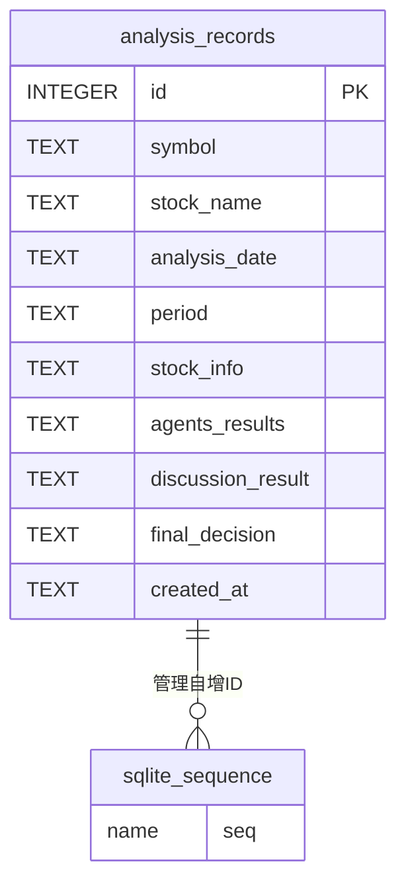

# stock_analysis.db 数据库关系图

## 数据库结构概览

### 表列表
- **analysis_records**：股票分析记录表
- **sqlite_sequence**：SQLite自动生成的序列表（用于管理自增ID）

## 表结构详情

### 1. analysis_records 表
| 字段名 | 数据类型 | 约束 | 描述 |
|-------|---------|------|------|
| id | INTEGER | PRIMARY KEY | 记录ID（自增） |
| symbol | TEXT | | 股票代码 |
| stock_name | TEXT | | 股票名称 |
| analysis_date | TEXT | | 分析日期 |
| period | TEXT | | 分析周期 |
| stock_info | TEXT | | 股票信息（JSON格式） |
| agents_results | TEXT | | AI代理分析结果（JSON格式） |
| discussion_result | TEXT | | 讨论结果 |
| final_decision | TEXT | | 最终决策 |
| created_at | TEXT | | 创建时间 |

### 2. sqlite_sequence 表
| 字段名 | 数据类型 | 约束 | 描述 |
|-------|---------|------|------|
| name | | | 表名 |
| seq | | | 当前序列值 |

## 关系图

## 关系说明

1. **analysis_records** 是主要的数据表，存储股票分析的完整记录
2. **sqlite_sequence** 是SQLite自动生成和管理的系统表，用于跟踪analysis_records表的自增ID值
3. 两个表之间没有显式的外键关系，只有隐式的序列管理关系

## 数据流向

1. 当插入新的分析记录时，SQLite会自动从sqlite_sequence获取当前seq值作为id
2. 插入完成后，sqlite_sequence中的seq值会自动递增
3. analysis_records表存储完整的分析数据，包括股票基本信息、AI分析结果和最终决策

## 设计特点

1. **简单性**：采用单一主表设计，所有分析数据存储在一个表中
2. **灵活性**：使用TEXT类型存储复杂数据（如JSON格式的股票信息和分析结果）
3. **自增ID管理**：利用SQLite内置的sqlite_sequence表管理主键自增
4. **无外键依赖**：设计简洁，没有复杂的表关联关系

## 使用场景

该数据库结构适用于：
- 存储股票分析历史记录
- 跟踪AI代理的分析结果
- 记录最终投资决策
- 提供分析历史查询功能
