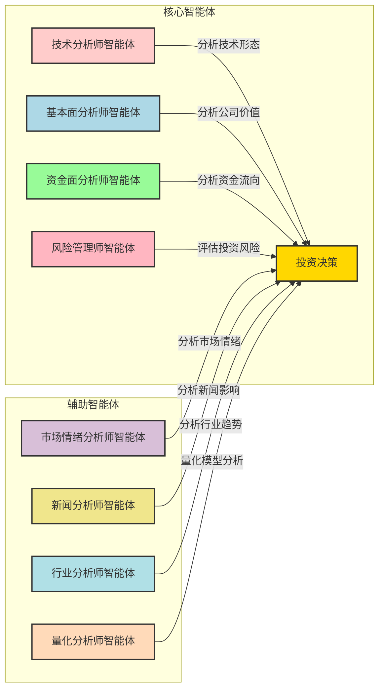
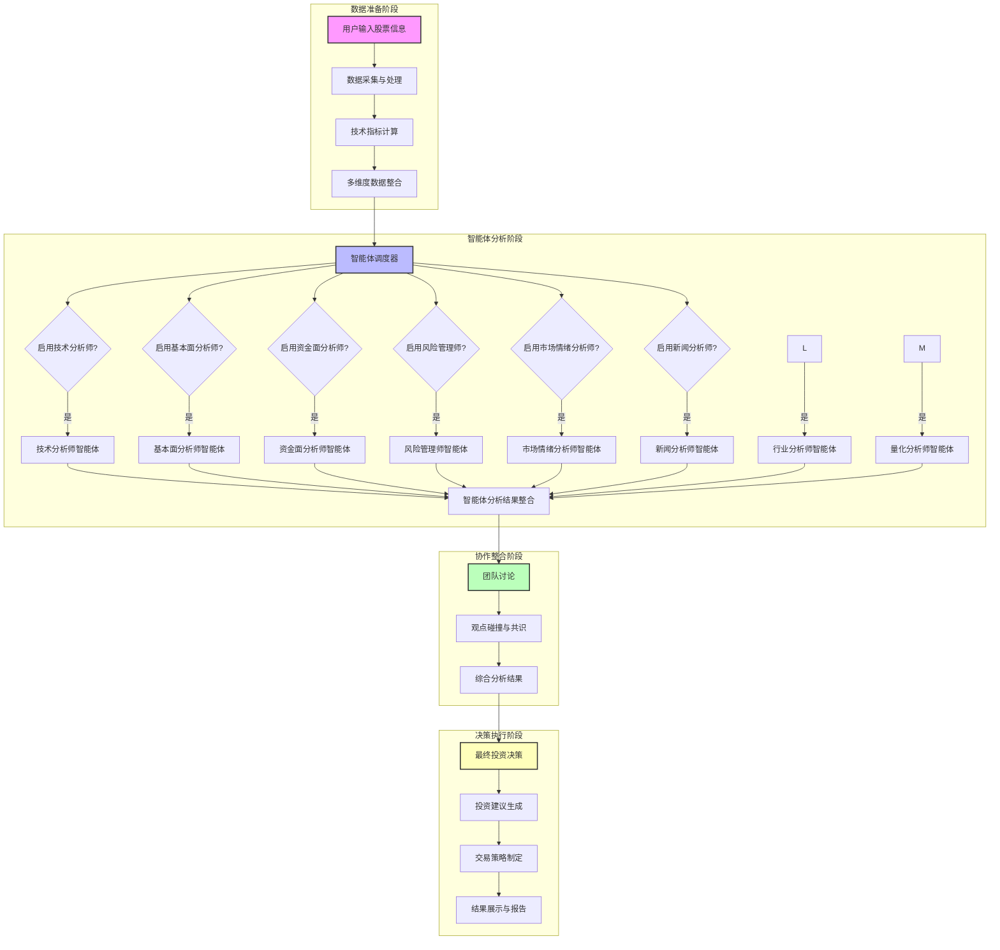

# 多智能体协作分析流程图

## 系统智能体架构

本系统采用多智能体协作架构，通过专业分工和信息融合，提供全面的股票分析服务。

## 智能体角色与职责分配

### 智能体角色分配图



### 智能体职责详细说明

| 智能体名称 | 主要职责 | 分析重点 | 输出结果 |
|-----------|---------|---------|----------|
| **技术分析师智能体** | 分析股票技术形态和趋势 | - K线形态分析<br>- 技术指标解读<br>- 趋势识别<br>- 买卖信号判断 | 技术分析报告、买卖信号、趋势预测 |
| **基本面分析师智能体** | 分析公司内在价值和财务状况 | - 财务报表分析<br>- 业绩增长评估<br>- 估值模型计算<br>- 行业对比分析 | 基本面分析报告、估值判断、投资价值评估 |
| **资金面分析师智能体** | 分析资金流向和主力动向 | - 资金进出分析<br>- 主力资金追踪<br>- 筹码分布分析<br>- 量价关系解读 | 资金面分析报告、主力动向判断、资金趋势预测 |
| **风险管理师智能体** | 评估投资风险和制定风控策略 | - 风险因素识别<br>- 止损止盈设置<br>- 仓位管理建议<br>- 风险收益比评估 | 风险评估报告、风控建议、仓位策略 |
| **市场情绪分析师智能体** | 分析市场情绪和投资者心理 | - 市场情绪指标分析<br>- 投资者信心评估<br>- 市场热度判断<br>- 情绪周期识别 | 市场情绪分析报告、情绪指标、市场热度评估 |
| **新闻分析师智能体** | 分析新闻公告对股票的影响 | - 公司公告解读<br>- 行业新闻分析<br>- 政策影响评估<br>- 事件驱动机会识别 | 新闻分析报告、事件影响评估、机会风险提示 |
| **行业分析师智能体** | 分析行业发展趋势和竞争格局 | - 行业生命周期分析<br>- 竞争格局评估<br>- 产业链分析<br>- 政策影响分析 | 行业分析报告、行业趋势预测、公司行业地位评估 |
| **量化分析师智能体** | 构建和应用量化分析模型 | - 因子模型构建<br>- 回测策略验证<br>- 量化信号生成<br>- 算法交易策略 | 量化分析报告、量化信号、策略回测结果 |

### 智能体协作关系

1. **信息共享**：各智能体共享基础数据，但专注于不同维度的分析
2. **观点互补**：不同智能体从不同角度分析，形成互补的观点
3. **交叉验证**：通过多维度分析结果的交叉验证，提高分析的可靠性
4. **权重分配**：根据市场环境和股票特性，动态调整各智能体观点的权重

### 智能体分析优先级

| 市场环境 | 优先智能体 | 次要智能体 |
|---------|-----------|-----------|
| 牛市初期 | 技术分析师、资金面分析师 | 基本面分析师 |
| 牛市中期 | 基本面分析师、技术分析师 | 资金面分析师 |
| 牛市末期 | 风险管理师、基本面分析师 | 市场情绪分析师 |
| 熊市初期 | 风险管理师、技术分析师 | 资金面分析师 |
| 熊市中期 | 风险管理师、基本面分析师 | 新闻分析师 |
| 熊市末期 | 基本面分析师、资金面分析师 | 市场情绪分析师 |
| 震荡市 | 技术分析师、风险管理师 | 新闻分析师 |

## 多智能体协作流程

### 协作流程图



## 智能体执行流程详解

### 1. 数据准备阶段

1. **用户输入股票信息**：用户选择股票代码，配置分析参数
2. **数据采集与处理**：从多个数据源获取股票数据，进行清洗和标准化
3. **技术指标计算**：计算各种技术指标（MACD、RSI、布林带等）
4. **多维度数据整合**：整合技术面、基本面、资金面等多维度数据

### 2. 智能体分析阶段

系统根据用户配置，启动相应的智能体进行分析。智能体的执行是**串行**的，按照以下顺序：

1. **技术分析师智能体**：分析股票的技术形态、趋势和买卖信号
2. **基本面分析师智能体**：分析公司财务状况、业绩增长和估值水平
3. **资金面分析师智能体**：分析资金流向、主力资金动向和筹码分布
4. **风险管理师智能体**：评估投资风险、设置止损止盈策略
5. **市场情绪分析师智能体**（可选）：分析市场情绪、投资者信心
6. **新闻分析师智能体**（可选）：分析相关新闻、公告对股票的影响
7. **行业分析师智能体**（可选）：分析行业发展趋势和竞争格局
8. **量化分析师智能体**（可选）：构建和应用量化分析模型

### 3. 协作整合阶段

1. **智能体分析结果整合**：收集所有启用智能体的分析结果
2. **团队讨论**：模拟投资决策团队会议，讨论各智能体的观点
3. **观点碰撞与共识**：分析不同维度观点的一致性和分歧，形成共识
4. **综合分析结果**：生成多维度综合分析报告

### 4. 决策执行阶段

1. **最终投资决策**：基于综合分析结果生成投资建议
2. **投资建议生成**：明确买入、卖出或持有信号
3. **交易策略制定**：制定具体的交易策略，包括仓位、止损止盈等
4. **结果展示与报告**：在界面展示分析结果，生成PDF报告

## 智能体协作特点

### 1. 灵活性
- 用户可根据需要选择启用哪些智能体
- 支持快速分析（2-3个智能体）和深度分析（全部智能体）

### 2. 专业性
- 每个智能体专注于特定领域的分析
- 模拟专业投资团队的分工协作

### 3. 综合性
- 多维度分析，避免单一视角的局限性
- 交叉验证，提高分析的可靠性

### 4. 可扩展性
- 模块化设计，便于添加新的智能体类型
- 支持自定义智能体配置

## 技术实现细节

### 智能体调度器

智能体调度器负责管理和协调各个智能体的执行，根据用户配置决定启用哪些智能体：

```python
def run_multi_agent_analysis(self, stock_info: Dict, stock_data: Any, indicators: Dict, 
                             financial_data: Dict = None, fund_flow_data: Dict = None, 
                             sentiment_data: Dict = None, news_data: Dict = None,
                             quarterly_data: Dict = None, risk_data: Dict = None,
                             enabled_analysts: Dict = None) -> Dict[str, Any]:
    """运行多智能体分析
    
    Args:
        enabled_analysts: 字典，指定哪些分析师参与分析
            例如: {'technical': True, 'fundamental': True, ...}
            如果为None，则运行所有分析师
    """
    # 如果未指定，默认所有分析师都参与
    if enabled_analysts is None:
        enabled_analysts = {
            'technical': True,
            'fundamental': True,
            'fund_flow': True,
            'risk': True,
            'sentiment': True,
            'news': True,
            'industry': False,
            'quantitative': False
        }
    
    # 串行运行各个分析师
    agents_results = {}
    
    # 技术面分析
    if enabled_analysts.get('technical', True):
        agents_results["technical"] = self.technical_analyst_agent(stock_info, stock_data, indicators)
    
    # 基本面分析
    if enabled_analysts.get('fundamental', True):
        agents_results["fundamental"] = self.fundamental_analyst_agent(stock_info, financial_data, quarterly_data)
    
    # 资金面分析
    if enabled_analysts.get('fund_flow', True):
        agents_results["fund_flow"] = self.fund_flow_analyst_agent(stock_info, indicators, fund_flow_data)
    
    # 风险管理分析
    if enabled_analysts.get('risk', True):
        agents_results["risk_management"] = self.risk_management_agent(stock_info, indicators, risk_data)
    
    # 市场情绪分析
    if enabled_analysts.get('sentiment', False):
        agents_results["market_sentiment"] = self.market_sentiment_agent(stock_info, sentiment_data)
    
    # 新闻分析
    if enabled_analysts.get('news', False):
        agents_results["news"] = self.news_analyst_agent(stock_info, news_data)
    
    # 行业分析
    if enabled_analysts.get('industry', False):
        agents_results["industry"] = self.industry_analyst_agent(stock_info, industry_data)
    
    # 量化分析
    if enabled_analysts.get('quantitative', False):
        agents_results["quantitative"] = self.quantitative_analyst_agent(stock_info, stock_data, indicators)
    
    return agents_results
```

### 团队讨论机制

团队讨论机制模拟真实投资团队的讨论过程，整合各智能体的分析结果：

```python
def conduct_team_discussion(self, agents_results: Dict[str, Any], stock_info: Dict) -> str:
    """进行团队讨论"""
    # 收集参与分析的分析师名单和报告
    participants = []
    reports = []
    
    if "technical" in agents_results:
        participants.append("技术分析师")
        reports.append(f"【技术分析师报告】\n{agents_results['technical'].get('analysis', '')}")
    
    if "fundamental" in agents_results:
        participants.append("基本面分析师")
        reports.append(f"【基本面分析师报告】\n{agents_results['fundamental'].get('analysis', '')}")
    
    if "fund_flow" in agents_results:
        participants.append("资金面分析师")
        reports.append(f"【资金面分析师报告】\n{agents_results['fund_flow'].get('analysis', '')}")
    
    if "risk_management" in agents_results:
        participants.append("风险管理师")
        reports.append(f"【风险管理师报告】\n{agents_results['risk_management'].get('analysis', '')}")
    
    if "market_sentiment" in agents_results:
        participants.append("市场情绪分析师")
        reports.append(f"【市场情绪分析师报告】\n{agents_results['market_sentiment'].get('analysis', '')}")
    
    if "news" in agents_results:
        participants.append("新闻分析师")
        reports.append(f"【新闻分析师报告】\n{agents_results['news'].get('analysis', '')}")
    
    if "industry" in agents_results:
        participants.append("行业分析师")
        reports.append(f"【行业分析师报告】\n{agents_results['industry'].get('analysis', '')}")
    
    if "quantitative" in agents_results:
        participants.append("量化分析师")
        reports.append(f"【量化分析师报告】\n{agents_results['quantitative'].get('analysis', '')}")
    
    # 组合所有报告并进行讨论
    all_reports = "\n\n".join(reports)
    # 生成讨论结果
```

## 智能体执行时间分析

| 智能体组合 | 分析时间 | Token消耗 | 适用场景 |
|-----------|---------|-----------|----------|
| 2位分析师 | 1-2分钟 | 低 | 快速判断 |
| 4位分析师（默认） | 2-3分钟 | 中 | 常规分析 |
| 6位分析师 | 4-5分钟 | 高 | 深度研究 |
| 8位分析师（全部） | 5-7分钟 | 超高 | 全面分析 |

## 推荐智能体组合

### 保守型投资者
- ✅ 基本面分析师（看价值）
- ✅ 风险管理师（控风险）

### 激进型投资者
- ✅ 技术分析师（抓趋势）
- ✅ 资金面分析师（跟主力）
- ✅ 市场情绪分析师（顺周期）

### 平衡型投资者（默认）
- ✅ 技术分析师
- ✅ 基本面分析师
- ✅ 资金面分析师
- ✅ 风险管理师

## 总结

本系统的多智能体协作流程通过专业分工、串行执行和综合讨论，实现了对股票的全面分析。智能体之间的协作不是并行的，而是按照一定顺序串行执行，然后通过团队讨论机制整合各方面的观点，形成最终的投资决策。

这种设计既保证了分析的全面性，又兼顾了系统的运行效率，为用户提供了专业、可靠的股票分析服务。