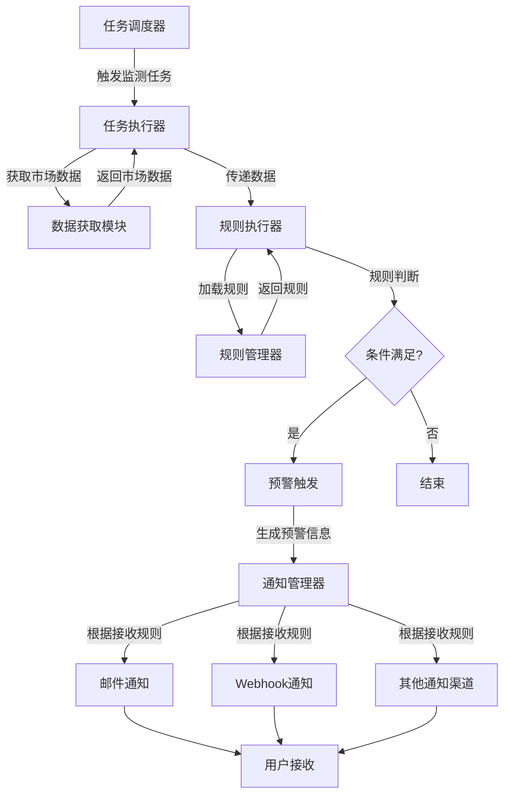

# 实时监测与预警流程图

## 1. 模块架构概述

本系统设计并实现了"任务调度-规则引擎-通知服务"的三层模块架构，为股票市场的实时监测和预警提供了完整的解决方案。

## 2. 模块详细说明

### 2.1 监测任务调度模块

**核心功能：**
- 基于Schedule框架开发，支持秒级至周级多时间粒度配置
- 采用任务池机制统一管理多监测任务
- 确保任务精准执行，避免任务冲突和遗漏

**技术实现：**
- 任务调度器：负责根据配置的时间规则触发监测任务
- 任务池：管理所有活跃的监测任务，提供任务的添加、删除、暂停、恢复等操作
- 任务执行器：执行具体的监测任务，获取市场数据并传递给规则引擎

### 2.2 预警规则引擎

**核心功能：**
- 可配置化设计，支持多种预警规则模板
- 内置价格突破、指标交叉等核心规则
- 支持用户自定义进场区间、止盈止损等参数
- 实时比对市场数据与预设规则
- 触发条件满足时启动预警流程

**技术实现：**
- 规则管理器：管理所有预警规则，支持规则的创建、修改、删除
- 规则执行器：执行规则判断逻辑，比对市场数据与规则条件
- 规则模板库：提供常见预警规则的模板，如价格突破、指标交叉等

### 2.3 通知服务模块

**核心功能：**
- 集成邮件、Webhook等多渠道通知
- 统一通知管理模块
- 支持用户自定义接收规则
- 预警触发时自动推送包含核心信息的通知

**技术实现：**
- 通知管理器：管理通知渠道和接收规则
- 多渠道适配器：适配不同的通知渠道，如邮件、Webhook等
- 通知格式化器：将预警信息格式化为适合不同渠道的通知内容

## 3. 流程图

## 4. 数据流程

1. **任务触发**：任务调度器根据配置的时间规则触发监测任务
2. **数据获取**：任务执行器从市场数据源获取最新的股票数据
3. **规则判断**：规则执行器使用获取的数据与预设规则进行比对
4. **预警触发**：当数据满足规则条件时，触发预警
5. **通知发送**：通知服务根据用户配置的接收规则，通过相应渠道发送预警信息
6. **用户接收**：用户通过邮件、Webhook等渠道接收到预警通知

## 5. 核心特性

### 5.1 多时间粒度支持
- 秒级：适用于高频交易策略
- 分钟级：适用于日内交易监控
- 小时级：适用于中短期趋势监控
- 日级：适用于中长期投资分析
- 周级：适用于长期投资策略

### 5.2 丰富的规则模板
- 价格突破规则：监测价格突破支撑位或阻力位
- 指标交叉规则：监测技术指标的金叉死叉信号
- 成交量异常规则：监测成交量的异常变化
- 波动率异常规则：监测价格波动率的异常变化
- 基本面变化规则：监测公司基本面数据的变化

### 5.3 多渠道通知
- 邮件通知：通过电子邮件发送预警信息
- Webhook通知：通过HTTP回调发送预警信息，支持与第三方系统集成
- 系统内通知：在系统内部显示预警信息
- 移动端通知：通过移动应用推送预警信息

## 6. 系统优势

1. **模块化设计**：清晰的三层架构，各模块职责明确，易于维护和扩展
2. **可配置性**：支持用户自定义监测任务、预警规则和通知方式
3. **实时性**：基于Schedule框架的任务调度，确保监测的实时性
4. **可靠性**：任务池机制确保任务的可靠执行，避免任务冲突和遗漏
5. **扩展性**：支持添加新的预警规则模板和通知渠道

## 7. 应用场景

- **日内交易监控**：实时监测股票价格和交易量的变化，捕捉短期交易机会
- **趋势跟踪**：监测技术指标的变化，跟踪股票的中长期趋势
- **风险控制**：设置止盈止损规则，及时控制投资风险
- **事件驱动**：监测公司公告、行业新闻等事件，捕捉事件驱动的投资机会
- **投资组合管理**：监测投资组合中各股票的表现，及时调整投资策略

## 8. 技术栈

- **后端框架**：Python
- **任务调度**：Schedule库
- **数据处理**：Pandas、NumPy
- **通知服务**：SMTP（邮件）、HTTP（Webhook）
- **配置管理**：JSON、YAML
- **数据存储**：SQLite、MySQL

## 9. 部署与配置

### 9.1 配置文件

系统使用JSON格式的配置文件管理监测任务和预警规则：

- `monitor_schedule_config.json`：存储任务调度配置
- `alert_rules_config.json`：存储预警规则配置
- `notification_config.json`：存储通知服务配置

### 9.2 部署方式

- **本地部署**：直接在本地运行Python脚本
- **Docker部署**：使用Docker容器化部署，便于跨平台运行
- **服务器部署**：部署在云服务器上，实现7x24小时监控

## 10. 总结

本系统通过"任务调度-规则引擎-通知服务"的三层架构，实现了股票市场的实时监测和预警功能。系统具有高度的可配置性和扩展性，能够满足不同用户的个性化需求。通过多时间粒度的任务调度、丰富的预警规则模板和多渠道的通知服务，系统能够及时捕捉市场机会并控制投资风险，为用户的投资决策提供有力的支持。