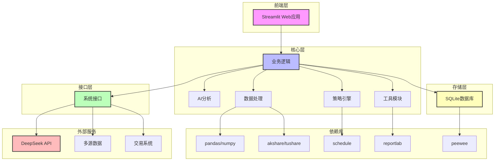
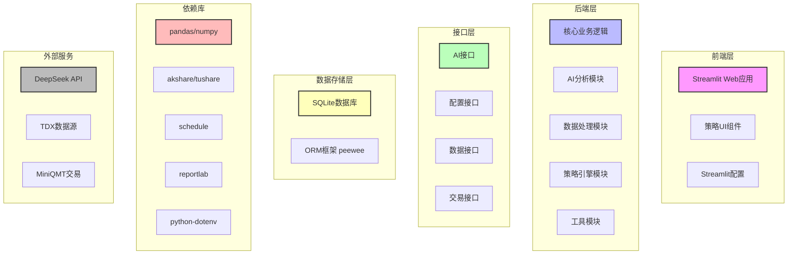
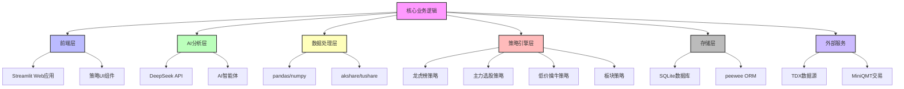
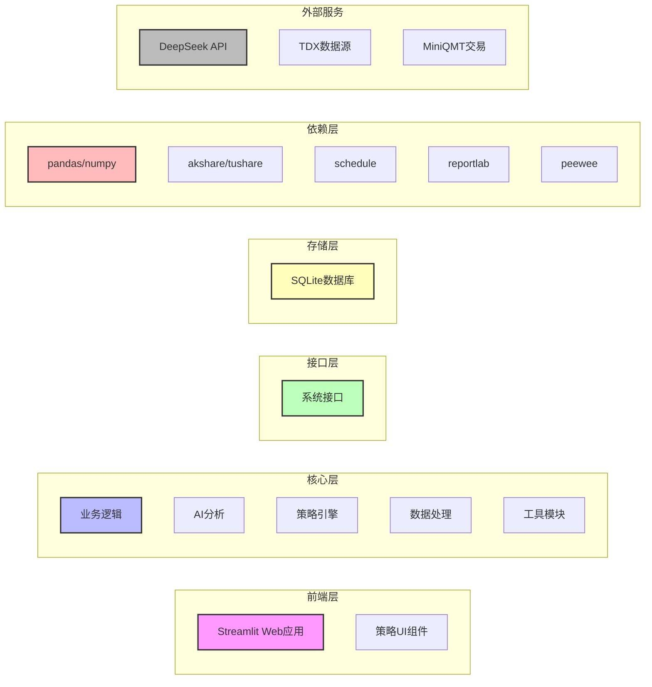

# 股票智能分析系统技术架构图

```mermaid
graph TD
    subgraph 前端层
        A[Streamlit Web应用] --> B[策略UI组件]
        B --> B1[龙虎榜UI]
        B --> B2[主力选股UI]
        B --> B3[低价擒牛UI]
        B --> B4[板块策略UI]
        B --> B5[智能盯盘UI]
        B --> B6[盈利增长UI]
        B --> B7[投资组合UI]
        A --> C[Streamlit配置]
    end

    subgraph 后端层
        D[核心业务逻辑] --> E[AI分析模块]
        D --> F[数据处理模块]
        D --> G[策略引擎模块]
        D --> H[工具模块]
        
        E --> E1[AI智能体]
        E --> E2[龙虎榜AI分析]
        E --> E3[板块策略AI分析]
        
        F --> F1[数据源管理器]
        F --> F2[股票数据处理]
        F --> F3[资金流向数据]
        F --> F4[市场情绪数据]
        F --> F5[新闻公告数据]
        F --> F6[季报数据]
        
        G --> G1[龙虎榜策略]
        G --> G2[主力选股策略]
        G --> G3[低价擒牛策略]
        G --> G4[板块策略]
        G --> G5[智能盯盘策略]
        G --> G6[盈利增长策略]
        G --> G7[小市值策略]
        G --> G8[投资组合管理]
        G --> G9[监测调度器]
        
        H --> H1[PDF生成器]
        H --> H2[通知服务]
    end

    subgraph 接口层
        I[系统接口] --> J[AI接口]
        I --> K[配置接口]
        I --> L[数据接口]
        I --> M[交易接口]
        
        J --> J1[DeepSeek客户端]
        K --> K1[配置管理器]
        L --> L1[TDX数据接口]
        M --> M1[MiniQMT接口]
        M --> M2[QMT交易接口]
    end

    subgraph 数据存储层
        N[数据存储] --> O[SQLite数据库]
        O --> O1[龙虎榜数据库]
        O --> O2[主力选股数据库]
        O --> O3[低价擒牛数据库]
        O --> O4[板块策略数据库]
        O --> O5[智能盯盘数据库]
        O --> O6[盈利增长数据库]
        O --> O7[投资组合数据库]
        O --> O8[股票分析数据库]
    end

    subgraph 配置与依赖
        P[配置管理] --> Q[环境变量配置]
        P --> R[系统配置文件]
        P --> S[监测调度配置]
        
        T[依赖管理] --> U[Python库依赖]
        U --> U1[pandas]
        U --> U2[numpy]
        U --> U3[streamlit]
        U --> U4[akshare]
        U --> U5[tushare]
        U --> U6[yfinance]
        U --> U7[schedule]
        U --> U8[reportlab]
        U --> U9[peewee]
        U --> U10[python-dotenv]
    end

    subgraph 外部服务
        V[DeepSeek API]
        W[TDX数据源]
        X[MiniQMT交易]
    end

    A -- 调用 --> D
    D -- 使用 --> I
    D -- 存储数据 --> N
    I -- 连接 --> V
    I -- 连接 --> W
    I -- 连接 --> X
    E1 --> J1
    F1 --> L1
    G9 --> S

    style A fill:#f9f,stroke:#333,stroke-width:2px
    style D fill:#bbf,stroke:#333,stroke-width:2px
    style I fill:#bfb,stroke:#333,stroke-width:2px
    style N fill:#ffb,stroke:#333,stroke-width:2px
    style P fill:#fbb,stroke:#333,stroke-width:2px
    style V fill:#bbb,stroke:#333,stroke-width:2px
```



## 技术架构说明

### 1. 前端层
- **Streamlit Web应用**：作为系统的前端界面，提供交互式操作体验
- **策略UI组件**：为各种分析策略提供专门的用户界面，包括龙虎榜、主力选股、低价擒牛等
- **Streamlit配置**：管理Streamlit框架的配置参数

### 2. 后端层
- **AI分析模块**：利用DeepSeek API进行金融文本处理和分析，支持多种AI智能体
- **数据处理模块**：管理多个数据源（akshare、tushare、yfinance等），处理股票数据、资金流向、市场情绪等信息
- **策略引擎模块**：实现多种股票分析策略，包括龙虎榜、主力选股、低价擒牛、板块策略等
- **工具模块**：提供PDF生成（reportlab）、通知服务等辅助功能

### 3. 接口层
- **AI接口**：封装DeepSeek API的调用
- **配置接口**：管理系统配置
- **数据接口**：连接TDX等数据源
- **交易接口**：连接MiniQMT等交易系统

### 4. 数据存储层
- **SQLite数据库**：轻量级数据存储，为各种策略和分析提供数据持久化，使用peewee ORM框架

### 5. 配置与依赖
- **配置管理**：管理环境变量（python-dotenv）、系统配置和监测调度配置
- **依赖管理**：管理Python库依赖，包括：
  - 前端：streamlit
  - 数据处理：pandas、numpy
  - 数据源：akshare、tushare、yfinance
  - 定时任务：schedule
  - PDF生成：reportlab
  - 数据库：peewee
  - 环境配置：python-dotenv

### 6. 外部服务
- **DeepSeek API**：提供AI分析能力
- **TDX数据源**：提供股票数据
- **MiniQMT交易**：提供交易功能

## 技术栈特点

1. **核心开发语言**：Python
2. **前端框架**：Streamlit（快速构建轻量化、高交互性Web应用）
3. **数据处理**：Pandas、NumPy（高效数据读写、转换与计算）
4. **数据源**：akshare、tushare、yfinance（多源数据采集）
5. **AI分析**：DeepSeek API（金融文本处理能力）
6. **数据存储**：SQLite + peewee ORM（轻量级数据持久化）
7. **定时任务**：Schedule库（周期性任务调度）
8. **PDF生成**：reportlab（报告生成）
9. **环境配置**：python-dotenv（环境变量管理）
10. **部署支持**：Docker（容器化部署）

## 架构设计原则

1. **模块化设计**：各功能模块独立封装，便于维护和扩展
2. **分层架构**：前端、后端、接口、数据存储清晰分层
3. **可扩展性**：支持多种数据源和策略的扩展
4. **轻量级**：使用SQLite等轻量级组件，降低部署复杂度
5. **实用性**：聚焦于股票分析的核心功能，避免过度设计

此架构设计充分考虑了开发效率、运行性能和可扩展性，确保系统能够满足实际应用场景的需求。

---

# 股票智能分析系统技术架构图 - 简洁版



## 简洁版技术架构说明

### 1. 前端层
- **Streamlit Web应用**：提供轻量化、高交互性的用户界面

### 2. 核心层
- **业务逻辑**：系统核心功能实现
- **AI分析**：基于DeepSeek API的智能分析能力
- **策略引擎**：多种股票分析策略的实现
- **数据处理**：高效数据读写、转换与计算
- **工具模块**：提供PDF生成、通知服务等辅助功能

### 3. 接口层
- **系统接口**：统一管理与外部服务的交互

### 4. 存储层
- **SQLite数据库**：轻量级数据持久化存储，使用peewee ORM框架

### 5. 外部服务
- **DeepSeek API**：提供AI分析能力
- **多源数据**：包括TDX、akshare、tushare、yfinance等数据源
- **交易系统**：包括MiniQMT等交易接口

### 6. 依赖库
- **pandas/numpy**：数据处理
- **akshare/tushare**：数据源
- **schedule**：定时任务调度
- **reportlab**：PDF生成
- **peewee**：ORM框架

## 简洁版技术栈特点

1. **核心开发语言**：Python
2. **前端框架**：Streamlit
3. **数据处理**：Pandas、NumPy
4. **数据源**：akshare、tushare、yfinance
5. **AI分析**：DeepSeek API
6. **数据存储**：SQLite + peewee
7. **定时任务**：Schedule库
8. **PDF生成**：reportlab
9. **环境配置**：python-dotenv
10. **部署支持**：Docker

## 简洁版架构设计原则

1. **模块化设计**：各功能模块独立封装
2. **分层架构**：清晰的层次结构
3. **可扩展性**：支持功能扩展
4. **轻量级**：使用轻量级组件
5. **实用性**：聚焦核心功能
6. **多源数据**：支持多种数据源集成
7. **AI驱动**：集成智能分析能力

---

# 股票智能分析系统技术架构图 - 无连接线版



## 无连接线版架构说明

此架构图展示了系统的各个组件和层次，没有显示连接线以保持结构清晰。系统由以下层次组成：

### 1. 前端层
- **Streamlit Web应用**：提供用户界面
- **策略UI组件**：各种分析策略的前端实现
- **Streamlit配置**：框架配置

### 2. 后端层
- **核心业务逻辑**：系统核心功能
- **AI分析模块**：智能分析能力
- **数据处理模块**：数据读写和转换
- **策略引擎模块**：各种分析策略
- **工具模块**：辅助功能

### 3. 接口层
- **AI接口**：与AI服务交互
- **配置接口**：管理配置
- **数据接口**：与数据源交互
- **交易接口**：与交易系统交互

### 4. 数据存储层
- **SQLite数据库**：数据持久化
- **ORM框架 peewee**：数据库操作

### 5. 依赖库
- **pandas/numpy**：数据处理
- **akshare/tushare**：数据源
- **schedule**：定时任务
- **reportlab**：PDF生成
- **python-dotenv**：环境配置

### 6. 外部服务
- **DeepSeek API**：AI分析
- **TDX数据源**：股票数据
- **MiniQMT交易**：交易功能

---

# 股票智能分析系统技术架构图 - 文字版

```
┌───────────────────────────────────────────────────────────────────────────┐
│                          股票智能分析系统                                │
└───────────────────────────────────────────────────────────────────────────┘
                                    │
                                    ▼
┌───────────────────────────────────────────────────────────────────────────┐
│                              前端层                                      │
├───────────────────────┬───────────────────────┬─────────────────────────┤
│  Streamlit Web应用   │  策略UI组件           │  Streamlit配置          │
└───────────────────────┴───────────────────────┴─────────────────────────┘
                                    │
                                    ▼
┌───────────────────────────────────────────────────────────────────────────┐
│                              后端层                                      │
├──────────────┬──────────────┬──────────────┬──────────────┬──────────────┤
│ 核心业务逻辑 │  AI分析模块  │ 数据处理模块 │ 策略引擎模块 │  工具模块    │
└──────────────┴──────────────┴──────────────┴──────────────┴──────────────┘
                                    │
                                    ▼
┌───────────────────────────────────────────────────────────────────────────┐
│                              接口层                                      │
├──────────────┬──────────────┬──────────────┬─────────────────────────────┤
│  AI接口      │ 配置接口     │ 数据接口     │ 交易接口                    │
└──────────────┴──────────────┴──────────────┴─────────────────────────────┘
                                    │
                                    ▼
┌───────────────────────────────────────────────────────────────────────────┐
│                             数据存储层                                   │
├───────────────────────┬───────────────────────────────────────────────────┤
│  SQLite数据库        │  ORM框架 peewee                                   │
└───────────────────────┴───────────────────────────────────────────────────┘
                                    │
                                    ▼
┌───────────────────────────────────────────────────────────────────────────┐
│                              依赖层                                      │
├───────┬───────┬───────┬───────┬───────────┬──────────────────────────────┤
│pandas │numpy  │akshare│tushare│schedule   │reportlab   │peewee  │python-dotenv │
└───────┴───────┴───────┴───────┴───────────┴──────────────────────────────┘
                                    │
                                    ▼
┌───────────────────────────────────────────────────────────────────────────┐
│                             外部服务层                                   │
├───────────────────────┬───────────────────────┬─────────────────────────┤
│  DeepSeek API         │  TDX数据源             │              │
└───────────────────────┴───────────────────────┴─────────────────────────┘
```

## 文字版架构说明

此架构图使用ASCII字符绘制，展示了系统的完整层次结构：

### 1. 前端层
- **Streamlit Web应用**：提供用户界面
- **策略UI组件**：各种分析策略的前端实现
- **Streamlit配置**：框架配置

### 2. 后端层
- **核心业务逻辑**：系统核心功能
- **AI分析模块**：智能分析能力
- **数据处理模块**：数据读写和转换
- **策略引擎模块**：各种分析策略
- **工具模块**：辅助功能

### 3. 接口层
- **AI接口**：与AI服务交互
- **配置接口**：管理配置
- **数据接口**：与数据源交互
- **交易接口**：与交易系统交互

### 4. 数据存储层
- **SQLite数据库**：数据持久化
- **ORM框架 peewee**：数据库操作

### 5. 依赖层
- **pandas/numpy**：数据处理
- **akshare/tushare**：数据源
- **schedule**：定时任务
- **reportlab**：PDF生成
- **peewee**：ORM框架
- **python-dotenv**：环境配置

### 6. 外部服务层
- **DeepSeek API**：AI分析
- **TDX数据源**：股票数据
- **MiniQMT交易**：交易功能

---

# 股票智能分析系统技术架构图 - 圆形布局版



## 圆形布局版架构说明

此架构图采用核心辐射式布局，以业务逻辑为中心，向四周辐射各个功能模块：

### 1. 核心层
- **核心业务逻辑**：系统的中心，协调各个模块的工作

### 2. 前端层
- **Streamlit Web应用**：提供用户界面
- **策略UI组件**：各种分析策略的前端实现

### 3. AI分析层
- **DeepSeek API**：提供AI分析能力
- **AI智能体**：实现智能分析功能

### 4. 数据处理层
- **pandas/numpy**：数据处理库
- **akshare/tushare**：数据源

### 5. 策略引擎层
- **龙虎榜策略**：基于龙虎榜数据的分析
- **主力选股策略**：基于主力资金的分析
- **低价擒牛策略**：低价股票分析
- **板块策略**：板块轮动分析

### 6. 存储层
- **SQLite数据库**：数据持久化
- **peewee ORM**：数据库操作框架

### 7. 外部服务
- **TDX数据源**：提供股票数据
- **MiniQMT交易**：提供交易功能

---

# 股票智能分析系统技术架构图 - 水平布局版



## 水平布局版架构说明

此架构图采用水平布局，展示了系统的各个层次和组件：

### 1. 前端层
- **Streamlit Web应用**：提供用户界面
- **策略UI组件**：各种分析策略的前端实现

### 2. 核心层
- **业务逻辑**：系统核心功能
- **AI分析**：智能分析能力
- **策略引擎**：各种分析策略
- **数据处理**：数据读写和转换
- **工具模块**：辅助功能

### 3. 接口层
- **系统接口**：与外部服务的交互

### 4. 存储层
- **SQLite数据库**：数据持久化

### 5. 依赖层
- **pandas/numpy**：数据处理
- **akshare/tushare**：数据源
- **schedule**：定时任务
- **reportlab**：PDF生成
- **peewee**：ORM框架

### 6. 外部服务
- **DeepSeek API**：AI分析
- **TDX数据源**：股票数据
- **MiniQMT交易**：交易功能