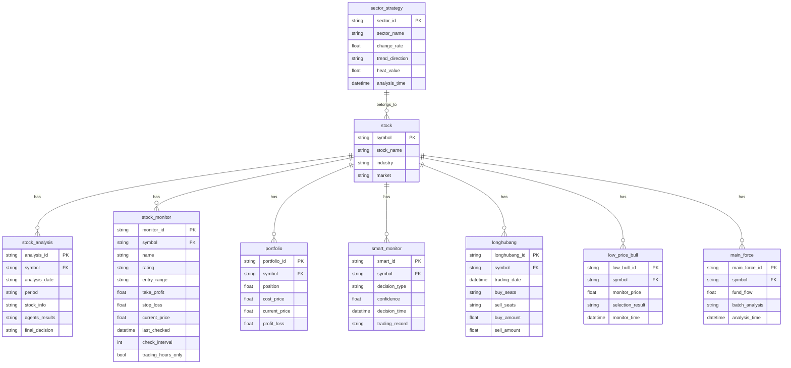

# 股票智能分析系统数据库关系E-R图

## 数据库关系实体-关系图



## 数据库文件清单

| 数据库名称 | 存储内容 | 功能描述 |
|---------|---------|--------|
| stock_analysis.db | 股票分析结果、历史记录、股票基本信息 | 存储AI分析系统的分析结果和历史记录，支持分析记录的查询和管理 |
| stock_monitor.db | 监测股票信息、价格历史、预警记录 | 用于实时监测股票价格和指标，触发预警通知 |
| portfolio_stocks.db | 投资组合信息、持仓明细、交易记录 | 用于投资组合的分析和管理，跟踪投资绩效 |
| smart_monitor.db | 智能盯盘配置、AI决策记录、交易记录 | 用于智能盯盘的配置管理和交易记录跟踪 |
| longhubang.db | 龙虎榜数据、席位交易行为分析、资金流向 | 存储龙虎榜数据和分析结果，支持龙虎榜策略 |
| low_price_bull_monitor.db | 低价擒牛策略监测数据、选股结果 | 存储低价擒牛策略的监测数据和选股结果 |
| main_force_batch.db | 主力选股批量分析结果、资金动向 | 存储主力选股批量分析结果和资金动向数据 |
| sector_strategy.db | 板块分析数据、多空趋势预测、板块轮动分析 | 存储板块分析数据和结果，支持板块策略 |

## 关系说明

1. **核心实体关系**：
   - 所有数据库文件都以`STOCK`实体为核心关联点，通过`symbol`字段建立逻辑关联
   - `SECTOR_STRATEGY`与`STOCK`之间存在`belongs_to`关系，表示股票属于特定板块

2. **数据库文件内部关系**：
   - 每个数据库文件内部包含多个相关表，实现特定功能模块的数据管理
   - 通过`symbol`字段实现不同数据库文件之间的逻辑关联

3. **关系特性**：
   - 采用模块化设计，各数据库文件独立管理
   - 通过应用层实现数据联动和查询
   - 支持复杂数据结构的存储和管理

## 数据库内部表结构关系图

```mermaid
erDiagram
    subgraph "stock_analysis.db"
        stock_basic {
            string symbol PK
            string stock_name
            string industry
            string market
            string listing_date
        }
        
        stock_history {
            string id PK
            string symbol FK
            date trading_date
            float open_price
            float high_price
            float low_price
            float close_price
            float volume
            float amount
        }
        
        stock_indicator {
            string id PK
            string symbol FK
            date indicator_date
            float ma5
            float ma10
            float ma20
            float macd
            float kdj_k
            float kdj_d
            float kdj_j
            float rsi
        }
        
        analysis_report {
            string id PK
            string symbol FK
            date report_date
            string report_type
            string report_content
            string author
        }
        
        stock_basic ||--o{ stock_history : has
        stock_basic ||--o{ stock_indicator : has
        stock_basic ||--o{ analysis_report : has
    end
    
    subgraph "stock_monitor.db"
        monitored_stocks {
            string id PK
            string symbol FK
            string name
            string rating
            string entry_range
            float take_profit
            float stop_loss
        }
        
        price_history {
            string id PK
            string stock_id FK
            float price
            datetime timestamp
        }
        
        notifications {
            string id PK
            string stock_id FK
            string type
            string message
            datetime triggered_at
            bool sent
        }
        
        monitored_stocks ||--o{ price_history : has
        monitored_stocks ||--o{ notifications : has
    end
    
    subgraph "portfolio_stocks.db"
        portfolio {
            string id PK
            string symbol FK
            float position
            float cost_price
            float current_price
        }
        
        trade_record {
            string id PK
            string portfolio_id FK
            string trade_type
            float price
            float quantity
            datetime trade_date
        }
        
        profit_statistics {
            string id PK
            string portfolio_id FK
            float total_profit
            float realized_profit
            float unrealized_profit
            date stat_date
        }
        
        portfolio ||--o{ trade_record : has
        portfolio ||--o{ profit_statistics : has
    end
    
    subgraph "smart_monitor.db"
        ai_decision {
            string id PK
            string symbol FK
            string decision_type
            float confidence
            datetime decision_time
        }
        
        smart_trade {
            string id PK
            string decision_id FK
            string trade_type
            float price
            float quantity
            datetime trade_time
        }
        
        smart_position {
            string id PK
            string symbol FK
            float quantity
            float cost_price
            datetime update_time
        }
        
        ai_decision ||--o{ smart_trade : has
        smart_position ||--o{ smart_trade : has
    end
```



## 核心数据表结构设计图

```mermaid
graph TD
    subgraph "stock_analysis.db"
        A1[analysis_records] --> A2[symbol]
        A1 --> A3[stock_name]
        A1 --> A4[analysis_date]
        A1 --> A5[period]
        A1 --> A6[stock_info]
        A1 --> A7[agents_results]
        A1 --> A8[final_decision]
    end
    
    subgraph "stock_monitor.db"
        B1[monitored_stocks] --> B2[symbol]
        B1 --> B3[name]
        B1 --> B4[rating]
        B1 --> B5[entry_range]
        B1 --> B6[take_profit]
        B1 --> B7[stop_loss]
        B1 --> B8[trading_hours_only]
        
        C1[price_history] --> B1
        D1[notifications] --> B1
    end
    
    subgraph "portfolio_stocks.db"
        E1[portfolio] --> E2[symbol]
        E1 --> E3[position]
        E1 --> E4[cost_price]
        E1 --> E5[current_price]
        E1 --> E6[profit_loss]
        
        F1[trade_record] --> E1
        G1[profit_statistics] --> E1
    end
    
    subgraph "smart_monitor.db"
        H1[ai_decision] --> H2[symbol]
        H1 --> H3[decision_type]
        H1 --> H4[confidence]
        H1 --> H5[decision_time]
        
        I1[smart_trade] --> H1
        J1[smart_position] --> H1
    end
    
    subgraph "longhubang.db"
        K1[longhubang_record] --> K2[symbol]
        K1 --> K3[trading_date]
        K1 --> K4[buy_seats]
        K1 --> K5[sell_seats]
        K1 --> K6[buy_amount]
        K1 --> K7[sell_amount]
        
        L1[stock_tracking] --> K1
    end
    
    subgraph "sector_strategy.db"
        M1[sector_quote] --> M2[sector_code]
        M1 --> M3[sector_name]
        M1 --> M4[change_rate]
        
        N1[trend_forecast] --> M1
        O1[sector_rotation] --> M1
        P1[sector_heat] --> M1
    end
    
    STOCK[stock] --> A1
    STOCK --> B1
    STOCK --> E1
    STOCK --> H1
    STOCK --> K1
    M1 --> STOCK
```



## 股票分析数据库详细E-R图

```mermaid
erDiagram
    subgraph "股票分析系统"
        user {
            string user_id PK
            string username
            string phone
        }
        
        comment {
            string comment_id PK
            string user_id FK
            string content
            string comment_time
        }
        
        comment_reply {
            string reply_id PK
            string comment_id FK
            string user_id FK
            string reply_content
            string reply_time
        }
        
        portfolio {
            string portfolio_id PK
            string user_id FK
            string stock_symbol FK
            float position
            float total_cost
            float current_value
        }
        
        trade {
            string trade_id PK
            string portfolio_id FK
            string trade_type
            float quantity
            float buy_price
            float sell_price
            string trade_time
        }
        
        stock_info {
            string stock_symbol PK
            string stock_name
            string stock_type
            string industry
            string market
        }
        
        kline_data {
            string kline_id PK
            string stock_symbol FK
            string time_period
            datetime start_time
            float open_price
            float high_price
            float low_price
            float close_price
            float volume
        }
        
        stock_prediction {
            string prediction_id PK
            string stock_symbol FK
            string prediction_type
            float predicted_price
            datetime prediction_time
            string trend
        }
        
        user ||--o{ comment : 发表
        user ||--o{ comment_reply : 回复
        user ||--o{ portfolio : 持有
        user ||--o{ trade : 交易
        
        comment ||--o{ comment_reply : 包含
        portfolio ||--o{ trade : 包含
        stock_info ||--o{ portfolio : 关联
        stock_info ||--o{ kline_data : 包含
        stock_info ||--o{ stock_prediction : 预测
        
        kline_data ||--o{ stock_prediction : 基于
    }
```