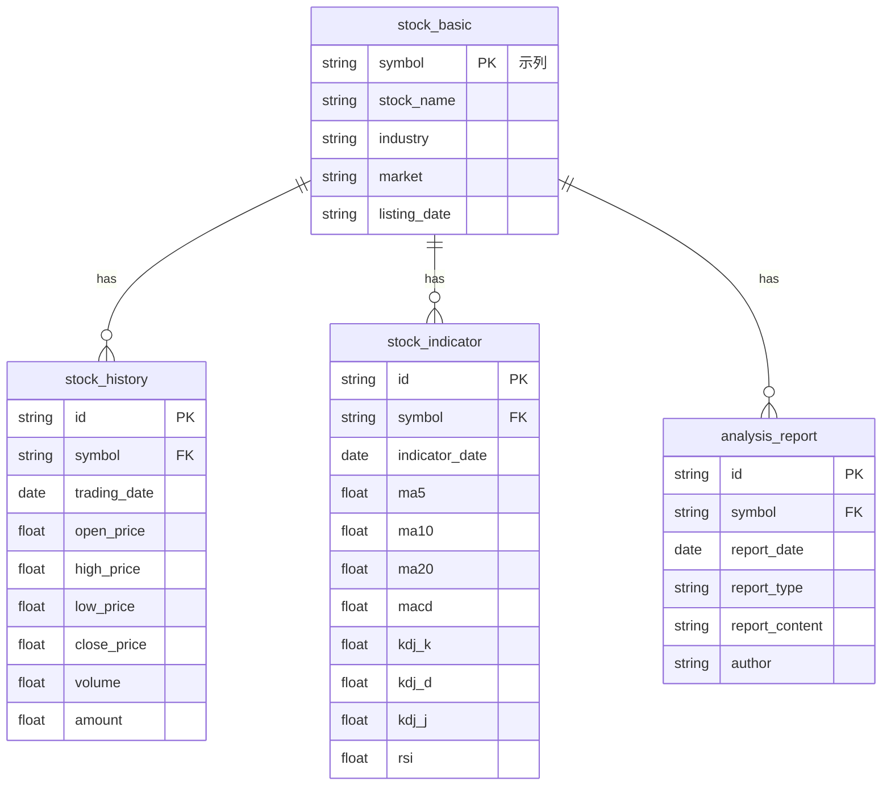

# 股票智能分析系统数据库关系图

## 一、数据库文件清单

| 数据库名称 | 存储内容 | 功能描述 |
|---------|---------|--------|
| stock_analysis.db | 股票分析结果、历史记录、股票基本信息 | 存储AI分析系统的分析结果和历史记录，支持分析记录的查询和管理 |
| stock_monitor.db | 监测股票信息、价格历史、预警记录 | 用于实时监测股票价格和指标，触发预警通知 |
| portfolio_stocks.db | 投资组合信息、持仓明细、交易记录 | 用于投资组合的分析和管理，跟踪投资绩效 |
| smart_monitor.db | 智能盯盘配置、AI决策记录、交易记录 | 用于智能盯盘的配置管理和交易记录跟踪 |
| longhubang.db | 龙虎榜数据、席位交易行为分析、资金流向 | 存储龙虎榜数据和分析结果，支持龙虎榜策略 |
| low_price_bull_monitor.db | 低价擒牛策略监测数据、选股结果 | 存储低价擒牛策略的监测数据和选股结果 |
| main_force_batch.db | 主力选股批量分析结果、资金动向 | 存储主力选股批量分析结果和资金动向数据 |
| sector_strategy.db | 板块分析数据、多空趋势预测、板块轮动分析 | 存储板块分析数据和结果，支持板块策略 |

## 二、核心数据表结构

### 1. 股票分析数据库 (stock_analysis.db)

#### stock_basic表
| 字段名 | 数据类型 | 约束 | 描述 |
|-------|---------|------|------|
| symbol | string | PRIMARY KEY | 股票代码 |
| stock_name | string | | 股票名称 |
| industry | string | | 所属行业 |
| market | string | | 所属市场 |
| listing_date | string | | 上市日期 |

#### stock_history表
| 字段名 | 数据类型 | 约束 | 描述 |
|-------|---------|------|------|
| id | string | PRIMARY KEY | 记录ID |
| symbol | string | FOREIGN KEY | 股票代码 |
| trading_date | date | | 交易日期 |
| open_price | float | | 开盘价 |
| high_price | float | | 最高价 |
| low_price | float | | 最低价 |
| close_price | float | | 收盘价 |
| volume | float | | 成交量 |
| amount | float | | 成交额 |

#### stock_indicator表
| 字段名 | 数据类型 | 约束 | 描述 |
|-------|---------|------|------|
| id | string | PRIMARY KEY | 指标ID |
| symbol | string | FOREIGN KEY | 股票代码 |
| indicator_date | date | | 指标日期 |
| ma5 | float | | 5日均线 |
| ma10 | float | | 10日均线 |
| ma20 | float | | 20日均线 |
| macd | float | | MACD值 |
| kdj_k | float | | KDJ-K值 |
| kdj_d | float | | KDJ-D值 |
| kdj_j | float | | KDJ-J值 |
| rsi | float | | RSI值 |

#### analysis_report表
| 字段名 | 数据类型 | 约束 | 描述 |
|-------|---------|------|------|
| id | string | PRIMARY KEY | 报告ID |
| symbol | string | FOREIGN KEY | 股票代码 |
| report_date | date | | 报告日期 |
| report_type | string | | 报告类型 |
| report_content | string | | 报告内容 |
| author | string | | 分析师 |

### 2. 实时监测数据库 (stock_monitor.db)

#### monitored_stocks表
| 字段名 | 数据类型 | 约束 | 描述 |
|-------|---------|------|------|
| id | string | PRIMARY KEY | 监测ID |
| symbol | string | FOREIGN KEY | 股票代码 |
| name | string | | 股票名称 |
| rating | string | | 投资评级 |
| entry_range | string | | 进场区间 |
| take_profit | float | | 止盈价格 |
| stop_loss | float | | 止损价格 |
| current_price | float | | 当前价格 |
| check_interval | int | | 检查间隔(分钟) |
| trading_hours_only | bool | | 仅交易时段监控 |

#### price_history表
| 字段名 | 数据类型 | 约束 | 描述 |
|-------|---------|------|------|
| id | string | PRIMARY KEY | 历史ID |
| stock_id | string | FOREIGN KEY | 监测ID |
| price | float | | 价格 |
| timestamp | datetime | | 时间戳 |

#### notifications表
| 字段名 | 数据类型 | 约束 | 描述 |
|-------|---------|------|------|
| id | string | PRIMARY KEY | 通知ID |
| stock_id | string | FOREIGN KEY | 监测ID |
| type | string | | 通知类型 |
| message | string | | 通知内容 |
| triggered_at | datetime | | 触发时间 |
| sent | bool | | 是否已发送 |

### 3. 持仓管理数据库 (portfolio_stocks.db)

#### portfolio表
| 字段名 | 数据类型 | 约束 | 描述 |
|-------|---------|------|------|
| id | string | PRIMARY KEY | 持仓ID |
| symbol | string | FOREIGN KEY | 股票代码 |
| position | float | | 持仓数量 |
| cost_price | float | | 成本价 |
| current_price | float | | 当前价格 |
| profit_loss | float | | 盈亏 |

#### trade_record表
| 字段名 | 数据类型 | 约束 | 描述 |
|-------|---------|------|------|
| id | string | PRIMARY KEY | 交易ID |
| portfolio_id | string | FOREIGN KEY | 持仓ID |
| trade_type | string | | 交易类型 |
| price | float | | 交易价格 |
| quantity | float | | 交易数量 |
| trade_date | datetime | | 交易日期 |

#### profit_statistics表
| 字段名 | 数据类型 | 约束 | 描述 |
|-------|---------|------|------|
| id | string | PRIMARY KEY | 统计ID |
| portfolio_id | string | FOREIGN KEY | 持仓ID |
| total_profit | float | | 总盈亏 |
| realized_profit | float | | 已实现盈亏 |
| unrealized_profit | float | | 浮动盈亏 |
| stat_date | date | | 统计日期 |

### 4. 智能盯盘数据库 (smart_monitor.db)

#### ai_decision表
| 字段名 | 数据类型 | 约束 | 描述 |
|-------|---------|------|------|
| id | string | PRIMARY KEY | 决策ID |
| symbol | string | FOREIGN KEY | 股票代码 |
| decision_type | string | | 决策类型 |
| confidence | float | | 置信度 |
| decision_time | datetime | | 决策时间 |

#### smart_trade表
| 字段名 | 数据类型 | 约束 | 描述 |
|-------|---------|------|------|
| id | string | PRIMARY KEY | 交易ID |
| decision_id | string | FOREIGN KEY | 决策ID |
| trade_type | string | | 交易类型 |
| price | float | | 交易价格 |
| quantity | float | | 交易数量 |
| trade_time | datetime | | 交易时间 |

#### smart_position表
| 字段名 | 数据类型 | 约束 | 描述 |
|-------|---------|------|------|
| id | string | PRIMARY KEY | 持仓ID |
| symbol | string | FOREIGN KEY | 股票代码 |
| quantity | float | | 持仓数量 |
| cost_price | float | | 成本价 |
| update_time | datetime | | 更新时间 |

## 三、数据库关系图

### 核心关系描述

```
stock_basic (股票基本信息)
  |
  +-- stock_history (历史行情数据) - 一对多关系
  |
  +-- stock_indicator (技术指标数据) - 一对多关系
  |
  +-- analysis_report (分析报告) - 一对多关系
  |
  +-- monitored_stocks (监测股票) - 一对多关系
  |
  +-- portfolio (持仓) - 一对多关系
  |
  +-- ai_decision (AI决策) - 一对多关系

monitored_stocks (监测股票)
  |
  +-- price_history (价格历史) - 一对多关系
  |
  +-- notifications (通知) - 一对多关系

portfolio (持仓)
  |
  +-- trade_record (交易记录) - 一对多关系
  |
  +-- profit_statistics (盈亏统计) - 一对多关系

ai_decision (AI决策)
  |
  +-- smart_trade (智能交易) - 一对多关系

smart_position (智能持仓)
  |
  +-- smart_trade (智能交易) - 一对多关系
```

## 四、关系特性

1. **模块化设计**：每个功能模块使用独立的数据库文件，便于维护和备份
2. **清晰的责任分离**：不同功能的数据存储在专门的数据库中，降低耦合度
3. **逻辑关联**：通过关键字段（如symbol）建立逻辑关联，提高系统灵活性
4. **数据一致性**：核心字段统一管理，确保数据一致性
5. **可扩展性**：支持JSON格式存储复杂数据结构，适应业务变化

## 五、数据流向

1. **数据输入**：通过API获取股票基本信息、行情数据等
2. **数据处理**：各功能模块对数据进行分析和处理
3. **数据存储**：处理结果存储到对应数据库文件
4. **数据关联**：通过关键字段实现跨模块数据关联
5. **数据查询**：应用层通过关联字段实现复杂查询

## 六、总结

股票智能分析系统的数据库架构采用了模块化设计，包含多个功能专用的数据库文件和管理模块。数据库系统使用SQLite作为存储引擎，实现了数据的分离存储和管理，便于系统的维护和扩展。

各数据库内部通过关键字段建立关联关系，实现数据的联动查询与更新。核心数据表结构设计合理，涵盖了股票分析、实时监测、投资组合管理、智能盯盘等核心功能模块的数据需求。

## 七、股票分析数据库 (stock_analysis.db) 详细说明

### 7.1 数据库概述

**stock_analysis.db** 是系统的核心数据库之一，专门用于存储股票分析相关的数据，包括股票基本信息、历史行情数据、技术指标数据和分析报告数据。该数据库通过合理的表结构设计，实现了股票分析数据的完整存储和高效查询。

### 7.2 包含的数据表

#### 7.2.1 股票基本信息表 (stock_basic)
| 字段名 | 数据类型 | 约束 | 描述 |
|-------|---------|------|------|
| symbol | string | PRIMARY KEY | 股票代码 |
| stock_name | string | | 股票名称 |
| industry | string | | 所属行业 |
| market | string | | 所属市场 |
| listing_date | string | | 上市日期 |

#### 7.2.2 历史行情数据表 (stock_history)
| 字段名 | 数据类型 | 约束 | 描述 |
|-------|---------|------|------|
| id | string | PRIMARY KEY | 记录ID |
| symbol | string | FOREIGN KEY | 股票代码 |
| trading_date | date | | 交易日期 |
| open_price | float | | 开盘价 |
| high_price | float | | 最高价 |
| low_price | float | | 最低价 |
| close_price | float | | 收盘价 |
| volume | float | | 成交量 |
| amount | float | | 成交额 |

#### 7.2.3 技术指标数据表 (stock_indicator)
| 字段名 | 数据类型 | 约束 | 描述 |
|-------|---------|------|------|
| id | string | PRIMARY KEY | 指标ID |
| symbol | string | FOREIGN KEY | 股票代码 |
| indicator_date | date | | 指标日期 |
| ma5 | float | | 5日均线 |
| ma10 | float | | 10日均线 |
| ma20 | float | | 20日均线 |
| macd | float | | MACD值 |
| kdj_k | float | | KDJ-K值 |
| kdj_d | float | | KDJ-D值 |
| kdj_j | float | | KDJ-J值 |
| rsi | float | | RSI值 |

#### 7.2.4 分析报告数据表 (analysis_report)
| 字段名 | 数据类型 | 约束 | 描述 |
|-------|---------|------|------|
| id | string | PRIMARY KEY | 报告ID |
| symbol | string | FOREIGN KEY | 股票代码 |
| report_date | date | | 报告日期 |
| report_type | string | | 报告类型 |
| report_content | string | | 报告内容 |
| author | string | | 分析师 |

### 7.3 表关系图

```
stock_basic (股票基本信息)
  |
  +-- stock_history (历史行情数据) - 一对多关系
  |
  +-- stock_indicator (技术指标数据) - 一对多关系
  |
  +-- analysis_report (分析报告) - 一对多关系
```

### 7.4 关系说明

1. **stock_basic 与 stock_history**：
   - 关系：一对多
   - 描述：一只股票对应多条历史行情记录
   - 关联字段：stock_basic.symbol ↔ stock_history.symbol

2. **stock_basic 与 stock_indicator**：
   - 关系：一对多
   - 描述：一只股票对应多条技术指标记录
   - 关联字段：stock_basic.symbol ↔ stock_indicator.symbol

3. **stock_basic 与 analysis_report**：
   - 关系：一对多
   - 描述：一只股票对应多条分析报告
   - 关联字段：stock_basic.symbol ↔ analysis_report.symbol

### 7.5 数据流向

1. **数据输入**：
   - 股票基本信息：通过API获取或手动录入
   - 历史行情数据：通过金融数据API定期获取
   - 技术指标数据：基于历史行情数据计算生成
   - 分析报告数据：由AI分析系统或分析师生成

2. **数据处理**：
   - 历史行情数据用于计算技术指标
   - 技术指标数据用于生成分析报告
   - 分析报告数据用于投资决策

3. **数据查询**：
   - 基于股票代码查询完整的分析数据
   - 基于日期范围查询历史行情和指标
   - 基于报告类型查询分析报告

### 7.6 应用场景

1. **股票分析**：通过查询历史行情和技术指标，进行趋势分析和形态识别
2. **投资决策**：基于分析报告和技术指标，辅助制定投资策略
3. **历史回顾**：查询股票的历史表现和分析记录，进行回顾和总结
4. **模式研究**：基于历史数据，研究股票价格和指标的变化模式

### 7.7 设计优势

1. **结构清晰**：表结构设计合理，字段定义明确
2. **关系完整**：通过关键字段建立完整的关联关系
3. **查询高效**：基于股票代码的关联查询效率高
4. **扩展性强**：支持添加新的技术指标和分析报告类型
5. **维护方便**：模块化设计便于数据维护和备份

### 7.8 股票分析数据库 ER 图

以下是使用 Mermaid 语法绘制的 stock_analysis.db 数据库关系图：



### 7.9 表结构详细说明

#### 7.9.1 股票基本信息表 (stock_basic)

**介绍**：股票基本信息表存储股票的基础信息，是整个数据库的核心表，其他表通过股票代码与该表建立关联。

| 字段名 | 数据类型 | 约束 | 描述 |
|-------|---------|------|------|
| symbol | string | PRIMARY KEY | 股票代码，唯一标识一只股票 |
| stock_name | string | | 股票名称 |
| industry | string | | 所属行业 |
| market | string | | 所属市场（如沪深主板、创业板等） |
| listing_date | string | | 上市日期 |

#### 7.9.2 历史行情数据表 (stock_history)

**介绍**：历史行情数据表存储股票的历史交易数据，包括每日的开盘价、最高价、最低价、收盘价、成交量和成交额等信息。

| 字段名 | 数据类型 | 约束 | 描述 |
|-------|---------|------|------|
| id | string | PRIMARY KEY | 记录ID，唯一标识一条行情记录 |
| symbol | string | FOREIGN KEY | 股票代码，关联到stock_basic表 |
| trading_date | date | | 交易日期 |
| open_price | float | | 开盘价 |
| high_price | float | | 最高价 |
| low_price | float | | 最低价 |
| close_price | float | | 收盘价 |
| volume | float | | 成交量 |
| amount | float | | 成交额 |

#### 7.9.3 技术指标数据表 (stock_indicator)

**介绍**：技术指标数据表存储基于历史行情数据计算的各种技术指标值，如移动平均线、MACD、KDJ、RSI等，用于股票分析和交易决策。

| 字段名 | 数据类型 | 约束 | 描述 |
|-------|---------|------|------|
| id | string | PRIMARY KEY | 指标ID，唯一标识一条指标记录 |
| symbol | string | FOREIGN KEY | 股票代码，关联到stock_basic表 |
| indicator_date | date | | 指标日期 |
| ma5 | float | | 5日均线值 |
| ma10 | float | | 10日均线值 |
| ma20 | float | | 20日均线值 |
| macd | float | | MACD指标值 |
| kdj_k | float | | KDJ指标的K值 |
| kdj_d | float | | KDJ指标的D值 |
| kdj_j | float | | KDJ指标的J值 |
| rsi | float | | RSI指标值 |

#### 7.9.4 分析报告数据表 (analysis_report)

**介绍**：分析报告数据表存储股票的分析报告信息，包括报告日期、报告类型、报告内容和分析师等信息，是AI分析系统和分析师工作成果的存储载体。

| 字段名 | 数据类型 | 约束 | 描述 |
|-------|---------|------|------|
| id | string | PRIMARY KEY | 报告ID，唯一标识一份分析报告 |
| symbol | string | FOREIGN KEY | 股票代码，关联到stock_basic表 |
| report_date | date | | 报告日期 |
| report_type | string | | 报告类型（如技术分析、基本面分析等） |
| report_content | string | | 报告内容 |
| author | string | | 分析师名称或AI系统标识 |