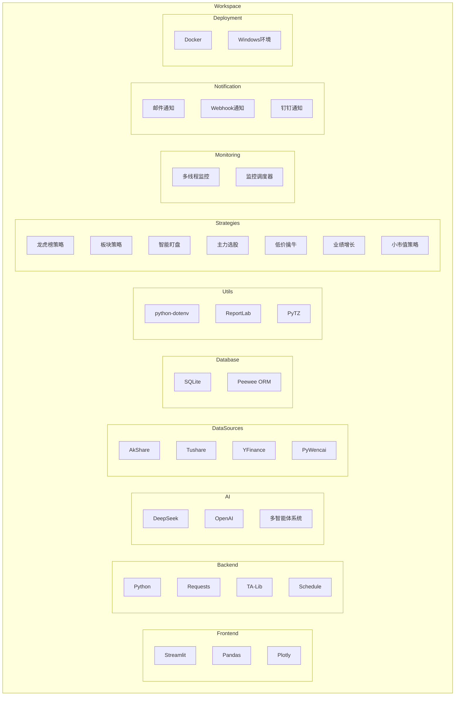

# 股票智能分析系统 - 核心技术选型

## 1. 核心技术选型图

## 2. 核心技术选型详细说明

### 2.1 前端技术
- **Streamlit**：构建交互式Web界面，用于展示分析结果、策略配置和监控状态
- **Pandas**：数据处理库，用于数据清洗、转换和分析
- **Plotly**：数据可视化库，用于创建交互式图表和可视化分析

### 2.2 后端技术
- **Python**：核心编程语言，实现所有业务逻辑
- **Requests**：HTTP客户端库，用于API调用和数据获取
- **TA-Lib**：技术分析库，提供各种技术指标计算
- **Schedule**：任务调度库，用于定时执行分析和监控任务

### 2.3 AI 技术
- **DeepSeek**：核心AI模型，为智能体提供分析能力
- **OpenAI**：可选的AI模型接口
- **多智能体系统**：协调多个专业智能体进行综合分析

### 2.4 数据源
- **AkShare**：A股市场数据获取库，提供资金流向、市场情绪等数据
- **Tushare**：金融数据接口，提供股票基础数据、财务数据等
- **YFinance**： Yahoo Finance数据接口，提供全球市场数据
- **PyWencai**：问财数据接口，提供风险数据、基本面数据等

### 2.5 数据库
- **SQLite**：轻量级数据库，用于存储分析结果、策略配置和历史记录
- **Peewee**：ORM库，简化数据库操作

### 2.6 工具库
- **python-dotenv**：环境变量管理库
- **ReportLab**：PDF生成库，用于生成分析报告
- **PyTZ**：时区处理库

### 2.7 策略模块
- **龙虎榜策略**：基于龙虎榜数据的选股策略
- **板块策略**：基于板块轮动的分析和选股策略
- **智能盯盘**：实时监控股票走势，基于AI进行决策
- **主力选股**：基于主力资金流向的选股策略
- **低价擒牛**：基于低价股的投资策略
- **业绩增长**：基于业绩增长的选股策略
- **小市值策略**：基于小市值股票的投资策略

### 2.8 监控系统
- **多线程监控**：使用多线程技术，支持同时监控多只股票
- **监控调度器**：管理多个监控任务，支持定时和触发式监控

### 2.9 通知系统
- **邮件通知**：通过邮件发送分析结果和交易信号
- **Webhook通知**：通过Webhook发送通知，支持自定义回调
- **钉钉通知**：通过钉钉机器人发送通知，支持关键词过滤

### 2.10 部署环境
- **Docker**：容器化部署，简化环境配置
- **Windows环境**：支持在Windows系统上运行

## 3. 技术选型特点

### 3.1 前端技术
- **Streamlit**：快速构建数据应用，无需前端开发经验
- **Pandas**：强大的数据处理能力，支持复杂数据操作
- **Plotly**：交互式可视化，提升用户体验

### 3.2 后端技术
- **Python**：简洁易读，生态丰富，适合金融分析
- **Requests**：轻量级HTTP客户端，易于集成各种API
- **TA-Lib**：专业的技术分析库，提供全面的技术指标
- **Schedule**：简单易用的任务调度库，支持复杂的定时任务

### 3.3 AI 技术
- **DeepSeek**：先进的大语言模型，提供高质量的分析能力
- **多智能体系统**：专业分工，协作分析，提高分析深度和广度

### 3.4 数据源
- **多数据源整合**：通过多个数据源获取全面的市场数据
- **数据源冗余**：当一个数据源失败时，自动切换到其他数据源
- **实时数据**：支持获取实时行情和市场数据

### 3.5 数据库
- **SQLite**：轻量级，无需单独部署，适合本地应用
- **Peewee**：简化数据库操作，提高开发效率

### 3.6 工具库
- **python-dotenv**：环境变量管理，提高配置灵活性
- **ReportLab**：专业的PDF生成库，支持复杂报告格式
- **PyTZ**：时区处理，确保时间数据的准确性

### 3.7 策略模块
- **多样化策略**：提供多种投资策略，满足不同投资需求
- **模块化设计**：策略之间相互独立，易于扩展和维护
- **AI增强**：结合AI技术，提高策略的智能化水平

### 3.8 监控系统
- **实时监控**：支持实时监控股票走势和市场变化
- **多线程**：高效处理多个监控任务
- **调度灵活**：支持多种监控模式和触发条件

### 3.9 通知系统
- **多渠道通知**：支持多种通知方式，适应不同场景需求
- **智能通知**：仅在重要信号时发送通知，减少干扰
- **自定义通知**：支持自定义通知内容和触发条件

### 3.10 部署环境
- **Docker**：容器化部署，简化环境配置和迁移
- **Windows兼容**：支持在Windows系统上运行，扩大用户群体

## 4. 技术架构优势

1. **技术栈成熟**：使用成熟的Python生态系统，稳定性高
2. **AI驱动**：结合先进的AI技术，提供智能化分析能力
3. **多数据源**：整合多个数据源，提高数据可靠性和完整性
4. **模块化设计**：清晰的模块划分，易于维护和扩展
5. **实时监控**：多线程实时监控，及时捕捉市场变化
6. **灵活部署**：支持Docker容器化和Windows环境，适应不同部署需求
7. **用户友好**：Streamlit前端，提供直观的用户界面
8. **多样化策略**：提供多种投资策略，满足不同投资需求
9. **智能通知**：多渠道智能通知，及时传递重要信息
10. **风险控制**：内置风险管理机制，提高投资安全性

## 5. 技术选型决策依据

1. **易用性**：选择易于使用和学习的技术，降低开发和维护成本
2. **性能**：确保系统在处理实时数据和多任务时的性能
3. **可靠性**：选择成熟稳定的技术，确保系统的可靠性
4. **扩展性**：考虑系统的未来扩展需求，选择具有良好扩展性的技术
5. **社区支持**：选择有活跃社区支持的技术，便于解决问题和获取资源
6. **成本**：考虑技术的使用成本，选择性价比高的解决方案
7. **功能需求**：根据系统的功能需求，选择最适合的技术
8. **兼容性**：确保各技术之间的兼容性，避免集成问题

通过以上技术选型，股票智能分析系统实现了智能化、实时化、全面化的股票分析和监控能力，为投资者提供科学的决策支持。