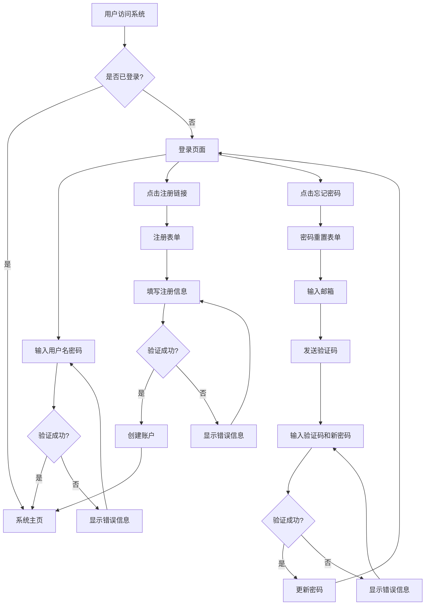

# 股票智能分析系统 - 登录页面PRD文档

## 1. 产品概览

登录页面是股票智能分析系统的用户访问入口，提供用户身份认证、注册和密码管理功能，确保系统安全性和用户数据隔离。

- **核心目标**：为用户提供安全、便捷的系统访问方式，支持用户身份认证和账户管理
- **价值**：增强系统安全性，实现用户数据隔离，为后续的个性化功能和权限管理奠定基础
- **目标用户**：系统的所有使用人员，包括个人投资者、分析师和管理员

## 2. 核心功能

### 2.1 功能模块

登录页面包含以下核心功能模块：

1. **登录模块**：用户身份认证，支持用户名/密码登录
2. **注册模块**：新用户账户创建，包含基本信息填写和验证
3. **密码重置模块**：用户密码找回功能，通过邮箱验证方式实现
4. **系统集成模块**：与现有系统的认证流程集成，确保无缝切换

### 2.2 页面详情

| 页面名称 | 模块名称 | 功能描述 |
|---------|---------|----------|
| 登录页面 | 登录表单 | 1. 输入用户名和密码 2. 点击登录按钮进行认证 3. 显示登录状态和错误信息 4. 提供注册和忘记密码链接 |
| 登录页面 | 注册表单 | 1. 输入用户名、密码、确认密码、邮箱 2. 点击注册按钮创建账户 3. 显示注册状态和错误信息 4. 提供返回登录链接 |
| 登录页面 | 密码重置表单 | 1. 输入注册邮箱 2. 点击发送验证码按钮 3. 输入验证码和新密码 4. 点击重置按钮完成密码修改 5. 提供返回登录链接 |
| 系统集成 | 认证流程 | 1. 验证用户身份后跳转到系统主页 2. 保持用户登录状态 3. 提供登出功能 4. 确保认证失败不影响系统稳定性 |

## 3. Core Process

### 用户登录流程

1. 用户访问系统URL
2. 系统检查用户登录状态
3. 未登录状态下显示登录页面
4. 用户输入用户名和密码
5. 系统验证用户凭证
6. 验证成功后跳转到系统主页
7. 验证失败显示错误信息

### 用户注册流程

1. 用户点击登录页面的注册链接
2. 显示注册表单
3. 用户填写注册信息
4. 系统验证信息合法性
5. 验证通过后创建用户账户
6. 自动登录并跳转到系统主页
7. 验证失败显示错误信息

### 密码重置流程

1. 用户点击登录页面的忘记密码链接
2. 显示密码重置表单
3. 用户输入注册邮箱
4. 系统发送验证码到邮箱
5. 用户输入验证码和新密码
6. 系统验证并更新密码
7. 显示重置成功信息并跳转到登录页面

## 4. 用户接口设计

### 4.1 设计风格

登录页面设计严格遵循系统现有的UI风格，保持视觉一致性：

- **主色调**：渐变蓝色 (#667eea 到 #764ba2)
- **辅助色**：白色、浅灰色、绿色（成功）、红色（错误）
- **按钮风格**：渐变背景、圆角设计、悬停效果
- **输入框风格**：圆角设计、边框高亮效果
- **字体**：无衬线字体，清晰易读
- **布局风格**：居中布局、卡片式设计、响应式适配
- **图标**：使用简洁的线性图标，保持风格统一

### 4.2 页面设计概览

| 页面名称 | 模块名称 | UI元素 |
|---------|---------|--------|
| 登录页面 | 登录表单 | 1. 系统Logo和名称 2. 用户名输入框（带图标） 3. 密码输入框（带图标和显示/隐藏按钮） 4. 登录按钮（渐变风格） 5. 记住我复选框 6. 忘记密码链接 7. 注册链接 8. 错误信息显示区域 |
| 登录页面 | 注册表单 | 1. 系统Logo和名称 2. 用户名输入框（带图标） 3. 密码输入框（带图标和显示/隐藏按钮） 4. 确认密码输入框（带图标） 5. 邮箱输入框（带图标） 6. 注册按钮（渐变风格） 7. 返回登录链接 8. 错误信息显示区域 |
| 登录页面 | 密码重置表单 | 1. 系统Logo和名称 2. 邮箱输入框（带图标） 3. 发送验证码按钮 4. 验证码输入框（带图标） 5. 新密码输入框（带图标和显示/隐藏按钮） 6. 确认新密码输入框（带图标） 7. 重置密码按钮（渐变风格） 8. 返回登录链接 9. 错误信息显示区域 |

### 4.3 自适应

登录页面支持响应式设计，适配不同设备屏幕：

- **桌面端**：居中显示，宽度限制在400-500px
- **平板端**：居中显示，宽度适应屏幕，左右留白
- **移动端**：全屏显示，表单元素自适应宽度

确保在各种设备上都能提供良好的用户体验，输入框大小和按钮尺寸适合触摸操作。

## 5. 技术要求

### 5.1 技术栈

- **前端**：Streamlit（与现有系统保持一致）
- **后端**：Python
- **数据库**：SQLite（.db文件格式，与现有系统保持一致）
- **认证**：基于Session的认证机制
- **安全**：密码加密存储（使用bcrypt或类似算法）

### 5.2 集成要求

- **独立模块**：登录功能采用独立调用方式实现，确保运行异常不影响主程序
- **系统集成**：与现有系统的导航和状态管理无缝集成
- **数据库集成**：使用与现有系统相同的数据库管理方式
- **错误处理**：完善的错误处理机制，确保系统稳定性

### 5.3 性能要求

- **响应时间**：登录验证响应时间不超过2秒
- **并发支持**：支持多用户同时访问登录页面
- **稳定性**：登录模块故障不影响系统其他功能

## 6. 实现计划

### 6.1 分阶段执行方案

**第一阶段**（基础登录功能）：
- 设计登录页面UI和交互逻辑
- 实现用户认证核心代码
- 设计并创建用户数据库表结构
- 集成到现有系统流程中

**第二阶段**（功能完善）：
- 实现用户注册功能
- 实现密码重置功能
- 完善错误处理和用户反馈
- 进行功能测试和优化

**第三阶段**（部署集成）：
- 与现有系统完全集成
- 进行安全测试
- 部署到生产环境
- 编写使用文档

### 6.2 开发时间表

| 阶段 | 任务 | 预计时间 |
|------|------|----------|
| 第一阶段 | 需求分析和文档编写 | 1天 |
| 第一阶段 | 页面设计和UI实现 | 1天 |
| 第一阶段 | 数据库设计和实现 | 0.5天 |
| 第一阶段 | 登录功能核心代码实现 | 1天 |
| 第一阶段 | 系统集成和测试 | 0.5天 |
| 第二阶段 | 注册功能实现 | 1天 |
| 第二阶段 | 密码重置功能实现 | 1天 |
| 第二阶段 | 功能测试和优化 | 0.5天 |
| 第三阶段 | 系统集成和安全测试 | 0.5天 |
| 第三阶段 | 部署和文档编写 | 0.5天 |

## 7. 验收标准

### 7.1 功能验收

- ✅ 登录功能：用户能够使用正确的用户名和密码登录系统
- ✅ 注册功能：新用户能够成功创建账户并自动登录
- ✅ 密码重置功能：用户能够通过邮箱验证找回密码
- ✅ 错误处理：系统能够显示清晰的错误信息
- ✅ 系统集成：登录后能够无缝跳转到系统主页

### 7.2 界面验收

- ✅ UI风格一致性：登录页面与现有系统风格一致
- ✅ 响应式设计：在不同设备上显示正常
- ✅ 交互体验：操作流畅，反馈及时
- ✅ 视觉效果：美观大方，符合现代设计标准

### 7.3 技术验收

- ✅ 代码质量：代码结构清晰，注释完善
- ✅ 安全性：密码加密存储，无安全漏洞
- ✅ 稳定性：登录模块运行稳定，不影响系统其他功能
- ✅ 性能：响应速度快，用户体验良好

## 8. 风险评估

### 8.1 潜在风险

1. **系统集成风险**：登录模块与现有系统的集成可能存在兼容性问题
2. **安全风险**：密码存储和传输过程中的安全隐患
3. **性能风险**：登录验证过程可能影响系统响应速度
4. **用户体验风险**：登录流程设计不合理可能影响用户体验

### 8.2 风险缓解措施

1. **系统集成风险**：
   - 采用独立模块设计，确保故障隔离
   - 充分测试集成点，确保兼容性

2. **安全风险**：
   - 使用bcrypt等安全算法加密存储密码
   - 实现输入验证，防止SQL注入等攻击
   - 限制登录尝试次数，防止暴力破解

3. **性能风险**：
   - 优化数据库查询，提高验证速度
   - 实现缓存机制，减少重复验证

4. **用户体验风险**：
   - 设计简洁直观的登录流程
   - 提供清晰的错误提示和用户引导
   - 支持响应式设计，适配不同设备

## 9. 依赖关系

### 9.1 技术依赖

- **Streamlit**：前端框架，用于构建登录页面UI
- **SQLite**：数据库，用于存储用户信息
- **bcrypt**：密码加密库，用于安全存储密码
- **Python标准库**：用于实现核心功能

### 9.2 系统依赖

- **现有系统架构**：登录模块需要与现有系统的导航和状态管理集成
- **数据库管理**：使用与现有系统相同的数据库管理方式
- **配置管理**：遵循现有系统的配置管理规范

## 10. 附录

### 10.1 术语定义

| 术语 | 解释 |
|------|------|
| 用户名 | 用户登录系统的唯一标识 |
| 密码 | 用户登录系统的安全凭证 |
| 邮箱 | 用户注册和密码重置时使用的联系方式 |
| 验证码 | 用于验证用户身份的临时随机码 |
| 会话 | 用户登录后在服务器端保持的状态 |
| 认证 | 验证用户身份的过程 |
| 授权 | 确定用户权限范围的过程 |

### 10.2 参考文档

- 《股票智能分析系统 - 技术架构文档》
- 《股票智能分析系统 - 前端开发规范》
- 《股票智能分析系统 - 数据库设计规范》
- Streamlit官方文档
- SQLite官方文档

### 10.3 联系方式

- 产品负责人：[姓名]
- 技术负责人：[姓名]
- 开发团队：[团队名称]

---

**文档版本**：1.0
**创建日期**：2026-01-08
**最后更新**：2026-01-08