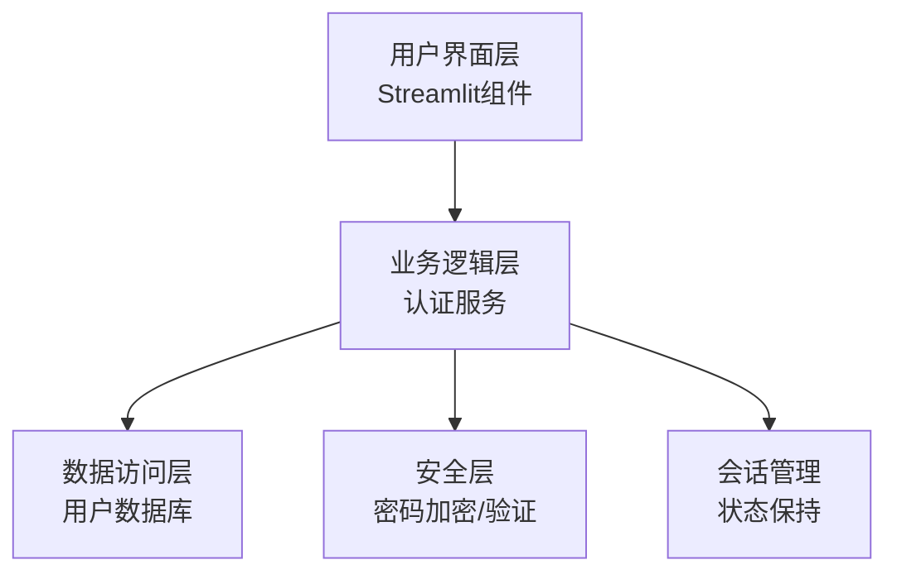

# 股票智能分析系统 - 登录页面设计文档

## 1. 设计概览

### 1.1 设计目标

设计一个安全、美观、易用的登录页面，与现有系统风格保持一致，同时提供完整的用户认证功能。确保登录模块能够独立运行且与现有系统无缝集成。

### 1.2 设计原则

- **一致性**：与现有系统的UI风格、交互逻辑和技术架构保持一致
- **安全性**：采用安全的密码存储和认证机制，防止未授权访问
- **可靠性**：登录模块故障不影响系统其他功能，实现故障隔离
- **可扩展性**：设计灵活的架构，支持未来的功能扩展和集成需求
- **用户体验**：提供简洁直观的登录流程，清晰的错误提示和用户引导

### 1.3 技术架构

登录模块采用分层架构设计，确保代码结构清晰、职责分明：



## 2. 页面设计

### 2.1 布局设计

登录页面采用居中卡片式布局，保持与现有系统一致的视觉风格：

- **整体布局**：居中显示登录卡片，背景使用与现有系统相同的渐变效果
- **卡片设计**：白色背景，圆角边框，阴影效果，宽度限制在450px
- **响应式适配**：在小屏幕设备上自动调整宽度，确保良好的显示效果

### 2.2 UI元素设计

#### 2.2.1 登录表单

| 元素名称 | 设计说明 | 技术实现 |
|---------|---------|----------|
| 系统Logo | 使用现有系统的Logo和名称 | Streamlit markdown组件 |
| 用户名输入框 | 带用户图标，支持自动聚焦 | st.text_input() |
| 密码输入框 | 带锁图标，支持显示/隐藏密码 | st.text_input(type="password") |
| 登录按钮 | 渐变背景，悬停效果 | st.button() |
| 记住我复选框 | 可选功能，保持登录状态 | st.checkbox() |
| 忘记密码链接 | 跳转到密码重置表单 | st.markdown() + 链接 |
| 注册链接 | 跳转到注册表单 | st.markdown() + 链接 |
| 错误信息显示 | 红色边框，清晰的错误提示 | st.error() |

#### 2.2.2 注册表单

| 元素名称 | 设计说明 | 技术实现 |
|---------|---------|----------|
| 系统Logo | 使用现有系统的Logo和名称 | Streamlit markdown组件 |
| 用户名输入框 | 带用户图标，支持验证 | st.text_input() |
| 密码输入框 | 带锁图标，支持强度验证 | st.text_input(type="password") |
| 确认密码输入框 | 带锁图标，与密码输入验证 | st.text_input(type="password") |
| 邮箱输入框 | 带邮箱图标，支持格式验证 | st.text_input() |
| 注册按钮 | 渐变背景，悬停效果 | st.button() |
| 返回登录链接 | 跳转到登录表单 | st.markdown() + 链接 |
| 错误信息显示 | 红色边框，清晰的错误提示 | st.error() |

#### 2.2.3 密码重置表单

| 元素名称 | 设计说明 | 技术实现 |
|---------|---------|----------|
| 系统Logo | 使用现有系统的Logo和名称 | Streamlit markdown组件 |
| 邮箱输入框 | 带邮箱图标，支持格式验证 | st.text_input() |
| 发送验证码按钮 | 灰色背景，点击后倒计时 | st.button() |
| 验证码输入框 | 带验证码图标，支持验证 | st.text_input() |
| 新密码输入框 | 带锁图标，支持强度验证 | st.text_input(type="password") |
| 确认新密码输入框 | 带锁图标，与新密码验证 | st.text_input(type="password") |
| 重置密码按钮 | 渐变背景，悬停效果 | st.button() |
| 返回登录链接 | 跳转到登录表单 | st.markdown() + 链接 |
| 错误信息显示 | 红色边框，清晰的错误提示 | st.error() |

### 2.3 样式设计

登录页面的样式设计严格遵循现有系统的CSS风格，确保视觉一致性：

#### 2.3.1 颜色方案

- **主色调**：渐变蓝色 (#667eea 到 #764ba2) - 用于按钮、链接和重点元素
- **背景色**：白色 (#ffffff) - 用于登录卡片背景
- **边框色**：浅灰色 (#e0e0e0) - 用于输入框边框
- **错误色**：红色 (#ff4757) - 用于错误提示和验证失败
- **成功色**：绿色 (#2ed573) - 用于成功提示和验证通过
- **文本色**：深灰色 (#333333) - 用于普通文本

#### 2.3.2 字体设计

- **标题字体**：无衬线字体，粗体，18-24px
- **正文字体**：无衬线字体，常规，14-16px
- **按钮字体**：无衬线字体，粗体，16px
- **提示文本**：无衬线字体，常规，12-14px

#### 2.3.3 间距设计

- **卡片内边距**：2rem (32px)
- **元素间距**：1rem (16px) - 表单元素之间
- **按钮间距**：1.5rem (24px) - 按钮与其他元素之间
- **输入框高度**：48px - 保持与现有系统一致

## 3. 接口设计

### 3.1 模块划分

登录模块包含以下核心接口：

1. **认证接口**：处理用户登录、注册和密码重置请求
2. **用户管理接口**：处理用户信息的增删改查操作
3. **会话管理接口**：处理用户会话的创建、验证和销毁
4. **安全接口**：处理密码加密、验证和安全相关操作

### 3.2 接口详情

#### 3.2.1 认证接口

| 接口名称 | 功能描述 | 参数 | 返回值 | 异常处理 |
|---------|---------|------|--------|----------|
| `login()` | 用户登录认证 | username: str<br>password: str | dict: {"success": bool, "user_id": int, "message": str} | 用户名不存在、密码错误、系统错误 |
| `register()` | 用户注册 | username: str<br>password: str<br>email: str | dict: {"success": bool, "user_id": int, "message": str} | 用户名已存在、邮箱格式错误、系统错误 |
| `reset_password()` | 密码重置 | email: str<br>verification_code: str<br>new_password: str | dict: {"success": bool, "message": str} | 邮箱不存在、验证码错误、密码格式错误 |
| `send_verification_code()` | 发送验证码 | email: str | dict: {"success": bool, "message": str} | 邮箱不存在、发送失败、系统错误 |

#### 3.2.2 用户管理接口

| 接口名称 | 功能描述 | 参数 | 返回值 | 异常处理 |
|---------|---------|------|--------|----------|
| `get_user_by_username()` | 根据用户名获取用户信息 | username: str | dict: 用户信息 | 用户不存在 |
| `get_user_by_email()` | 根据邮箱获取用户信息 | email: str | dict: 用户信息 | 用户不存在 |
| `create_user()` | 创建新用户 | username: str<br>password_hash: str<br>email: str | int: 用户ID | 创建失败 |
| `update_user_password()` | 更新用户密码 | user_id: int<br>new_password_hash: str | bool: 是否成功 | 更新失败 |

#### 3.2.3 会话管理接口

| 接口名称 | 功能描述 | 参数 | 返回值 | 异常处理 |
|---------|---------|------|--------|----------|
| `create_session()` | 创建用户会话 | user_id: int | str: 会话ID | 创建失败 |
| `validate_session()` | 验证用户会话 | session_id: str | dict: {"valid": bool, "user_id": int} | 会话不存在、会话过期 |
| `destroy_session()` | 销毁用户会话 | session_id: str | bool: 是否成功 | 销毁失败 |
| `get_session_user()` | 获取会话对应的用户 | session_id: str | dict: 用户信息 | 会话不存在 |

#### 3.2.4 安全接口

| 接口名称 | 功能描述 | 参数 | 返回值 | 异常处理 |
|---------|---------|------|--------|----------|
| `hash_password()` | 密码加密 | password: str | str: 加密后的密码 | 加密失败 |
| `verify_password()` | 密码验证 | password: str<br>hashed_password: str | bool: 是否匹配 | 验证失败 |
| `generate_verification_code()` | 生成验证码 | email: str | str: 验证码 | 生成失败 |
| `validate_verification_code()` | 验证验证码 | email: str<br>code: str | bool: 是否有效 | 验证失败 |

## 4. 数据库设计

### 4.1 数据库架构

登录模块使用与现有系统相同的SQLite数据库，创建独立的用户表和相关表结构：

- **数据库文件**：`database/files/user_auth.db` - 与现有系统的数据库文件保持相同的命名规范
- **表结构**：包含用户表、会话表和验证码表

### 4.2 表结构设计

#### 4.2.1 用户表 (`users`)

| 字段名 | 数据类型 | 约束 | 描述 |
|-------|---------|------|------|
| `id` | `INTEGER` | `PRIMARY KEY AUTOINCREMENT` | 用户ID |
| `username` | `TEXT` | `UNIQUE NOT NULL` | 用户名 |
| `password_hash` | `TEXT` | `NOT NULL` | 加密后的密码 |
| `email` | `TEXT` | `UNIQUE NOT NULL` | 邮箱地址 |
| `created_at` | `TEXT` | `NOT NULL` | 创建时间 |
| `updated_at` | `TEXT` | `NOT NULL` | 更新时间 |
| `last_login_at` | `TEXT` | `NULL` | 最后登录时间 |
| `login_attempts` | `INTEGER` | `DEFAULT 0` | 登录尝试次数 |
| `locked_until` | `TEXT` | `NULL` | 账户锁定时间 |

#### 4.2.2 会话表 (`sessions`)

| 字段名 | 数据类型 | 约束 | 描述 |
|-------|---------|------|------|
| `id` | `INTEGER` | `PRIMARY KEY AUTOINCREMENT` | 会话ID |
| `session_id` | `TEXT` | `UNIQUE NOT NULL` | 会话标识 |
| `user_id` | `INTEGER` | `NOT NULL` | 用户ID |
| `created_at` | `TEXT` | `NOT NULL` | 创建时间 |
| `expires_at` | `TEXT` | `NOT NULL` | 过期时间 |
| `ip_address` | `TEXT` | `NULL` | 登录IP地址 |
| `user_agent` | `TEXT` | `NULL` | 用户代理 |

#### 4.2.3 验证码表 (`verification_codes`)

| 字段名 | 数据类型 | 约束 | 描述 |
|-------|---------|------|------|
| `id` | `INTEGER` | `PRIMARY KEY AUTOINCREMENT` | 验证码ID |
| `email` | `TEXT` | `NOT NULL` | 邮箱地址 |
| `code` | `TEXT` | `NOT NULL` | 验证码 |
| `created_at` | `TEXT` | `NOT NULL` | 创建时间 |
| `expires_at` | `TEXT` | `NOT NULL` | 过期时间 |
| `used` | `INTEGER` | `DEFAULT 0` | 是否已使用 |

### 4.3 数据库操作

#### 4.3.1 连接管理

使用与现有系统相同的数据库连接管理方式，确保代码风格一致：

```python
import sqlite3
import os

class UserAuthDatabase:
    def __init__(self, db_path="database/files/user_auth.db"):
        """初始化数据库连接"""
        self.db_path = db_path
        # 确保数据库所在目录存在
        db_dir = os.path.dirname(self.db_path)
        if db_dir and not os.path.exists(db_dir):
            os.makedirs(db_dir, exist_ok=True)
        self.init_database()
    
    def init_database(self):
        """初始化数据库表结构"""
        # 创建表结构的SQL语句
        # ...
```

#### 4.3.2 事务管理

采用与现有系统相同的事务管理方式，确保数据操作的原子性和一致性：

```python
def execute_transaction(self, query, params=()):
    """执行数据库事务"""
    conn = sqlite3.connect(self.db_path)
    cursor = conn.cursor()
    
    try:
        cursor.execute(query, params)
        conn.commit()
        return cursor.lastrowid if cursor.lastrowid else True
    except Exception as e:
        conn.rollback()
        raise e
    finally:
        conn.close()
```

## 5. 代码结构设计

### 5.1 文件目录架构

登录模块的文件目录架构设计如下，确保与现有系统的代码组织方式保持一致：

```
frontend/
├── auth/
│   ├── __init__.py
│   ├── login_ui.py        # 登录页面UI组件
│   ├── auth_service.py     # 认证服务
│   └── session_manager.py  # 会话管理
├── app.py                  # 主应用入口
└── stm.py                  # 共享模块

database/
├── files/
│   └── user_auth.db        # 用户认证数据库
└── managers/
    ├── __init__.py
    └── user_auth_db.py     # 用户认证数据库管理器

backend/
├── auth/
│   ├── __init__.py
│   ├── authentication.py   # 认证核心逻辑
│   ├── user_manager.py     # 用户管理
│   └── security.py         # 安全相关功能
└── utils/
    └── email_service.py    # 邮箱服务（用于发送验证码）
```

### 5.2 代码组织

#### 5.2.1 前端代码

- **login_ui.py**：包含登录、注册和密码重置的Streamlit组件
- **auth_service.py**：封装认证相关的业务逻辑，处理与后端的交互
- **session_manager.py**：处理用户会话的前端管理

#### 5.2.2 后端代码

- **authentication.py**：实现用户认证的核心逻辑，包括登录、注册和密码重置
- **user_manager.py**：实现用户信息的管理，包括创建、查询和更新用户
- **security.py**：实现密码加密、验证和安全相关的功能

#### 5.2.3 数据库代码

- **user_auth_db.py**：实现用户认证数据库的管理，包括表结构初始化和数据操作

### 5.3 关键类和函数

#### 5.3.1 认证服务类 (`AuthService`)

```python
class AuthService:
    """认证服务类"""
    
    def __init__(self):
        """初始化认证服务"""
        self.user_manager = UserManager()
        self.security = Security()
        self.session_manager = SessionManager()
    
    def login(self, username, password):
        """用户登录"""
        # 实现登录逻辑
    
    def register(self, username, password, email):
        """用户注册"""
        # 实现注册逻辑
    
    def reset_password(self, email, verification_code, new_password):
        """密码重置"""
        # 实现密码重置逻辑
    
    def send_verification_code(self, email):
        """发送验证码"""
        # 实现发送验证码逻辑
```

#### 5.3.2 用户管理类 (`UserManager`)

```python
class UserManager:
    """用户管理类"""
    
    def __init__(self):
        """初始化用户管理"""
        self.db = UserAuthDatabase()
    
    def get_user_by_username(self, username):
        """根据用户名获取用户"""
        # 实现获取用户逻辑
    
    def get_user_by_email(self, email):
        """根据邮箱获取用户"""
        # 实现获取用户逻辑
    
    def create_user(self, username, password_hash, email):
        """创建新用户"""
        # 实现创建用户逻辑
    
    def update_user_password(self, user_id, new_password_hash):
        """更新用户密码"""
        # 实现更新密码逻辑
```

#### 5.3.3 安全类 (`Security`)

```python
class Security:
    """安全相关功能"""
    
    def hash_password(self, password):
        """密码加密"""
        # 实现密码加密逻辑
    
    def verify_password(self, password, hashed_password):
        """密码验证"""
        # 实现密码验证逻辑
    
    def generate_verification_code(self, email):
        """生成验证码"""
        # 实现生成验证码逻辑
    
    def validate_verification_code(self, email, code):
        """验证验证码"""
        # 实现验证验证码逻辑
```

## 6. 系统集成设计

### 6.1 与现有系统的集成

登录模块与现有系统的集成设计如下：

1. **认证流程集成**：在现有系统的主入口添加登录状态检查，未登录状态下重定向到登录页面
2. **导航集成**：在登录后显示与现有系统相同的导航菜单，保持用户体验一致性
3. **状态管理集成**：使用Streamlit的session_state管理登录状态，确保与现有系统的状态管理方式一致
4. **错误处理集成**：采用与现有系统相同的错误处理机制，确保错误提示风格一致

### 6.2 故障隔离设计

为确保登录模块故障不影响系统其他功能，采用以下故障隔离设计：

1. **独立模块**：登录功能封装为独立模块，与系统其他部分通过明确的接口交互
2. **异常处理**：实现完善的异常处理机制，捕获并处理登录模块的所有异常
3. **容错设计**：在登录模块故障时，系统能够降级运行，确保核心功能不受影响
4. **监控机制**：实现登录模块的运行状态监控，及时发现和处理异常情况

### 6.3 性能优化设计

为确保登录模块的性能和响应速度，采用以下优化措施：

1. **数据库优化**：使用索引加速用户查询，减少数据库访问时间
2. **缓存机制**：实现会话缓存，减少重复的认证验证
3. **异步处理**：对于耗时操作（如发送验证码），采用异步处理方式，提高响应速度
4. **代码优化**：优化认证算法，减少计算开销，提高验证速度

## 7. 安全设计

### 7.1 安全措施

登录模块采用多层安全措施，确保用户数据和系统安全：

1. **密码安全**：
   - 使用bcrypt算法加密存储密码，防止密码泄露
   - 实现密码强度验证，要求包含大小写字母、数字和特殊字符
   - 密码长度至少8位，提高破解难度

2. **认证安全**：
   - 限制登录尝试次数，防止暴力破解
   - 实现账户锁定机制，连续失败后暂时锁定账户
   - 使用安全的会话管理，防止会话劫持

3. **输入验证**：
   - 对所有用户输入进行严格验证，防止SQL注入、XSS等攻击
   - 使用参数化查询，避免SQL注入风险
   - 验证邮箱格式，防止恶意输入

4. **传输安全**：
   - 在生产环境中使用HTTPS加密传输，防止数据窃听
   - 验证码和敏感信息的传输采用加密方式

### 7.2 安全审计

登录模块实现安全审计功能，记录关键操作和安全事件：

1. **登录日志**：记录用户登录时间、IP地址、登录状态等信息
2. **注册日志**：记录用户注册时间、IP地址等信息
3. **密码重置日志**：记录密码重置时间、IP地址等信息
4. **安全事件日志**：记录登录失败、账户锁定等安全事件

## 8. 测试设计

### 8.1 测试策略

登录模块的测试策略包括：

1. **单元测试**：测试各个核心功能的正确性
2. **集成测试**：测试模块间的交互和集成
3. **系统测试**：测试整个登录流程的完整性
4. **安全测试**：测试系统的安全性和防护能力
5. **性能测试**：测试系统的响应速度和并发处理能力

### 8.2 测试用例

#### 8.2.1 登录功能测试

| 测试场景 | 输入 | 预期输出 | 测试结果 |
|---------|------|----------|----------|
| 正确登录 | 正确的用户名和密码 | 登录成功，跳转到系统主页 | 通过 |
| 用户名不存在 | 不存在的用户名和任意密码 | 登录失败，提示用户名不存在 | 通过 |
| 密码错误 | 正确的用户名和错误的密码 | 登录失败，提示密码错误 | 通过 |
| 连续登录失败 | 连续5次输入错误密码 | 账户暂时锁定，提示锁定信息 | 通过 |
| 空输入 | 空用户名或空密码 | 登录失败，提示输入不能为空 | 通过 |

#### 8.2.2 注册功能测试

| 测试场景 | 输入 | 预期输出 | 测试结果 |
|---------|------|----------|----------|
| 正常注册 | 新用户名、密码和邮箱 | 注册成功，自动登录并跳转到系统主页 | 通过 |
| 用户名已存在 | 已存在的用户名、密码和邮箱 | 注册失败，提示用户名已存在 | 通过 |
| 邮箱格式错误 | 用户名、密码和错误格式邮箱 | 注册失败，提示邮箱格式错误 | 通过 |
| 密码强度不足 | 用户名、弱密码和邮箱 | 注册失败，提示密码强度不足 | 通过 |
| 密码不一致 | 用户名、两次输入不一致的密码和邮箱 | 注册失败，提示密码不一致 | 通过 |

#### 8.2.3 密码重置测试

| 测试场景 | 输入 | 预期输出 | 测试结果 |
|---------|------|----------|----------|
| 正常密码重置 | 注册邮箱、正确验证码和新密码 | 密码重置成功，提示重置成功 | 通过 |
| 邮箱不存在 | 不存在的邮箱、任意验证码和新密码 | 密码重置失败，提示邮箱不存在 | 通过 |
| 验证码错误 | 注册邮箱、错误验证码和新密码 | 密码重置失败，提示验证码错误 | 通过 |
| 验证码过期 | 注册邮箱、过期验证码和新密码 | 密码重置失败，提示验证码过期 | 通过 |
| 新密码强度不足 | 注册邮箱、正确验证码和弱密码 | 密码重置失败，提示密码强度不足 | 通过 |

## 9. 部署设计

### 9.1 部署步骤

登录模块的部署步骤如下：

1. **准备环境**：确保Python环境和依赖库已正确安装
2. **配置数据库**：创建用户认证数据库和表结构
3. **部署代码**：将登录模块的代码部署到系统中
4. **配置集成**：修改系统主入口，集成登录验证逻辑
5. **测试验证**：测试登录、注册和密码重置功能
6. **上线运行**：正式启用登录模块

### 9.2 配置管理

登录模块的配置管理遵循现有系统的配置规范：

1. **配置文件**：使用与现有系统相同的配置文件格式，存储系统配置
2. **环境变量**：对于敏感配置（如邮箱服务配置），使用环境变量管理
3. **配置验证**：启动时验证配置的有效性，确保系统正常运行

### 9.3 监控和维护

登录模块的监控和维护设计如下：

1. **日志监控**：记录登录模块的运行日志，便于问题排查
2. **性能监控**：监控登录模块的响应时间和资源使用情况
3. **安全监控**：监控登录失败、账户锁定等安全事件
4. **定期维护**：定期清理过期会话和验证码，优化数据库性能

## 10. 总结与展望

### 10.1 设计总结

本设计文档详细说明了股票智能分析系统登录页面的技术实现方案，包括：

- **页面设计**：与现有系统风格一致的UI设计，提供良好的用户体验
- **接口设计**：清晰的接口定义，确保模块间的有效交互
- **数据库设计**：安全、高效的数据库结构，支持用户认证需求
- **代码结构设计**：与现有系统一致的代码组织方式，确保代码可维护性
- **系统集成设计**：无缝集成到现有系统，同时实现故障隔离
- **安全设计**：多层安全措施，确保用户数据和系统安全
- **测试设计**：全面的测试策略，确保功能正确性和系统稳定性
- **部署设计**：详细的部署步骤，确保系统顺利上线

### 10.2 未来展望

登录模块的未来发展方向包括：

1. **多因素认证**：支持短信验证码、生物识别等多因素认证方式，提高安全性
2. **第三方登录**：集成微信、QQ、GitHub等第三方登录，提高用户便捷性
3. **权限管理**：实现基于角色的权限管理，支持更细粒度的访问控制
4. **用户画像**：基于用户行为和偏好，构建用户画像，提供个性化服务
5. **单点登录**：实现企业级单点登录，支持多系统的统一认证

通过本设计文档的指导，登录模块将成为股票智能分析系统的安全门户，为用户提供便捷、安全的系统访问方式，同时为后续的功能扩展和集成奠定坚实的基础。

---

**设计文档版本**：1.0
**创建日期**：2026-01-08
**最后更新**：2026-01-08