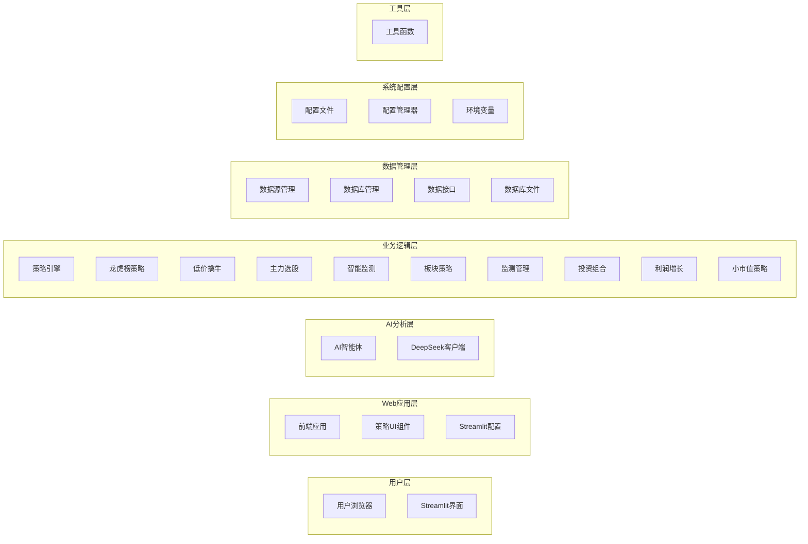
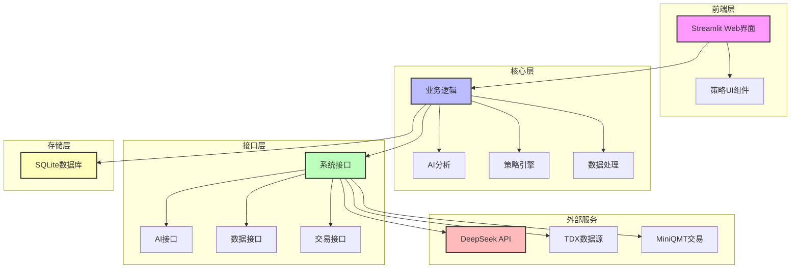

# 股票智能分析系统分层架构图

## 架构说明

### 用户层
- **用户浏览器**：用户通过主流浏览器访问系统
- **Streamlit界面**：提供直观的用户交互界面

### Web应用层
- **前端应用** (`frontend/app.py`)：Streamlit主应用入口
- **策略UI组件** (`frontend/strategies/`)：各个策略的用户界面实现
- **Streamlit配置** (`.streamlit/config.toml`)：Streamlit框架配置

### AI分析层
- **AI智能体** (`backend/ai/`)：实现各种AI分析智能体
- **DeepSeek客户端** (`interface/ai/deepseek_client.py`)：与DeepSeek API交互的客户端

### 业务逻辑层
- **策略引擎** (`backend/strategies/`)：核心业务逻辑实现
  - **龙虎榜策略** (`longhubang/`)：基于龙虎榜数据的分析策略
  - **低价擒牛** (`low_price_bull/`)：低价股票分析策略
  - **主力选股** (`main_force/`)：主力资金分析策略
  - **智能监测** (`smart_monitor/`)：智能盯盘和监测功能
  - **板块策略** (`sector_strategy/`)：板块轮动分析策略
  - **监测管理** (`monitor/`)：系统监测功能
  - **投资组合** (`portfolio/`)：投资组合构建和管理
  - **利润增长** (`profit_growth/`)：基于利润增长的选股策略
  - **小市值策略** (`small_cap/`)：小市值股票分析策略

### 数据管理层
- **数据源管理** (`backend/data/`)：多源数据的采集和管理
- **数据库管理** (`database/managers/`)：数据库操作和管理
- **数据接口** (`interface/data/`)：外部数据接口集成
- **数据库文件** (`database/files/`)：本地数据库文件存储

### 系统配置层
- **配置文件** (`config/`)：系统全局配置参数
- **配置管理器** (`interface/config/config_manager.py`)：配置管理和加载
- **环境变量** (`.env.example`)：环境变量配置模板

### 工具层
- **工具函数** (`backend/utils/`)：通用工具函数和辅助功能

## 架构特点

1. **分层清晰**：各层级职责明确，边界清晰
2. **松耦合设计**：各层级通过标准化接口交互，降低耦合度
3. **可扩展性**：新策略和功能可独立开发和集成
4. **模块化**：功能模块化实现，便于维护和测试
5. **多源数据支持**：支持多种数据源的集成和管理
6. **AI驱动**：集成DeepSeek API实现智能分析能力

---

# 股票智能分析系统 - 简洁版架构图

## 简洁版架构说明

### 1. 前端层
- **Streamlit Web界面**：提供直观的用户交互界面
- **策略UI组件**：各分析策略的前端实现

### 2. 核心层
- **业务逻辑**：系统核心功能实现
- **AI分析**：基于DeepSeek API的智能分析
- **策略引擎**：各种股票分析策略的实现
- **数据处理**：数据采集、转换和计算

### 3. 接口层
- **系统接口**：统一接口管理
- **AI接口**：与DeepSeek API的交互
- **数据接口**：与外部数据源的连接
- **交易接口**：与交易系统的集成

### 4. 存储层
- **SQLite数据库**：轻量级数据持久化存储

### 5. 外部服务
- **DeepSeek API**：提供AI分析能力
- **TDX数据源**：提供股票市场数据
- **MiniQMT交易**：提供交易功能

## 简洁版架构特点

1. **核心功能突出**：聚焦系统最关键的功能模块
2. **层次关系清晰**：各层职责和依赖关系一目了然
3. **易于理解**：简化了详细实现细节，便于快速把握系统架构
4. **技术栈明确**：清晰展示了系统使用的主要技术和服务
5. **扩展性体现**：通过分层设计展示了系统的扩展能力
