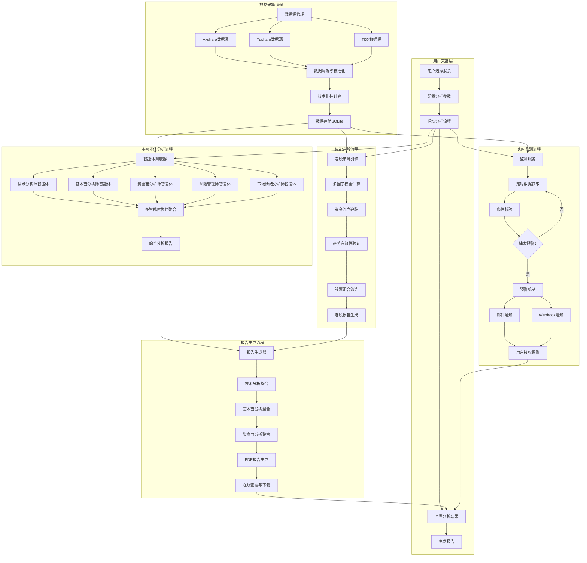
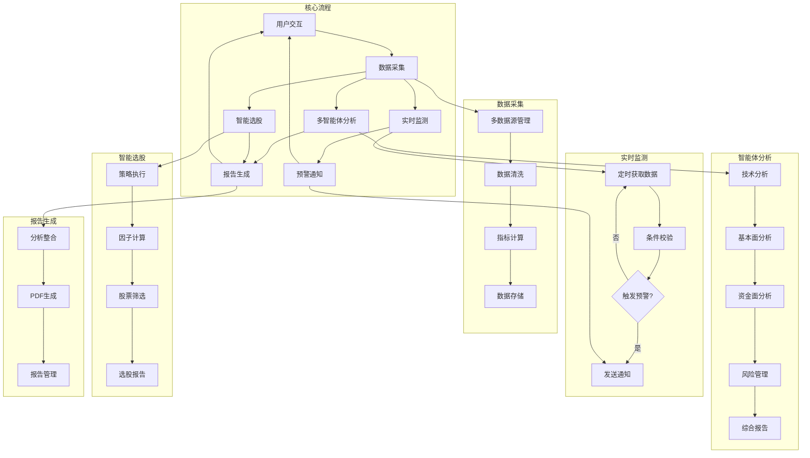
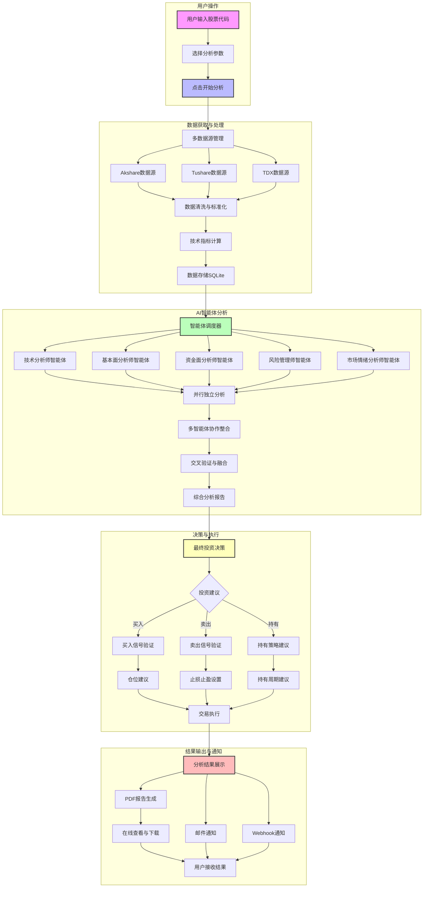
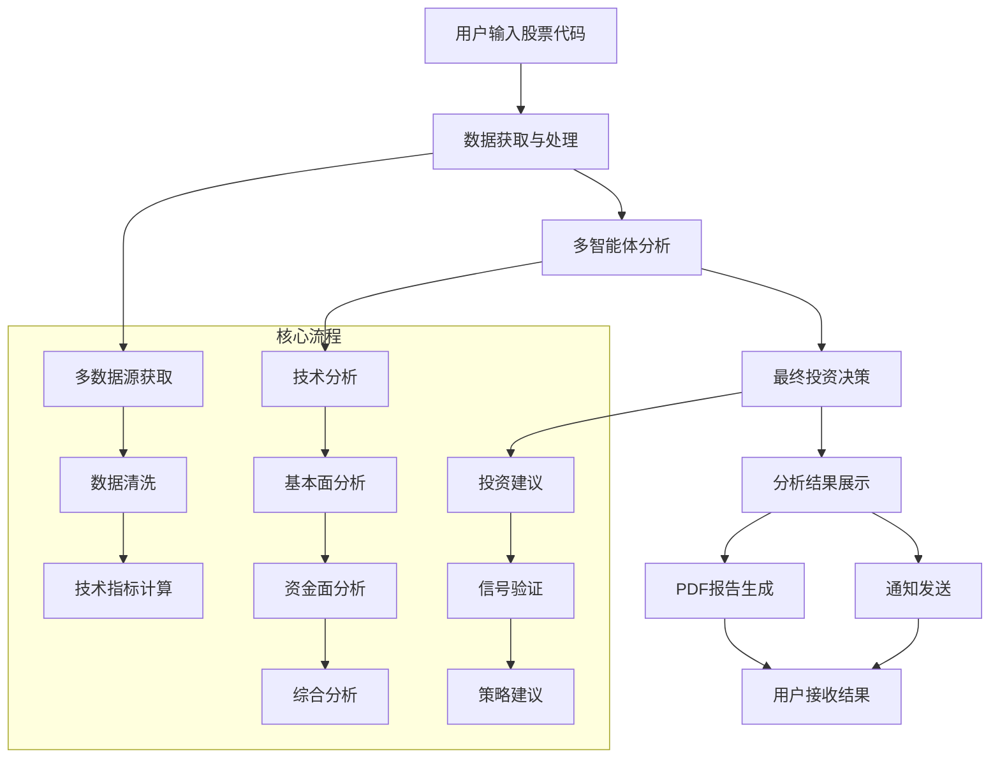
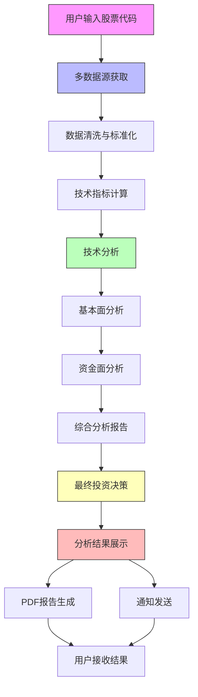
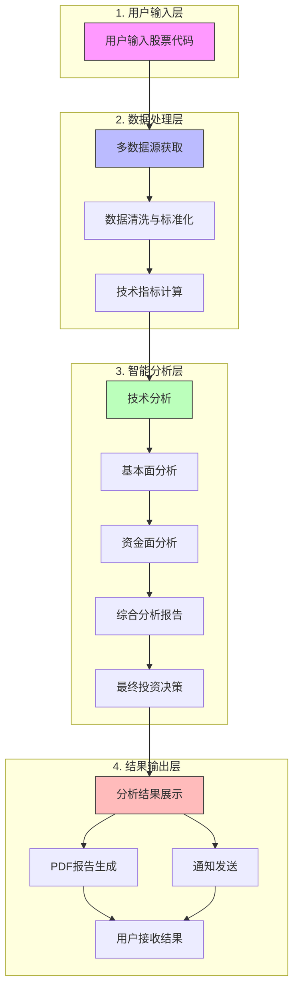

# 系统核心流程总览图

## 流程说明

基于系统实际代码结构，以下是系统的核心流程总览图，包含用户要求的五个主要流程：数据采集、多智能体分析、实时监测、智能选股和报告生成。

## 流程详情说明

### 1. 数据采集流程
- **数据源管理**：通过 `DataSourceManager` 实现，支持 Akshare、Tushare、TDX 等数据源的自动切换
- **数据清洗与标准化**：对获取的数据进行格式标准化、去重等预处理
- **技术指标计算**：自动计算各种技术指标
- **数据存储**：将处理后的数据存储到 SQLite 数据库中

### 2. 多智能体分析流程
- **智能体调度器**：根据用户配置启动不同的智能体
- **专业智能体**：包括技术分析师、基本面分析师、资金面分析师、风险管理师、市场情绪分析师
- **多智能体协作**：对各维度分析结果进行交叉验证与融合
- **综合分析报告**：生成最终的综合分析结果

### 3. 实时监测流程
- **监测服务**：通过 `monitor_service` 实现实时监测功能
- **定时数据获取**：按照配置的监测间隔获取股票数据
- **条件校验**：检查是否触发预警条件
- **预警机制**：当触发预警条件时，通过邮件、Webhook 等方式通知用户

### 4. 智能选股流程
- **选股策略引擎**：根据用户选择的策略执行选股逻辑
- **多因子分析**：计算各种因子的权重，追踪资金流向，验证趋势有效性
- **股票组合筛选**：筛选出符合策略条件的股票组合
- **选股报告**：生成包含选股逻辑和结果分析的报告

### 5. 报告生成流程
- **报告生成器**：通过 `pdf_generator` 实现报告生成功能
- **分析内容整合**：整合技术分析、基本面分析、资金面分析等核心内容
- **PDF报告生成**：生成标准化的 PDF 分析报告
- **报告管理**：支持用户在线查看、下载及分享报告

## 系统架构特点

1. **模块化设计**：各流程相对独立，便于维护和扩展
2. **数据源冗余**：支持多数据源自动切换，提高数据可靠性
3. **智能体协作**：多智能体并行分析，交叉验证提高分析质量
4. **实时监测**：支持交易时段智能调度，提高监测效率
5. **报告标准化**：生成专业的 PDF 分析报告，便于用户决策

## 技术实现要点

- **数据采集**：基于 `backend/data/data_source_manager.py` 实现多数据源管理
- **智能体分析**：基于 `backend/ai/ai_agents.py` 实现多智能体分析
- **实时监测**：基于 `backend/strategies/monitor/monitor_service.py` 实现监测功能
- **报告生成**：基于 `backend/utils/pdf_generator.py` 实现 PDF 报告生成

该流程总览图完整反映了系统的核心功能和数据流向，为系统的后续开发和维护提供了清晰的参考。

## 简化版系统核心流程总览图

以下是简化版的系统核心流程总览图，保留了核心流程但减少了细节复杂度，更加清晰易读：

### 简化版流程说明

1. **用户交互**：用户选择股票、配置参数、启动分析流程
2. **数据采集**：从多数据源获取数据，进行清洗和指标计算后存储
3. **多智能体分析**：各专业智能体并行分析，生成综合报告
4. **实时监测**：定时获取数据，触发预警时发送通知
5. **智能选股**：执行选股策略，筛选股票并生成选股报告
6. **报告生成**：整合分析结果，生成PDF报告供用户查看

简化版流程图更加突出核心流程之间的关系，便于快速理解系统整体架构。

## 股票智能分析详细流程

以下是基于系统实际实现的股票智能分析流程，详细展示了从用户输入到分析结果生成的完整过程：

### 股票智能分析流程说明

1. **用户操作**
   - 用户输入股票代码（6位数字）
   - 选择分析参数（如是否自动交易）
   - 点击开始分析按钮启动流程

2. **数据获取与处理**
   - 多数据源管理：通过 `DataSourceManager` 实现数据源自动切换
   - 数据清洗与标准化：对获取的数据进行格式标准化、去重等预处理
   - 技术指标计算：自动计算各种技术指标（MACD、RSI、布林带等）
   - 数据存储：将处理后的数据存储到 SQLite 数据库中

3. **AI智能体分析**
   - 智能体调度器：根据配置启动不同的智能体
   - 专业智能体：包括技术分析师、基本面分析师、资金面分析师、风险管理师、市场情绪分析师
   - 并行独立分析：各智能体同时分析不同维度的数据
   - 多智能体协作整合：对各维度分析结果进行交叉验证与融合
   - 综合分析报告：生成最终的综合分析结果

4. **决策与执行**
   - 最终投资决策：基于综合分析结果生成投资建议
   - 投资建议：买入、卖出或持有
   - 信号验证：验证买入/卖出信号的有效性
   - 策略建议：提供仓位、止损止盈、持有周期等具体建议
   - 交易执行：如果开启自动交易，AI会自动执行交易决策

5. **结果输出与通知**
   - 分析结果展示：在界面上显示详细的分析结果
   - PDF报告生成：生成标准化的 PDF 分析报告
   - 通知发送：通过邮件、Webhook 等方式发送分析结果和预警
   - 用户接收：用户在线查看、下载报告，接收通知

### 系统特色

1. **多数据源冗余**：支持 Akshare、Tushare、TDX 等多数据源，提高数据可靠性
2. **多智能体并行分析**：多个专业智能体同时分析，提供全方位视角
3. **智能体协作整合**：通过交叉验证和融合，提高分析质量
4. **标准化报告生成**：自动生成专业的 PDF 分析报告
5. **多渠道通知**：支持邮件、Webhook 等多种通知方式
6. **自动交易支持**：可选择开启自动交易，AI 自动执行交易决策

该流程完整反映了系统的实际股票智能分析过程，从数据获取到最终决策执行的全流程。

## 股票智能分析简化流程

以下是股票智能分析的简化版流程图，只保留了核心流程内容：

### 简化流程说明

1. **用户输入**：用户输入股票代码启动分析
2. **数据处理**：从多数据源获取数据，进行清洗和指标计算
3. **智能体分析**：技术分析、基本面分析、资金面分析的综合
4. **投资决策**：生成投资建议，验证信号，提供策略建议
5. **结果输出**：展示分析结果，生成PDF报告，发送通知
6. **用户接收**：用户查看分析结果，下载报告，接收通知

简化版流程图更加突出核心流程步骤，便于快速理解股票智能分析的主要过程。

## 股票智能分析垂直简化流程

以下是从上到下流程的股票智能分析简化版流程图：

### 垂直流程说明

1. **用户输入**：用户输入股票代码启动分析流程
2. **数据获取**：从多个数据源获取股票相关数据
3. **数据处理**：对获取的数据进行清洗、标准化和技术指标计算
4. **智能分析**：依次进行技术分析、基本面分析和资金面分析
5. **综合分析**：生成综合分析报告和最终投资决策
6. **结果输出**：展示分析结果，生成PDF报告，发送通知
7. **用户接收**：用户查看分析结果，下载报告，接收通知

垂直流程更加直观地展示了股票智能分析的顺序过程，从数据输入到最终结果的完整链路。

## 股票智能分析四层垂直流程

以下是基于系统实际架构的四层垂直简化流程图：

### 四层流程说明

1. **用户输入层**：用户输入股票代码启动分析流程
2. **数据处理层**：从多数据源获取数据，进行清洗、标准化和技术指标计算
3. **智能分析层**：依次进行技术分析、基本面分析、资金面分析，生成综合分析报告和最终投资决策
4. **结果输出层**：展示分析结果，生成PDF报告，发送通知，用户接收最终结果

此流程图基于系统的实际架构分层，更加清晰地展示了股票智能分析的核心流程和层次关系。