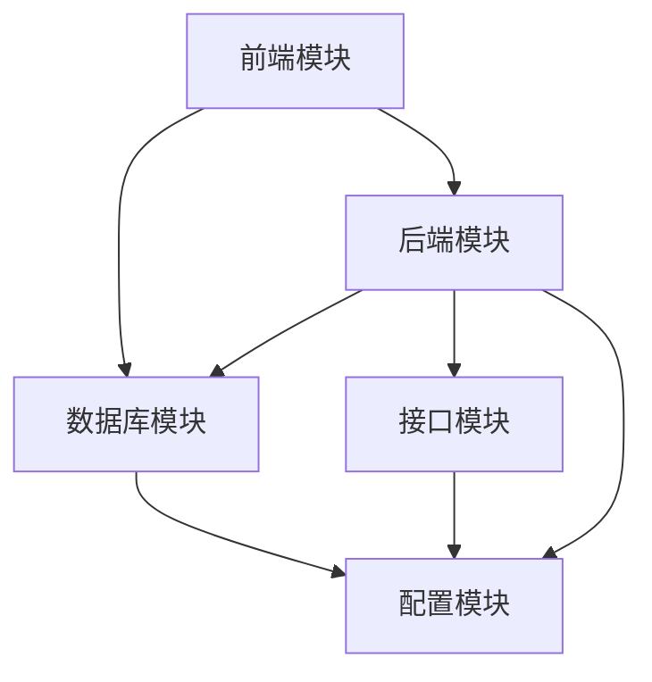

# 股票智能分析系统 - 代码架构重构方案

## 1. 项目现状分析

### 1.1 项目概述

股票智能分析系统是一个基于Streamlit的股票分析平台，集成了多数据源、多策略分析、AI辅助决策等功能。系统目前采用扁平化的目录结构，所有文件直接存放在根目录下，随着功能的不断扩展，代码组织变得日益复杂，不利于后续的维护和开发。

### 1.2 当前目录结构

```
aiagents-stock-main/
├── app.py                  # 主应用入口
├── stock_data.py           # 股票数据获取与分析
├── ai_agents.py            # 多智能体AI分析系统
├── monitor_db.py           # 监测数据库管理
├── database.py             # 分析记录数据库管理
├── config.py               # 系统配置
├── model_config.py         # AI模型配置
├── config_manager.py       # 配置管理器
├── data_source_manager.py  # 数据源管理器
├── notification_service.py # 通知服务
├── deepseek_client.py      # DeepSeek AI客户端
├── miniqmt_interface.py    # MiniQMT交易接口
├── pdf_generator.py        # PDF报告生成
├── pdf_generator_fixed.py  # PDF生成修复版
├── pdf_generator_pandoc.py # Pandoc PDF生成
├── test_tdx_api.py         # TDX API测试
├── update_env_example.py   # 环境配置示例更新

├── 启动系统.bat            # 启动批处理文件
├── Dockerfile              # Docker构建文件
├── Dockerfile国际源版      # 国际源Docker构建文件
├── docker-compose.yml      # Docker Compose配置
├── requirements.txt        # 依赖包列表
├── README.md               # 项目说明
├── BUILD_CN.md             # 中文构建说明
├── .env.example            # 环境变量示例
├── env_example.txt         # 环境配置示例
├── .gitignore              # Git忽略文件
├── .dockerignore           # Docker忽略文件
├── monitor_schedule_config.json # 监测调度配置
├── risk_data_debug_output.txt   # 风险数据调试输出
├── __pycache__/            # Python缓存目录
├── .streamlit/             # Streamlit配置目录
├── docs/                   # 文档目录
├── docx-new/               # 新建文档目录
├── longhubang.db           # 龙虎榜数据库
├── main_force_batch.db     # 主力批量数据库
├── portfolio_stocks.db     # 投资组合数据库
├── profit_growth_monitor.db # 净利增长监测数据库
├── sector_strategy.db      # 板块策略数据库
├── smart_monitor.db        # 智能盯盘数据库
├── stock_analysis.db       # 股票分析数据库
├── stock_monitor.db        # 股票监测数据库
├── low_price_bull_monitor.db # 低价擒牛监测数据库
├── low_price_bull_monitor.py # 低价擒牛监测
├── low_price_bull_selector.py # 低价擒牛选股
├── low_price_bull_service.py # 低价擒牛服务
├── low_price_bull_strategy.py # 低价擒牛策略
├── low_price_bull_ui.py    # 低价擒牛界面
├── low_price_bull_monitor_ui.py # 低价擒牛监测界面
├── main_force_analysis.py  # 主力分析
├── main_force_batch_db.py  # 主力批量数据库管理
├── main_force_history_ui.py # 主力历史界面
├── main_force_pdf_generator.py # 主力PDF生成
├── main_force_selector.py  # 主力选股
├── main_force_ui.py        # 主力界面
├── market_sentiment_data.py # 市场情绪数据
├── longhubang_agents.py     # 龙虎榜智能体
├── longhubang_data.py      # 龙虎榜数据
├── longhubang_db.py        # 龙虎榜数据库管理
├── longhubang_engine.py     # 龙虎榜引擎
├── longhubang_pdf.py        # 龙虎榜PDF生成
├── longhubang_scoring.py    # 龙虎榜评分
├── longhubang_ui.py         # 龙虎榜界面
├── portfolio_db.py          # 投资组合数据库管理
├── portfolio_manager.py     # 投资组合管理器
├── portfolio_scheduler.py   # 投资组合调度
├── portfolio_ui.py          # 投资组合界面
├── profit_growth_monitor.py # 净利增长监测
├── profit_growth_selector.py # 净利增长选股
├── profit_growth_ui.py      # 净利增长界面
├── qstock_news_data.py      # 新闻数据
├── quarterly_report_data.py # 季报数据
├── risk_data_fetcher.py     # 风险数据获取
├── sector_strategy_agents.py # 板块策略智能体
├── sector_strategy_data.py  # 板块策略数据
├── sector_strategy_db.py    # 板块策略数据库管理
├── sector_strategy_engine.py # 板块策略引擎
├── sector_strategy_pdf.py   # 板块策略PDF生成
├── sector_strategy_scheduler.py # 板块策略调度
├── sector_strategy_ui.py    # 板块策略界面
├── small_cap_selector.py    # 小市值选股
├── small_cap_ui.py          # 小市值界面
├── smart_monitor_data.py    # 智能盯盘数据
├── smart_monitor_db.py      # 智能盯盘数据库管理
├── smart_monitor_deepseek.py # 智能盯盘DeepSeek
├── smart_monitor_engine.py  # 智能盯盘引擎
├── smart_monitor_kline.py   # 智能盯盘K线
├── smart_monitor_qmt.py     # 智能盯盘QMT
├── smart_monitor_tdx_data.py # 智能盯盘TDX数据
├── smart_monitor_ui.py      # 智能盯盘界面
├── stm.py                   # 智能盯盘模块
├── fund_flow_akshare.py     # 资金流向数据
├── news_announcement_data.py # 新闻公告数据
├── monitor_manager.py       # 监测管理器
├── monitor_scheduler.py     # 监测调度
├── monitor_service.py       # 监测服务
├── monitor_ui.py            # 监测界面
```

### 1.3 存在的问题

1. **代码组织混乱**：所有文件都存放在根目录，缺乏明确的分类
2. **依赖关系复杂**：文件间相互引用，难以理清调用关系
3. **维护难度大**：新增功能需要修改多个文件，容易引入错误
4. **扩展性差**：新功能模块难以集成到现有架构中
5. **测试困难**：无法针对特定模块进行独立测试

## 2. 重构目标

### 2.1 重构原则

1. **模块化设计**：将系统划分为清晰的功能模块，只移动文件，修改模块调用
2. **职责分离**：每个模块只负责特定的功能领域
3. **高内聚低耦合**：模块内部高度内聚，模块间松耦合
4. **可维护性**：代码结构清晰，易于理解和维护
5. **可扩展性**：便于后续功能的扩展和集成

### 2.2 重构后目录结构

```
aiagents-stock-main/
├── frontend/                 # 前端代码文件夹
│   ├── app.py                # 主Streamlit应用
│   ├── stm.py                # Streamlit工具模块
│   ├── strategies/           # 策略模块UI
│   │   ├── main_force_ui.py
│   │   ├── main_force_history_ui.py
│   │   ├── low_price_bull_ui.py
│   │   ├── low_price_bull_monitor_ui.py
│   │   ├── longhubang_ui.py
│   │   ├── sector_strategy_ui.py
│   │   ├── smart_monitor_ui.py
│   │   ├── monitor_ui.py
│   │   ├── portfolio_ui.py
│   │   ├── profit_growth_ui.py
│   │   └── small_cap_ui.py
│   └── config/               # 前端配置
│       └── config.toml       # Streamlit配置
├── backend/                  # 后端功能模块代码文件夹
│   ├── data/                 # 数据管理模块
│   │   ├── stock_data.py
│   │   ├── data_source_manager.py
│   │   ├── fund_flow_akshare.py
│   │   ├── market_sentiment_data.py
│   │   ├── news_announcement_data.py
│   │   ├── qstock_news_data.py
│   │   ├── quarterly_report_data.py
│   │   └── risk_data_fetcher.py
│   ├── ai/                   # AI分析模块
│   │   ├── ai_agents.py
│   │   ├── longhubang_agents.py
│   │   └── sector_strategy_agents.py
│   ├── strategies/           # 策略实现模块
│   │   ├── main_force/
│   │   │   ├── main_force_analysis.py
│   │   │   ├── main_force_selector.py
│   │   │   └── main_force_batch_db.py
│   │   ├── low_price_bull/
│   │   │   ├── low_price_bull_strategy.py
│   │   │   ├── low_price_bull_selector.py
│   │   │   ├── low_price_bull_service.py
│   │   │   └── low_price_bull_monitor.py
│   │   ├── longhubang/
│   │   │   ├── longhubang_data.py
│   │   │   ├── longhubang_engine.py
│   │   │   ├── longhubang_scoring.py
│   │   │   └── longhubang_db.py
│   │   ├── sector_strategy/
│   │   │   ├── sector_strategy_data.py
│   │   │   ├── sector_strategy_engine.py
│   │   │   └── sector_strategy_db.py
│   │   ├── smart_monitor/
│   │   │   ├── smart_monitor_data.py
│   │   │   ├── smart_monitor_engine.py
│   │   │   ├── smart_monitor_kline.py
│   │   │   └── smart_monitor_deepseek.py
│   │   ├── monitor/
│   │   │   ├── monitor_manager.py
│   │   │   ├── monitor_service.py
│   │   │   └── monitor_scheduler.py
│   │   ├── portfolio/
│   │   │   ├── portfolio_manager.py
│   │   │   └── portfolio_scheduler.py
│   │   ├── profit_growth/
│   │   │   ├── profit_growth_selector.py
│   │   │   └── profit_growth_monitor.py
│   │   └── small_cap/
│   │       └── small_cap_selector.py
│   └── utils/                # 工具模块
│       ├── notification_service.py
│       ├── pdf_generator.py
│       ├── pdf_generator_fixed.py
│       ├── pdf_generator_pandoc.py
│       ├── longhubang_pdf.py
│       ├── main_force_pdf_generator.py
│       └── sector_strategy_pdf.py
├── database/                 # 数据库存储文件夹
│   ├── managers/             # 数据库管理模块
│   │   ├── database.py
│   │   ├── monitor_db.py
│   │   ├── portfolio_db.py
│   │   ├── smart_monitor_db.py
│   │   ├── longhubang_db.py
│   │   └── sector_strategy_db.py
│   └── files/                # 数据库文件
│       ├── stock_analysis.db
│       ├── stock_monitor.db
│       ├── portfolio_stocks.db
│       ├── smart_monitor.db
│       ├── longhubang.db
│       ├── low_price_bull_monitor.db
│       ├── main_force_batch.db
│       ├── profit_growth_monitor.db
│       └── sector_strategy.db
├── interface/                # 接口功能代码文件夹
│   ├── ai/                   # AI模型接口
│   │   ├── deepseek_client.py
│   │   ├── smart_monitor_deepseek.py
│   │   └── model_config.py
│   ├── data/                 # 数据源接口
│   │   ├── smart_monitor_tdx_data.py
│   │   └── test_tdx_api.py
│   ├── trading/              # 交易接口
│   │   ├── miniqmt_interface.py
│   │   └── smart_monitor_qmt.py
│   └── config/               # 配置接口
│       ├── config_manager.py
├── config/                   # 系统配置
│   ├── config.py
│   ├── model_config.py
│   └── monitor_schedule_config.json
├── docs/                     # 文档文件夹
├── docx-new/                 # 新增文档文件夹
├── .dockerignore             # Docker构建忽略文件
├── .env.example              # 环境变量示例文件
├── .gitignore                # Git忽略文件
├── BUILD_CN.md               # 构建指南
├── Dockerfile                # Docker构建文件
├── Dockerfile国际源版         # 国际源Docker构建文件
├── docker-compose.yml        # Docker Compose配置
├── env_example.txt           # 环境变量示例文件
├── monitor_schedule_config.json # 监测调度配置
├── README.md                 # 项目说明文档
├── requirements.txt          # Python依赖包列表
└── 启动系统.bat              # Windows启动脚本
```

## 3. 详细重构计划

### 3.1 模块划分

| 模块 | 职责 | 包含文件 |
|------|------|----------|
| 前端 | 用户界面、交互逻辑 | app.py, *_ui.py, monitor_ui.py |
| 后端 | 业务逻辑、数据处理 | stock_data.py, *_analysis.py, *_strategy.py, *_service.py |
| 数据库 | 数据存储、数据管理 | *.db, *_db.py, database.py |
| 接口 | 外部服务、模型调用 | deepseek_client.py, miniqmt_interface.py, notification_service.py |

### 3.2 文件移动计划

#### 3.2.1 前端文件移动

| 当前路径 | 目标路径 | 说明 |
|----------|----------|------|
| app.py | frontend/app.py | 主Streamlit应用 |
| run.py | run.py | 应用启动脚本（保留在根目录） |
| stm.py | frontend/stm.py | Streamlit工具模块 |
| main_force_ui.py | frontend/strategies/main_force_ui.py | 主力选股UI |
| main_force_history_ui.py | frontend/strategies/main_force_history_ui.py | 主力选股历史记录UI |
| low_price_bull_ui.py | frontend/strategies/low_price_bull_ui.py | 低价擒牛UI |
| low_price_bull_monitor_ui.py | frontend/strategies/low_price_bull_monitor_ui.py | 低价擒牛监测UI |
| longhubang_ui.py | frontend/strategies/longhubang_ui.py | 龙虎榜分析UI |
| sector_strategy_ui.py | frontend/strategies/sector_strategy_ui.py | 板块分析UI |
| smart_monitor_ui.py | frontend/strategies/smart_monitor_ui.py | 智能盯盘UI |
| monitor_ui.py | frontend/strategies/monitor_ui.py | 实时监测UI |
| portfolio_ui.py | frontend/strategies/portfolio_ui.py | 持仓分析UI |
| profit_growth_ui.py | frontend/strategies/profit_growth_ui.py | 净利增长UI |
| small_cap_ui.py | frontend/strategies/small_cap_ui.py | 小市值策略UI |
| .streamlit/config.toml | frontend/config/config.toml | Streamlit配置文件 |

#### 3.2.2 后端文件移动

| 当前路径 | 目标路径 | 说明 |
|----------|----------|------|
| stock_data.py | backend/data/stock_data.py | 股票数据处理 |
| data_source_manager.py | backend/data/data_source_manager.py | 数据源管理 |
| fund_flow_akshare.py | backend/data/fund_flow_akshare.py | 资金流向数据 |
| market_sentiment_data.py | backend/data/market_sentiment_data.py | 市场情绪数据 |
| news_announcement_data.py | backend/data/news_announcement_data.py | 新闻公告数据 |
| qstock_news_data.py | backend/data/qstock_news_data.py | 新闻数据 |
| quarterly_report_data.py | backend/data/quarterly_report_data.py | 季报数据 |
| risk_data_fetcher.py | backend/data/risk_data_fetcher.py | 风险数据 |
| ai_agents.py | backend/ai/ai_agents.py | AI分析系统 |
| longhubang_agents.py | backend/ai/longhubang_agents.py | 龙虎榜AI分析 |
| sector_strategy_agents.py | backend/ai/sector_strategy_agents.py | 板块分析AI |
| main_force_analysis.py | backend/strategies/main_force/main_force_analysis.py | 主力资金分析 |
| main_force_selector.py | backend/strategies/main_force/main_force_selector.py | 主力选股逻辑 |
| main_force_batch_db.py | backend/strategies/main_force/main_force_batch_db.py | 主力选股批量分析 |
| low_price_bull_strategy.py | backend/strategies/low_price_bull/low_price_bull_strategy.py | 低价擒牛策略 |
| low_price_bull_selector.py | backend/strategies/low_price_bull/low_price_bull_selector.py | 低价擒牛选股 |
| low_price_bull_service.py | backend/strategies/low_price_bull/low_price_bull_service.py | 低价擒牛服务 |
| low_price_bull_monitor.py | backend/strategies/low_price_bull/low_price_bull_monitor.py | 低价擒牛监测 |
| longhubang_data.py | backend/strategies/longhubang/longhubang_data.py | 龙虎榜数据 |
| longhubang_engine.py | backend/strategies/longhubang/longhubang_engine.py | 龙虎榜分析引擎 |
| longhubang_scoring.py | backend/strategies/longhubang/longhubang_scoring.py | 龙虎榜评分 |
| sector_strategy_data.py | backend/strategies/sector_strategy/sector_strategy_data.py | 板块数据 |
| sector_strategy_engine.py | backend/strategies/sector_strategy/sector_strategy_engine.py | 板块分析引擎 |
| smart_monitor_data.py | backend/strategies/smart_monitor/smart_monitor_data.py | 智能盯盘数据 |
| smart_monitor_engine.py | backend/strategies/smart_monitor/smart_monitor_engine.py | 智能盯盘引擎 |
| smart_monitor_kline.py | backend/strategies/smart_monitor/smart_monitor_kline.py | 智能盯盘K线分析 |
| smart_monitor_deepseek.py | backend/strategies/smart_monitor/smart_monitor_deepseek.py | 智能盯盘DeepSeek集成 |
| monitor_manager.py | backend/strategies/monitor/monitor_manager.py | 监测管理器 |
| monitor_service.py | backend/strategies/monitor/monitor_service.py | 监测服务 |
| monitor_scheduler.py | backend/strategies/monitor/monitor_scheduler.py | 监测调度器 |
| portfolio_manager.py | backend/strategies/portfolio/portfolio_manager.py | 持仓管理器 |
| portfolio_scheduler.py | backend/strategies/portfolio/portfolio_scheduler.py | 持仓分析调度器 |
| profit_growth_selector.py | backend/strategies/profit_growth/profit_growth_selector.py | 净利增长选股 |
| profit_growth_monitor.py | backend/strategies/profit_growth/profit_growth_monitor.py | 净利增长监测 |
| small_cap_selector.py | backend/strategies/small_cap/small_cap_selector.py | 小市值策略选股 |
| notification_service.py | backend/utils/notification_service.py | 通知服务 |
| pdf_generator.py | backend/utils/pdf_generator.py | PDF生成 |
| pdf_generator_fixed.py | backend/utils/pdf_generator_fixed.py | PDF生成修复版 |
| pdf_generator_pandoc.py | backend/utils/pdf_generator_pandoc.py | Pandoc PDF生成 |
| longhubang_pdf.py | backend/utils/longhubang_pdf.py | 龙虎榜PDF生成 |
| main_force_pdf_generator.py | backend/utils/main_force_pdf_generator.py | 主力PDF生成 |
| sector_strategy_pdf.py | backend/utils/sector_strategy_pdf.py | 板块策略PDF生成 |

#### 3.2.3 数据库文件移动

| 当前路径 | 目标路径 | 说明 |
|----------|----------|------|
| monitor_db.py | database/managers/monitor_db.py | 监测数据库管理 |
| database.py | database/managers/database.py | 分析数据库管理 |
| longhubang_db.py | database/managers/longhubang_db.py | 龙虎榜数据库管理 |
| portfolio_db.py | database/managers/portfolio_db.py | 投资组合数据库管理 |
| sector_strategy_db.py | database/managers/sector_strategy_db.py | 板块策略数据库管理 |
| smart_monitor_db.py | database/managers/smart_monitor_db.py | 智能盯盘数据库管理 |
| longhubang.db | database/files/longhubang.db | 龙虎榜数据库 |
| main_force_batch.db | database/files/main_force_batch.db | 主力批量数据库 |
| portfolio_stocks.db | database/files/portfolio_stocks.db | 投资组合数据库 |
| profit_growth_monitor.db | database/files/profit_growth_monitor.db | 净利增长监测数据库 |
| sector_strategy.db | database/files/sector_strategy.db | 板块策略数据库 |
| smart_monitor.db | database/files/smart_monitor.db | 智能盯盘数据库 |
| stock_analysis.db | database/files/stock_analysis.db | 股票分析数据库 |
| stock_monitor.db | database/files/stock_monitor.db | 股票监测数据库 |
| low_price_bull_monitor.db | database/files/low_price_bull_monitor.db | 低价擒牛监测数据库 |

#### 3.2.4 接口文件移动

| 当前路径 | 目标路径 | 说明 |
|----------|----------|------|
| deepseek_client.py | interface/ai/deepseek_client.py | DeepSeek AI接口 |
| miniqmt_interface.py | interface/trading/miniqmt_interface.py | MiniQMT交易接口 |
| test_tdx_api.py | interface/data/test_tdx_api.py | TDX API测试 |
| smart_monitor_qmt.py | interface/trading/smart_monitor_qmt.py | 智能盯盘QMT接口 |
| smart_monitor_tdx_data.py | interface/data/smart_monitor_tdx_data.py | 智能盯盘TDX数据 |
| model_config.py | interface/ai/model_config.py | AI模型配置 |
| config_manager.py | interface/config/config_manager.py | 配置管理器 |


#### 3.2.5 配置文件移动

| 当前路径 | 目标路径 | 说明 |
|----------|----------|------|
| config.py | config/config.py | 系统配置 |
| model_config.py | config/model_config.py | AI模型配置 |
| data_source_manager.py | backend/data/data_source_manager.py | 数据源管理器 |
| monitor_schedule_config.json | config/monitor_schedule_config.json | 监测调度配置 |

#### 3.2.6 工具和脚本文件移动

| 当前路径 | 目标路径 | 说明 |
|----------|----------|------|
| notification_service.py | backend/utils/notification_service.py | 通知服务 |
| pdf_generator.py | backend/utils/pdf_generator.py | PDF生成工具 |
| pdf_generator_fixed.py | backend/utils/pdf_generator_fixed.py | PDF生成修复版 |
| pdf_generator_pandoc.py | backend/utils/pdf_generator_pandoc.py | Pandoc PDF生成 |
| longhubang_pdf.py | backend/utils/longhubang_pdf.py | 龙虎榜PDF生成 |
| main_force_pdf_generator.py | backend/utils/main_force_pdf_generator.py | 主力PDF生成 |
| sector_strategy_pdf.py | backend/utils/sector_strategy_pdf.py | 板块策略PDF生成 |
| run.py | run.py | 运行脚本（保留在根目录） |
| update_env_example.py | update_env_example.py | 环境配置示例更新（保留在根目录） |
| 启动系统.bat | 启动系统.bat | 启动批处理文件（保留在根目录） |

### 3.3 代码引用修改

#### 3.3.1 主要文件引用修改

| 文件 | 原引用 | 新引用 |
|------|--------|--------|
| frontend/app.py | from stock_data import StockDataFetcher<br>from ai_agents import StockAnalysisAgents<br>from database import db<br>from monitor_manager import display_monitor_manager<br>from monitor_service import monitor_service<br>from notification_service import notification_service<br>from config_manager import config_manager | from backend.data.stock_data import StockDataFetcher<br>from backend.ai.ai_agents import StockAnalysisAgents<br>from database.managers.database import db<br>from backend.strategies.monitor.monitor_manager import display_monitor_manager<br>from backend.strategies.monitor.monitor_service import monitor_service<br>from backend.utils.notification_service import notification_service<br>from interface.config.config_manager import config_manager |
| frontend/app.py | from main_force_ui import display_main_force_selector<br>from sector_strategy_ui import display_sector_strategy<br>from longhubang_ui import display_longhubang<br>from smart_monitor_ui import smart_monitor_ui | from frontend.strategies.main_force_ui import display_main_force_selector<br>from frontend.strategies.sector_strategy_ui import display_sector_strategy<br>from frontend.strategies.longhubang_ui import display_longhubang<br>from frontend.strategies.smart_monitor_ui import smart_monitor_ui |
| frontend/app.py | from low_price_bull_ui import display_low_price_bull<br>from small_cap_ui import display_small_cap<br>from profit_growth_ui import display_profit_growth<br>from portfolio_ui import display_portfolio_manager | from frontend.strategies.low_price_bull_ui import display_low_price_bull<br>from frontend.strategies.small_cap_ui import display_small_cap<br>from frontend.strategies.profit_growth_ui import display_profit_growth<br>from frontend.strategies.portfolio_ui import display_portfolio_manager |
| backend/data/stock_data.py | from config import *<br>from data_source_manager import DataSourceManager | from config.config import *<br>from backend.data.data_source_manager import DataSourceManager |
| backend/ai/ai_agents.py | from stock_data import StockDataFetcher<br>from deepseek_client import DeepSeekClient | from backend.data.stock_data import StockDataFetcher<br>from interface.ai.deepseek_client import DeepSeekClient |
| backend/strategies/monitor/monitor_service.py | from monitor_db import monitor_db<br>from notification_service import notification_service | from database.managers.monitor_db import monitor_db<br>from backend.utils.notification_service import notification_service |
| interface/ai/deepseek_client.py | from config import DEEPSEEK_API_KEY, DEEPSEEK_BASE_URL | from config.config import DEEPSEEK_API_KEY, DEEPSEEK_BASE_URL |
| interface/trading/miniqmt_interface.py | from config import MINIQMT_ACCOUNT_ID, MINIQMT_HOST, MINIQMT_PORT | from config.config import MINIQMT_ACCOUNT_ID, MINIQMT_HOST, MINIQMT_PORT |
| database/managers/monitor_db.py | 无路径引用，仅修改数据库文件路径 | 修改数据库文件路径为 database/files/stock_monitor.db |
| database/managers/database.py | 无路径引用，仅修改数据库文件路径 | 修改数据库文件路径为 database/files/stock_analysis.db |
| database/managers/longhubang_db.py | 无路径引用，仅修改数据库文件路径 | 修改数据库文件路径为 database/files/longhubang.db |
| database/managers/portfolio_db.py | 无路径引用，仅修改数据库文件路径 | 修改数据库文件路径为 database/files/portfolio_stocks.db |
| database/managers/sector_strategy_db.py | 无路径引用，仅修改数据库文件路径 | 修改数据库文件路径为 database/files/sector_strategy.db |
| database/managers/smart_monitor_db.py | 无路径引用，仅修改数据库文件路径 | 修改数据库文件路径为 database/files/smart_monitor.db |

#### 3.3.2 其他文件引用修改

对于其他文件，需要根据其具体的引用情况进行相应的修改，主要原则是：

1. **相对路径引用**：如果使用相对路径引用其他模块，需要根据新的目录结构调整路径
2. **绝对路径引用**：如果使用绝对路径引用，需要修改为新的模块路径
3. **数据库文件路径**：所有引用数据库文件的地方，需要修改为新的数据库文件路径

## 4. 模块依赖关系

### 4.1 核心模块依赖关系



### 4.2 详细依赖关系

| 模块 | 依赖模块 | 依赖说明 |
|------|----------|----------|
| 前端模块 | 后端模块 | 调用后端的分析和数据处理功能 |
| 前端模块 | 数据库模块 | 读取数据库中的监测和分析数据 |
| 后端模块 | 数据库模块 | 存储和读取分析结果、策略数据 |
| 后端模块 | 接口模块 | 调用AI模型、交易接口、通知服务 |
| 后端模块 | 配置模块 | 读取系统配置、数据源配置 |
| 数据库模块 | 配置模块 | 读取数据库配置信息 |
| 接口模块 | 配置模块 | 读取接口配置信息 |

## 5. 实施步骤

### 5.1 准备工作

1. **创建新目录结构**：按照重构后的目录结构创建相应的文件夹
2. **备份现有代码**：确保在重构前备份所有代码文件
3. **分析依赖关系**：确认所有文件间的依赖关系，为后续修改做准备

### 5.2 实施阶段

| 步骤 | 任务 | 说明 |
|------|------|------|
| 1 | 创建目录结构 | 创建重构后的目录结构 |
| 2 | 移动配置文件 | 将配置文件移动到 config 目录 |
| 3 | 移动数据库文件 | 将数据库文件和管理模块移动到 database 目录 |
| 4 | 移动接口文件 | 将接口相关文件移动到 interface 目录 |
| 5 | 移动后端文件 | 将后端功能文件移动到 backend 目录 |
| 6 | 移动前端文件 | 将前端界面文件移动到 frontend 目录 |
| 7 | 移动脚本文件 | 将脚本文件移动到 scripts 目录 |
| 8 | 修改配置文件引用 | 更新所有引用配置文件的路径 |
| 9 | 修改数据库引用 | 更新所有引用数据库文件的路径 |
| 10 | 修改接口引用 | 更新所有引用接口模块的路径 |
| 11 | 修改后端引用 | 更新所有引用后端模块的路径 |
| 12 | 修改前端引用 | 更新所有引用前端模块的路径 |
| 13 | 测试系统功能 | 确保系统能够正常运行 |

### 5.3 验证阶段

1. **功能测试**：测试系统的各项功能是否正常
2. **性能测试**：确保重构后系统性能不劣于重构前
3. **兼容性测试**：确保与现有数据和配置的兼容性

## 6. 重构风险评估

### 6.1 潜在风险

| 风险 | 影响 | 应对措施 |
|------|------|----------|
| 代码引用错误 | 系统无法正常运行 | 仔细检查所有引用路径，确保修改正确 |
| 数据库路径错误 | 数据无法正常读取和存储 | 统一修改数据库文件路径，确保所有引用一致 |
| 功能缺失 | 某些功能无法正常使用 | 重构后全面测试所有功能模块 |
| 性能下降 | 系统运行速度变慢 | 重构后进行性能测试，必要时进行优化 |

### 6.2 风险控制

1. **分阶段实施**：将重构过程分为多个阶段，每个阶段完成后进行测试
2. **详细记录**：记录所有文件的移动和修改情况，便于回滚
3. **充分测试**：重构后进行全面的功能测试，确保系统正常运行
4. **备份数据**：在重构前备份所有数据，防止数据丢失

## 7. 重构效益

### 7.1 短期效益

1. **代码结构清晰**：模块化的代码结构更易于理解和维护
2. **开发效率提升**：明确的模块划分减少了开发过程中的混乱
3. **问题定位快速**：出现问题时能够快速定位到具体模块

### 7.2 长期效益

1. **可扩展性增强**：新功能可以作为独立模块集成到系统中
2. **团队协作改善**：不同团队成员可以负责不同的模块
3. **技术债务减少**：清晰的代码结构降低了技术债务
4. **系统稳定性提升**：模块化设计减少了模块间的相互影响

## 8. 后续建议

1. **建立代码规范**：制定统一的代码规范，确保代码质量
2. **完善文档**：为每个模块编写详细的文档
3. **单元测试**：为关键模块编写单元测试
4. **持续集成**：建立持续集成流程，确保代码质量
5. **定期重构**：定期对系统进行小规模重构，保持代码的良好状态

## 9. 结论

本次重构计划通过将系统划分为前端、后端、数据库、接口四个核心模块，建立了清晰的代码组织结构。重构过程严格遵循模块化设计原则，确保了系统的可维护性和可扩展性。通过详细的文件移动计划和代码引用修改说明，最大限度地降低了重构风险。重构后，系统将具备更加清晰的架构和更好的发展潜力，为后续功能的扩展和维护奠定坚实的基础。