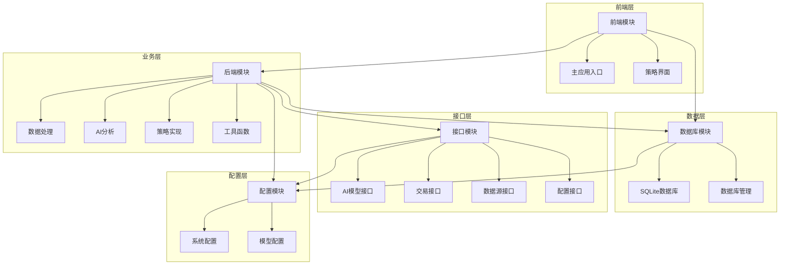
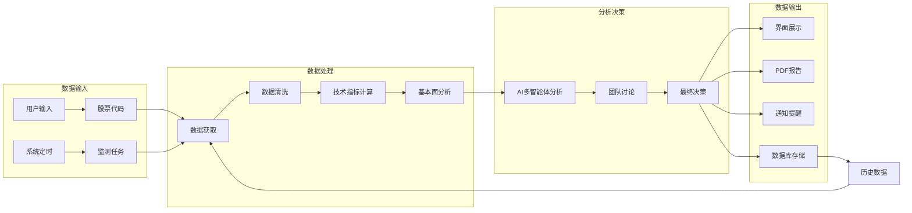

# 股票智能分析系统 - 模块依赖关系说明

## 1. 核心模块依赖关系

### 1.1 模块层级结构

### 1.2 模块依赖矩阵

| 模块 | 前端 | 后端 | 数据库 | 接口 | 配置 |
|------|------|------|--------|------|------|
| 前端 | ✓ | ✓ | ✓ | | ✓ |
| 后端 | | ✓ | ✓ | ✓ | ✓ |
| 数据库 | | | ✓ | | ✓ |
| 接口 | | | | ✓ | ✓ |
| 配置 | | | | | ✓ |

## 2. 详细依赖关系

### 2.1 前端模块依赖

#### 2.1.1 主应用入口 (app.py)

| 依赖模块 | 依赖文件 | 依赖说明 |
|----------|----------|----------|
| 后端数据处理 | backend/data/stock_data.py | 获取股票数据和技术指标 |
| 后端AI分析 | backend/ai/ai_agents.py | 执行多智能体AI分析 |
| 数据库管理 | database/managers/database.py | 存储和读取分析记录 |
| 后端策略模块 | backend/strategies/monitor/monitor_manager.py | 显示监测管理界面 |
| 后端策略模块 | backend/strategies/monitor/monitor_service.py | 管理监测服务状态 |
| 后端工具模块 | backend/utils/notification_service.py | 发送系统通知 |
| 接口配置模块 | interface/config/config_manager.py | 读取系统配置 |
| 前端策略界面 | frontend/strategies/main_force_ui.py | 显示主力选股界面 |
| 前端策略界面 | frontend/strategies/sector_strategy_ui.py | 显示板块策略界面 |
| 前端策略界面 | frontend/strategies/longhubang_ui.py | 显示龙虎榜界面 |
| 前端策略界面 | frontend/strategies/smart_monitor_ui.py | 显示智能盯盘界面 |
| 前端策略界面 | frontend/strategies/low_price_bull_ui.py | 显示低价擒牛界面 |
| 前端策略界面 | frontend/strategies/small_cap_ui.py | 显示小市值界面 |
| 前端策略界面 | frontend/strategies/profit_growth_ui.py | 显示净利增长界面 |
| 前端策略界面 | frontend/strategies/portfolio_ui.py | 显示投资组合界面 |

#### 2.1.2 策略界面模块

| 界面模块 | 依赖后端模块 | 依赖文件 |
|----------|--------------|----------|
| 主力选股界面 | 后端策略模块 | backend/strategies/main_force/main_force_analysis.py |
| 主力选股界面 | 后端策略模块 | backend/strategies/main_force/main_force_selector.py |
| 板块策略界面 | 后端策略模块 | backend/strategies/sector_strategy/sector_strategy_engine.py |
| 板块策略界面 | 后端策略模块 | backend/strategies/sector_strategy/sector_strategy_data.py |
| 龙虎榜界面 | 后端策略模块 | backend/strategies/longhubang/longhubang_engine.py |
| 龙虎榜界面 | 后端策略模块 | backend/strategies/longhubang/longhubang_data.py |
| 低价擒牛界面 | 后端策略模块 | backend/strategies/low_price_bull/low_price_bull_selector.py |
| 低价擒牛界面 | 后端策略模块 | backend/strategies/low_price_bull/low_price_bull_service.py |
| 小市值界面 | 后端策略模块 | backend/strategies/small_cap/small_cap_selector.py |
| 净利增长界面 | 后端策略模块 | backend/strategies/profit_growth/profit_growth_selector.py |
| 净利增长界面 | 后端策略模块 | backend/strategies/profit_growth/profit_growth_monitor.py |
| 投资组合界面 | 后端策略模块 | backend/strategies/portfolio/portfolio_manager.py |

#### 2.1.3 监测界面模块

| 界面模块 | 依赖后端模块 | 依赖文件 |
|----------|--------------|----------|
| 智能盯盘界面 | 后端策略模块 | backend/strategies/smart_monitor/smart_monitor_engine.py |
| 智能盯盘界面 | 后端策略模块 | backend/strategies/smart_monitor/smart_monitor_data.py |
| 智能盯盘界面 | 接口交易模块 | interface/trading/smart_monitor_qmt.py |
| 监测界面 | 后端策略模块 | backend/strategies/monitor/monitor_manager.py |
| 监测界面 | 数据库管理 | database/managers/monitor_db.py |

### 2.2 后端模块依赖

#### 2.2.1 数据处理模块

| 数据模块 | 依赖模块 | 依赖文件 |
|----------|----------|----------|
| 股票数据 | 配置模块 | config/config.py |
| 股票数据 | 后端数据模块 | backend/data/data_source_manager.py |
| 龙虎榜数据 | 数据库管理 | database/managers/longhubang_db.py |
| 板块策略数据 | 数据库管理 | database/managers/sector_strategy_db.py |
| 智能盯盘数据 | 接口交易模块 | interface/trading/smart_monitor_qmt.py |
| 新闻数据 | 接口数据源 | interface/data/test_tdx_api.py |

#### 2.2.2 分析模块

| 分析模块 | 依赖模块 | 依赖文件 |
|----------|----------|----------|
| AI分析系统 | 数据模块 | backend/data/stock_data.py |
| AI分析系统 | 接口AI模块 | interface/ai/deepseek_client.py |
| 主力分析 | 数据模块 | backend/data/stock_data.py |
| 龙虎榜引擎 | 策略模块 | backend/strategies/longhubang/longhubang_data.py |
| 板块策略引擎 | 策略模块 | backend/strategies/sector_strategy/sector_strategy_data.py |
| 智能盯盘引擎 | 策略模块 | backend/strategies/smart_monitor/smart_monitor_data.py |
| 智能盯盘引擎 | 接口交易模块 | interface/trading/smart_monitor_qmt.py |
| 智能盯盘引擎 | 工具模块 | backend/utils/notification_service.py |

#### 2.2.3 策略实现模块

| 策略模块 | 依赖模块 | 依赖文件 |
|----------|----------|----------|
| 主力选股 | 策略模块 | backend/strategies/main_force/main_force_analysis.py |
| 主力选股 | 数据库管理 | database/managers/monitor_db.py |
| 低价擒牛 | 数据模块 | backend/data/stock_data.py |
| 小市值选股 | 数据模块 | backend/data/stock_data.py |
| 净利增长选股 | 数据模块 | backend/data/stock_data.py |

#### 2.2.4 服务模块

| 服务模块 | 依赖模块 | 依赖文件 |
|----------|----------|----------|
| 监测管理 | 数据库管理 | database/managers/monitor_db.py |
| 监测服务 | 数据库管理 | database/managers/monitor_db.py |
| 监测服务 | 工具模块 | backend/utils/notification_service.py |
| 投资组合管理 | 数据库管理 | database/managers/portfolio_db.py |
| 低价擒牛服务 | 数据库管理 | database/managers/monitor_db.py |
| 净利增长监测 | 数据库管理 | database/managers/monitor_db.py |

### 2.3 数据库模块依赖

| 数据库管理 | 依赖配置 | 依赖说明 |
|------------|----------|----------|
| 分析数据库 | 配置模块 | 读取数据库路径配置 |
| 监测数据库 | 配置模块 | 读取数据库路径配置 |
| 龙虎榜数据库 | 配置模块 | 读取数据库路径配置 |
| 投资组合数据库 | 配置模块 | 读取数据库路径配置 |
| 板块策略数据库 | 配置模块 | 读取数据库路径配置 |
| 智能盯盘数据库 | 配置模块 | 读取数据库路径配置 |

### 2.4 接口模块依赖

| 接口模块 | 依赖配置 | 依赖文件 |
|----------|----------|----------|
| DeepSeek AI接口 | 配置模块 | config/config.py |
| MiniQMT交易接口 | 配置模块 | config/config.py |
| TDX API测试 | 配置模块 | config/config.py |

## 2. 数据流分析

### 2.1 核心数据流

### 2.2 主要数据流程

| 流程名称 | 数据源 | 处理模块 | 存储位置 | 输出方式 |
|----------|--------|----------|----------|----------|
| 单股分析 | 用户输入股票代码 | 后端数据处理、AI分析 | 分析数据库 | 界面展示、PDF报告 |
| 批量分析 | 用户输入多个股票代码 | 后端数据处理、多线程分析 | 分析数据库 | 界面展示、批量报告 |
| 策略选股 | 系统定时或用户触发 | 后端策略模块 | 策略数据库 | 界面展示、监测添加 |
| 智能盯盘 | 系统定时监测 | 智能盯盘引擎、交易接口 | 盯盘数据库 | 通知提醒、自动交易 |
| 实时监测 | 系统定时监测 | 监测服务、数据接口 | 监测数据库 | 通知提醒、界面展示 |

## 3. 依赖关系特点

### 3.1 依赖方向

1. **自上而下依赖**：前端模块依赖后端模块，后端模块依赖数据库和接口模块
2. **配置中心依赖**：所有模块都依赖配置模块，配置是系统的核心
3. **数据流向**：数据从接口和外部数据源流向后端，经过处理后流向数据库和前端
4. **服务调用**：后端服务模块调用接口模块执行具体功能

### 3.2 依赖强度

| 依赖类型 | 强度 | 说明 |
|----------|------|------|
| 强依赖 | 必须存在 | 如前端依赖后端的核心功能 |
| 弱依赖 | 可选存在 | 如部分功能依赖特定接口 |
| 运行时依赖 | 运行时需要 | 如数据库连接、API调用 |
| 编译时依赖 | 编译时需要 | 如模块导入、类型检查 |

### 3.3 依赖风险

| 风险类型 | 影响 | 应对措施 |
|----------|------|----------|
| 循环依赖 | 模块间相互依赖，导致初始化失败 | 重构模块职责，建立单向依赖 |
| 过度依赖 | 单个模块被过多其他模块依赖 | 拆分核心功能，减少依赖范围 |
| 隐式依赖 | 依赖关系不明确，难以追踪 | 明确依赖声明，使用依赖注入 |
| 外部依赖 | 依赖外部服务，可能不可用 | 实现降级策略，增加缓存机制 |

## 4. 模块解耦建议

### 4.1 解耦策略

1. **接口抽象**：为核心功能定义抽象接口，减少直接依赖
2. **依赖注入**：使用依赖注入模式，动态注入依赖实例
3. **事件驱动**：使用事件机制，减少模块间直接调用
4. **数据传输对象**：使用DTO模式，明确数据结构
5. **服务层隔离**：通过服务层隔离业务逻辑和数据访问

### 4.2 具体实现建议

| 模块 | 解耦建议 | 实现方式 |
|------|----------|----------|
| 前端与后端 | 定义明确的数据接口 | 使用结构化的数据传输对象 |
| 后端与数据库 | 实现数据访问层 | 抽象数据库操作接口 |
| 后端与接口 | 使用适配器模式 | 为不同接口实现统一适配器 |
| 配置管理 | 使用配置服务 | 集中管理配置，提供统一访问接口 |

## 5. 依赖管理最佳实践

1. **明确依赖声明**：在模块文档中明确声明依赖关系
2. **版本管理**：对外部依赖进行版本锁定
3. **依赖注入**：使用依赖注入容器管理内部依赖
4. **模块测试**：针对模块进行独立测试，验证依赖关系
5. **依赖分析**：定期分析依赖关系，识别潜在问题
6. **文档更新**：当依赖关系变化时，及时更新文档

## 6. 结论

通过对股票智能分析系统模块依赖关系的详细分析，我们可以看到系统采用了清晰的分层架构，各模块职责明确，依赖关系合理。前端模块负责用户交互，后端模块处理业务逻辑，数据库模块管理数据存储，接口模块对接外部服务，配置模块集中管理系统配置。

这种架构设计使得系统具有良好的可维护性和可扩展性，同时也为后续的功能扩展和技术升级奠定了基础。在重构过程中，我们将保持这种清晰的依赖关系，确保系统的稳定性和可靠性。