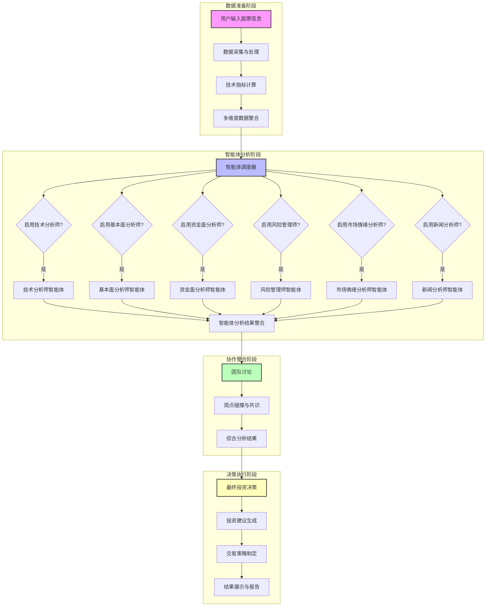

# 股票智能分析系统 - 项目结构分析

## 1. 项目概况

股票智能分析系统是一个基于Streamlit的综合股票分析平台，集成了多种分析策略、AI驱动的分析系统、实时监测、风险管理等功能。系统使用Python开发，支持多数据源、多市场分析，并提供Docker容器化部署方案。

## 2. 目录结构分析

### 2.1 根目录文件

| 文件类型 | 文件名 | 功能描述 |
|---------|-------|--------|
| 配置文件 | .dockerignore | Docker构建忽略文件配置 |
| 配置文件 | .env.example | 环境变量示例文件 |
| 配置文件 | .gitignore | Git版本控制忽略文件配置 |
| 文档文件 | BUILD_CN.md | 构建指南 |
| 容器配置 | Dockerfile | Docker构建文件 |
| 容器配置 | Dockerfile国际源版 | 国际源版本Docker构建文件 |
| 文档文件 | README.md | 项目说明文档 |
| 容器配置 | docker-compose.yml | Docker Compose配置文件 |
| 配置文件 | env_example.txt | 环境变量示例文件 |
| 依赖管理 | requirements.txt | Python依赖包列表 |
| 启动脚本 | 启动系统.bat | Windows启动脚本 |

### 2.2 核心应用文件

| 文件名 | 功能描述 |
|-------|--------|
| app.py | 主Streamlit应用，包含UI组件和导航逻辑 |
| run.py | 应用启动脚本 |
| stm.py | 可能是Streamlit相关工具模块 |

### 2.3 数据管理模块

| 文件名 | 功能描述 |
|-------|--------|
| stock_data.py | 股票数据获取和技术分析 |
| data_source_manager.py | 数据源管理，处理多数据源冗余 |
| fund_flow_akshare.py | 资金流向数据获取（使用akshare） |
| market_sentiment_data.py | 市场情绪数据获取和分析 |
| news_announcement_data.py | 新闻公告数据获取 |
| qstock_news_data.py | 新闻数据获取（使用akshare） |
| quarterly_report_data.py | 季报数据获取和分析 |
| risk_data_fetcher.py | 风险数据获取（限售解禁、大股东减持等） |

### 2.4 AI分析模块

| 文件名 | 功能描述 |
|-------|--------|
| ai_agents.py | 多智能体AI分析系统 |
| deepseek_client.py | DeepSeek AI模型客户端 |
| model_config.py | AI模型配置管理 |

### 2.5 数据库模块

| 文件名 | 功能描述 |
|-------|--------|
| database.py | 数据库管理（主要分析数据） |
| monitor_db.py | 监测数据库管理 |
| portfolio_db.py | 持仓分析数据库管理 |
| smart_monitor_db.py | 智能盯盘数据库管理 |
| longhubang_db.py | 龙虎榜分析数据库管理 |
| low_price_bull_monitor.py | 低价擒牛监测数据库管理 |
| main_force_batch_db.py | 主力选股批量分析数据库管理 |
| profit_growth_monitor.py | 净利增长监测数据库管理 |
| sector_strategy_db.py | 智策板块数据库管理 |

### 2.6 数据库文件

| 文件名 | 功能描述 |
|-------|--------|
| stock_analysis.db | 股票分析数据 |
| stock_monitor.db | 股票监测数据 |
| portfolio_stocks.db | 持仓分析数据 |
| smart_monitor.db | 智能盯盘数据 |
| longhubang.db | 龙虎榜分析数据 |
| low_price_bull_monitor.db | 低价擒牛监测数据 |
| main_force_batch.db | 主力选股批量分析数据 |
| profit_growth_monitor.db | 净利增长监测数据 |
| sector_strategy.db | 智策板块数据 |

### 2.7 策略模块

#### 2.7.1 主力选股
| 文件名 | 功能描述 |
|-------|--------|
| main_force_analysis.py | 主力资金分析 |
| main_force_selector.py | 主力选股逻辑 |
| main_force_ui.py | 主力选股UI |
| main_force_history_ui.py | 主力选股历史记录UI |
| main_force_pdf_generator.py | 主力选股PDF报告生成 |

#### 2.7.2 低价擒牛
| 文件名 | 功能描述 |
|-------|--------|
| low_price_bull_strategy.py | 低价擒牛策略逻辑 |
| low_price_bull_selector.py | 低价擒牛选股 |
| low_price_bull_service.py | 低价擒牛服务 |
| low_price_bull_ui.py | 低价擒牛UI |
| low_price_bull_monitor_ui.py | 低价擒牛监测UI |

#### 2.7.3 智瞰龙虎
| 文件名 | 功能描述 |
|-------|--------|
| longhubang_data.py | 龙虎榜数据获取 |
| longhubang_agents.py | 龙虎榜AI分析代理 |
| longhubang_engine.py | 龙虎榜分析引擎 |
| longhubang_scoring.py | 龙虎榜评分系统 |
| longhubang_pdf.py | 龙虎榜PDF报告生成 |
| longhubang_ui.py | 龙虎榜分析UI |

#### 2.7.4 智策板块
| 文件名 | 功能描述 |
|-------|--------|
| sector_strategy_data.py | 板块数据获取 |
| sector_strategy_agents.py | 板块AI分析代理 |
| sector_strategy_engine.py | 板块分析引擎 |
| sector_strategy_pdf.py | 板块PDF报告生成 |
| sector_strategy_ui.py | 板块分析UI |

#### 2.7.5 智能盯盘
| 文件名 | 功能描述 |
|-------|--------|
| smart_monitor_data.py | 智能盯盘数据获取 |
| smart_monitor_deepseek.py | 智能盯盘DeepSeek集成 |
| smart_monitor_engine.py | 智能盯盘引擎 |
| smart_monitor_kline.py | 智能盯盘K线分析 |
| smart_monitor_qmt.py | 智能盯盘MiniQMT集成 |
| smart_monitor_tdx_data.py | 智能盯盘TDX数据集成 |
| smart_monitor_ui.py | 智能盯盘UI |

#### 2.7.6 实时监测
| 文件名 | 功能描述 |
|-------|--------|
| monitor_manager.py | 监测管理器 |
| monitor_service.py | 监测服务 |
| monitor_scheduler.py | 监测调度器 |
| monitor_ui.py | 监测UI |
| monitor_schedule_config.json | 监测调度配置 |

#### 2.7.7 持仓分析
| 文件名 | 功能描述 |
|-------|--------|
| portfolio_manager.py | 持仓管理器 |
| portfolio_scheduler.py | 持仓分析调度器 |
| portfolio_ui.py | 持仓分析UI |

#### 2.7.8 净利增长
| 文件名 | 功能描述 |
|-------|--------|
| profit_growth_selector.py | 净利增长选股 |
| profit_growth_ui.py | 净利增长UI |

#### 2.7.9 小市值策略
| 文件名 | 功能描述 |
|-------|--------|
| small_cap_selector.py | 小市值策略选股 |
| small_cap_ui.py | 小市值策略UI |

### 2.8 工具模块

| 文件名 | 功能描述 |
|-------|--------|
| notification_service.py | 通知服务（邮件、Webhook） |
| pdf_generator.py | PDF报告生成 |
| pdf_generator_fixed.py | PDF生成修复版本 |
| pdf_generator_pandoc.py | 使用Pandoc的PDF生成 |
| config_manager.py | 配置管理器 |
| update_env_example.py | 环境变量示例更新 |
| miniqmt_interface.py | MiniQMT交易接口 |
| test_tdx_api.py | TDX API测试 |

### 2.9 子目录

#### 2.9.1 .streamlit/
| 文件名 | 功能描述 |
|-------|--------|
| config.toml | Streamlit配置文件 |

#### 2.9.2 docs/
包含大量文档文件，涵盖系统各个功能模块的使用指南、更新日志等。

#### 2.9.3 docx-new/
| 文件名 | 功能描述 |
|-------|--------|
| 系统重构/股票智能分析系统-目录重构方案.md | 系统重构方案文档 |

## 3. 系统架构分析

### 3.1 前端架构
- 使用Streamlit框架构建Web界面
- 主要入口：app.py
- UI组件：各模块的_ui.py文件
- 布局：响应式设计，包含导航栏、分析面板、结果展示等

### 3.2 后端架构
- 数据获取：stock_data.py, 各模块的_data.py文件
- 业务逻辑：各模块的核心功能实现
- 数据处理：技术分析、财务分析、风险分析等
- 多线程处理：支持批量分析

### 3.3 数据库架构
- 使用SQLite作为存储引擎
- 多个功能专用数据库文件
- 数据库管理：各模块的_db.py文件

### 3.4 接口架构
- AI模型：DeepSeek集成
- 数据源：akshare, yfinance, tushare, TDX
- 交易接口：MiniQMT
- 通知接口：邮件、Webhook（钉钉、企业微信、飞书）

### 3.5 模块依赖关系

```
┌─────────────────┐
│   app.py (主UI)  │
└────────┬────────┘
         │
         ▼
┌────────────────────────────────┐
│         功能模块                │
├────────┬────────┬────────┬──────┤
│ 主力选股 │ 低价擒牛 │ 智瞰龙虎 │ 其他  │
└─┬──────└─┬──────└─┬──────└─┬───┘
  │        │        │        │
  ▼        ▼        ▼        ▼
┌────────────────────────────────┐
│         核心服务                │
├────────┬────────┬────────┬──────┤
│ 数据获取 │ AI分析 │ 数据库 │ 通知  │
└────────┴────────┴────────┴──────┘
```

### 3.6 多智能体协作分析流程

系统的多智能体分析流程是其核心功能之一，通过多个专业智能体的协作，提供全面的股票分析服务。



#### 智能体执行流程说明

1. **数据准备阶段**
   - 用户输入股票信息和分析参数
   - 系统从多数据源获取股票数据并进行处理
   - 计算技术指标，整合多维度数据

2. **智能体分析阶段**
   - 智能体调度器根据用户配置决定启用哪些智能体
   - 智能体按照串行顺序执行分析：技术分析师 → 基本面分析师 → 资金面分析师 → 风险管理师 → 市场情绪分析师 → 新闻分析师
   - 每个智能体专注于特定领域的分析

3. **协作整合阶段**
   - 收集所有智能体的分析结果
   - 进行团队讨论，分析不同观点的一致性和分歧
   - 形成综合分析结果

4. **决策执行阶段**
   - 基于综合分析结果生成最终投资决策
   - 制定具体的交易策略
   - 展示分析结果，生成PDF报告

#### 智能体执行特点

- **灵活性**：用户可根据需要选择启用哪些智能体
- **专业性**：每个智能体专注于特定领域的分析
- **综合性**：多维度分析，避免单一视角的局限性
- **可扩展性**：模块化设计，便于添加新的智能体类型

#### 推荐智能体组合

| 投资者类型 | 推荐智能体组合 | 分析时间 | 适用场景 |
|-----------|--------------|---------|----------|
| 保守型 | 基本面分析师 + 风险管理师 | 1-2分钟 | 价值投资 |
| 激进型 | 技术分析师 + 资金面分析师 + 市场情绪分析师 | 3-4分钟 | 趋势投资 |
| 平衡型（默认） | 技术分析师 + 基本面分析师 + 资金面分析师 + 风险管理师 | 2-3分钟 | 综合分析 |

## 4. 重构建议

基于对项目结构的分析，建议将系统重构为以下目录结构：

### 4.1 前端模块（frontend/）
- UI组件和界面逻辑
- 包含所有_ui.py文件

### 4.2 后端模块（backend/）
- 业务逻辑和功能实现
- 包含核心功能模块

### 4.3 数据库模块（database/）
- 数据库文件和管理代码
- 包含所有.db文件和_db.py文件

### 4.4 接口模块（interface/）
- 模型调用和外部API集成
- 包含数据源、AI模型、交易接口等

### 4.5 配置和工具（config/, utils/）
- 配置文件和通用工具

### 4.6 文档（docs/）
- 保持现有文档结构

## 5. 总结

股票智能分析系统是一个功能丰富、架构清晰的股票分析平台，包含多个独立的分析策略模块。系统使用Streamlit构建前端，Python实现后端逻辑，SQLite存储数据，并集成了多种外部接口。

重构方案将按照功能模块对代码进行重新组织，以提高代码的可维护性和可扩展性，同时保持系统的现有功能不变。

通过本次重构，可以使系统架构更加清晰，便于后续的功能扩展和维护。