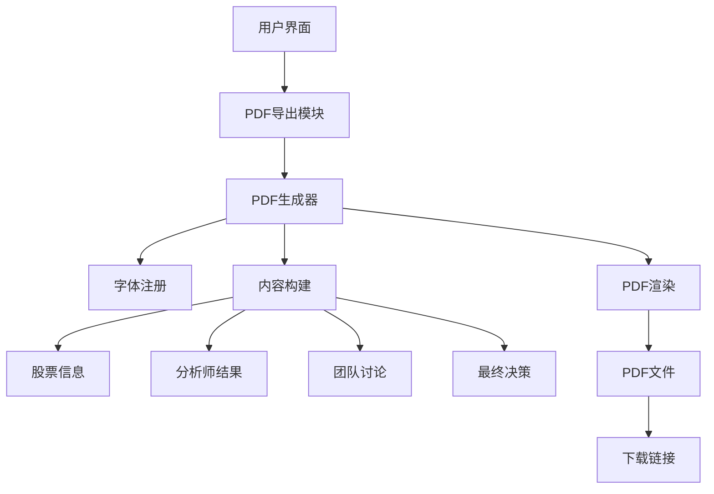
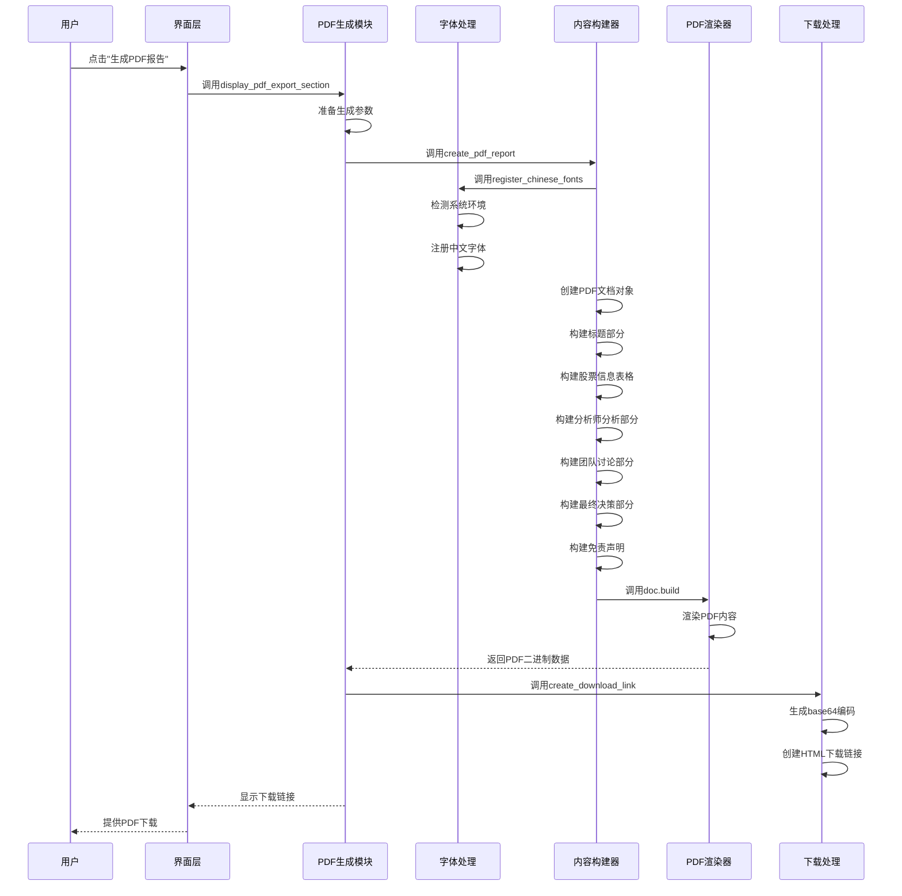
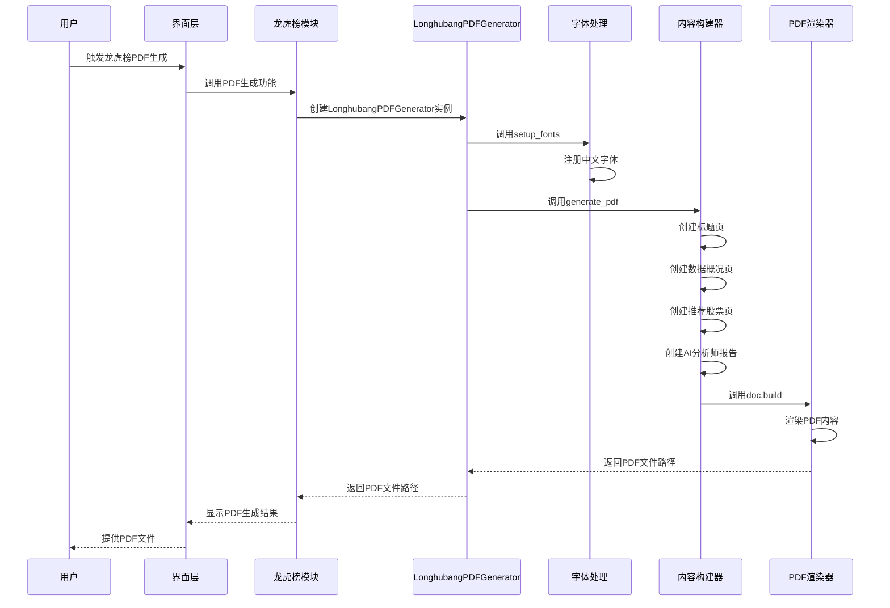
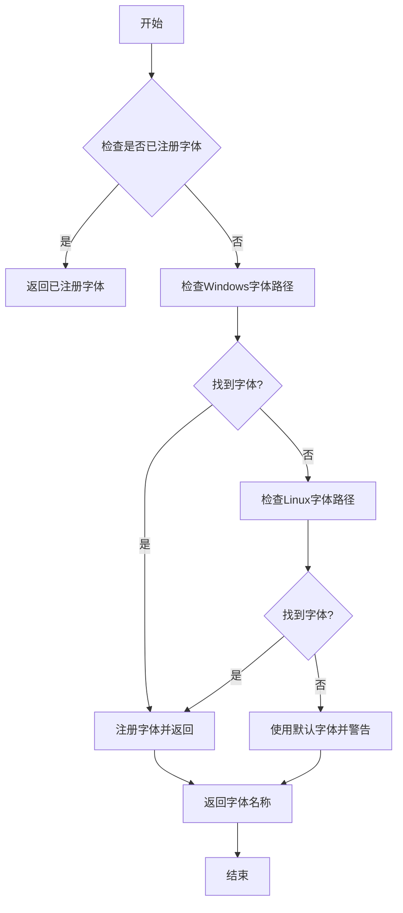
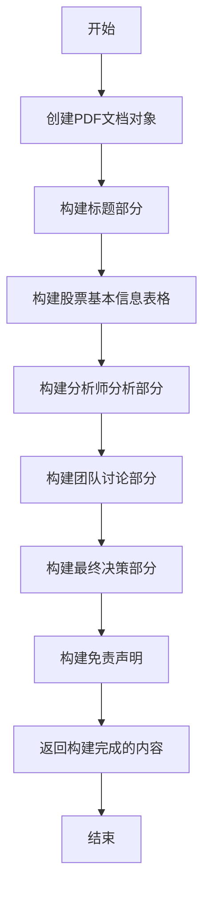
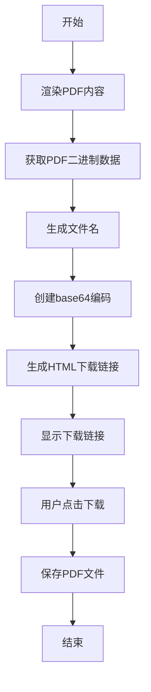

# PDF报告生成流程图

## 1. PDF报告生成系统架构

### 1.1 核心模块关系



## 2. PDF报告生成详细流程

### 2.1 标准PDF报告生成流程



### 2.2 智瞰龙虎PDF报告生成流程



## 3. 核心功能模块详解

### 3.1 字体处理模块



### 3.2 内容构建模块



### 3.3 PDF渲染与下载模块



## 4. 技术实现要点

### 4.1 字体处理技术

- **跨平台字体支持**：同时支持Windows和Linux系统
- **字体自动检测**：按优先级检测多个字体路径
- **容错处理**：当无中文字体时使用默认字体

### 4.2 PDF生成技术

- **内存中生成**：使用io.BytesIO避免临时文件
- **样式定制**：创建多种自定义ParagraphStyle
- **表格处理**：使用Table和TableStyle创建结构化数据
- **中文支持**：通过注册中文字体确保中文正确显示

### 4.3 下载处理技术

- **Base64编码**：将PDF二进制数据编码为可下载链接
- **动态文件名**：包含股票代码和时间戳
- **HTML嵌入**：生成美观的下载按钮

## 5. 生成流程优化

### 5.1 性能优化

1. **字体缓存**：避免重复注册字体
2. **内存管理**：使用BytesIO减少I/O操作
3. **错误处理**：提供详细的错误信息

### 5.2 用户体验优化

1. **加载动画**：生成过程中显示spinner
2. **成功反馈**：生成成功后显示成功消息和气球效果
3. **提示信息**：提供清晰的下载提示

## 6. 系统调用关系

### 6.1 标准PDF报告调用链

```
frontend/app.py → display_pdf_export_section → create_pdf_report → doc.build → create_download_link
```

### 6.2 智瞰龙虎PDF报告调用链

```
frontend/strategies/longhubang_ui.py → LonghubangPDFGenerator.generate_pdf → doc.build
```

## 7. 输入输出示例

### 7.1 输入数据结构

```python
# 标准PDF报告输入
data = {
    "stock_info": {
        "symbol": "600519",
        "name": "贵州茅台",
        "current_price": 1789.00,
        "change_percent": 2.5
    },
    "agents_results": {
        "technical": {"analysis": "技术面分析结果"},
        "fundamental": {"analysis": "基本面分析结果"}
    },
    "discussion_result": "团队讨论结果",
    "final_decision": {
        "rating": "买入",
        "target_price": 1900.00,
        "operation_advice": "逢低买入"
    }
}
```

### 7.2 输出结果

- **生成的PDF文件**：包含完整的分析报告
- **下载链接**：HTML格式的下载按钮
- **用户反馈**：成功消息和气球效果

## 8. 总结

PDF报告生成系统是股票智能分析系统的重要组成部分，它通过以下步骤完成PDF报告的生成：

1. **字体注册**：确保中文字体正确显示
2. **内容构建**：整合股票信息、分析师结果、团队讨论和最终决策
3. **PDF渲染**：将内容渲染为PDF格式
4. **下载处理**：生成可下载的PDF文件链接

系统支持两种类型的PDF报告生成：标准分析报告和智瞰龙虎专项报告，满足不同场景的需求。通过跨平台字体支持、内存优化和用户体验改进，确保了PDF报告生成的可靠性和效率。