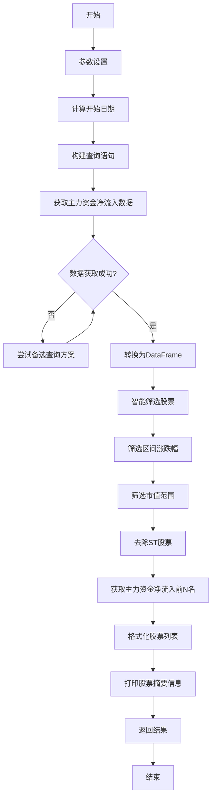

# 图4-6 主力选股策略流程图

## 流程说明

1. **参数设置**：用户设置开始日期、市值范围等参数
2. **计算开始日期**：如果未提供开始日期，根据days_ago计算
3. **构建查询语句**：使用多个备选方案，确保获取到数据
4. **获取主力资金净流入数据**：通过pywencai获取主力资金净流入排名前100名股票
5. **智能筛选股票**：
   - 筛选区间涨跌幅（小于设定值）
   - 筛选市值范围（在设定范围内）
   - 去除ST股票
6. **获取主力资金净流入前N名**：按主力资金净流入排序，取前N名
7. **格式化股票列表**：准备提交给AI分析师的格式
8. **打印股票摘要信息**：显示候选股票列表
9. **返回结果**：返回筛选后的股票数据

## 核心功能

- **多方案查询**：支持4种不同的查询方案，确保数据获取成功率
- **智能字段匹配**：自动识别区间涨跌幅、主力资金等字段
- **多重筛选**：基于涨跌幅、市值、ST状态等多维度筛选
- **数据格式化**：为AI分析准备标准化的数据格式

## 技术实现

基于`MainForceStockSelector`类，主要方法包括：
- `get_main_force_stocks()`：获取主力资金净流入数据
- `filter_stocks()`：智能筛选股票
- `get_top_stocks()`：获取主力资金净流入前N名
- `format_stock_list_for_analysis()`：格式化股票列表
- `print_stock_summary()`：打印股票摘要信息