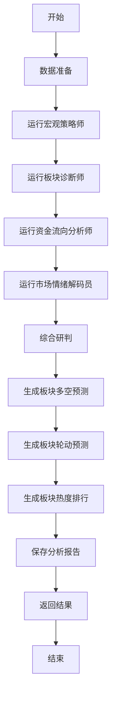

# 图4-7 板块分析算法流程图

## 流程说明

1. **数据准备**：收集市场概览、板块数据、资金流向、新闻等数据
2. **运行AI智能体分析集群**：
   - **宏观策略师**：分析宏观经济环境、政策走向等
   - **板块诊断师**：分析板块基本面、技术面、资金面等
   - **资金流向分析师**：分析板块资金流向、北向资金等
   - **市场情绪解码员**：分析市场情绪、投资者信心等
3. **综合研判**：整合各智能体的分析结果，形成全面的市场和板块研判
4. **生成最终预测**：
   - **板块多空情况**：看多、看空、中性板块
   - **板块轮动预测**：当前强势、潜力接力、衰退板块
   - **板块热度排行**：最热、升温、降温板块
5. **保存分析报告**：将分析结果保存到数据库
6. **返回结果**：返回完整的分析结果

## 核心功能

- **多智能体协作**：4个专业智能体分工协作，提供多维度分析
- **综合研判**：首席策略官整合各分析师观点，形成全面判断
- **精准预测**：基于多维度分析，生成板块多空、轮动、热度预测
- **报告管理**：保存历史分析报告，支持查询和管理

## 技术实现

基于`SectorStrategyEngine`类，主要方法包括：
- `run_comprehensive_analysis()`：运行综合分析流程
- `_conduct_comprehensive_discussion()`：综合研判各智能体分析
- `_generate_final_predictions()`：生成最终的板块预测
- `save_analysis_report()`：保存分析报告到数据库
- `get_historical_reports()`：获取历史报告

## 智能体职责

1. **宏观策略师**：分析宏观经济环境、政策走向、市场整体趋势
2. **板块诊断师**：分析板块基本面、技术面、资金面、估值水平
3. **资金流向分析师**：分析板块资金流向、北向资金、主力资金动向
4. **市场情绪解码员**：分析市场情绪、投资者信心、风险偏好

## 预测内容

1. **板块多空情况**：
   - 看多板块（5-8个）
   - 看空板块（3-5个）
   - 中性板块（2-3个）

2. **板块轮动预测**：
   - 当前强势板块（2-3个）
   - 潜力接力板块（3-5个）
   - 衰退板块（2-3个）

3. **板块热度排行**：
   - 最热板块TOP5
   - 升温板块TOP5
   - 降温板块TOP3

## 数据存储

分析报告保存到`sector_strategy.db`数据库，包含：
- 数据日期范围
- 分析内容
- 推荐板块
- 报告摘要
- 置信度评分
- 风险等级
- 投资周期
- 市场展望