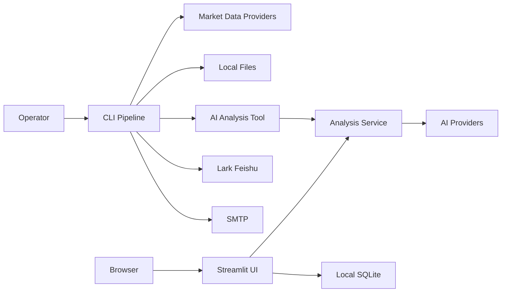

# Threat Model: A Stock Value Monitor

Date: 2026-06-26

## Executive Summary

The highest-risk themes are secret leakage, unsafe publication of generated runtime data, unauthenticated local web/admin surfaces being exposed beyond localhost, and integrity risk in automated report delivery. The system should be treated as a local research automation stack unless additional production controls are added.

## Scope and Assumptions

In scope:

- Root pipeline: `main.py`, `src/`, `config/`, `tools/`
- Streamlit AI app: `aiagents-stock-main/frontend/`, `backend/`, `interface/`, `database/managers/`, `tools/`
- Local configuration, reports, runtime data, and delivery integrations

Out of scope:

- Third-party provider internals: Tushare, Akshare, AI providers, SMTP, Lark/Feishu
- Real personal data and local secret values
- Trading execution hardening beyond local MiniQMT configuration surfaces

Assumptions:

- Intended deployment is local or private server use.
- Streamlit and config web endpoints are not intentionally public internet services.
- Runtime data may contain personal notification settings, generated stock analysis, and local account configuration.
- API keys and SMTP credentials are managed through environment variables or ignored local files.

Open questions that change risk ranking:

- Will the Streamlit app be exposed to other users or the public internet?
- Will MiniQMT or any real trading function be enabled in production?
- Is there a required compliance boundary for generated reports or portfolio records?

## System Model

### Primary Components

- CLI scheduler and pipeline: `main.py`
- Data acquisition and caching: `src/data_source_manager.py`, `src/tushare_client.py`, `src/cache_manager.py`
- Strategy and scoring: `src/universe_scanner.py`, `src/strategy_validator.py`, `src/valuation.py`
- Delivery: `src/lark_bitable_client.py`, `src/email_sender.py`
- Runtime state: `src/runtime_state.py`
- Streamlit app: `aiagents-stock-main/frontend/app.py`
- AI providers: `aiagents-stock-main/interface/ai/`
- Local SQLite managers: `aiagents-stock-main/database/managers/`

### Data Flows and Trust Boundaries

- Operator -> CLI: command-line flags and environment variables cross into trusted pipeline code. Validation is mostly argument parsing and runtime checks.
- Pipeline -> market data providers: API tokens and stock identifiers cross network boundaries. Provider availability and data correctness are external assumptions.
- Pipeline -> local filesystem: reports, caches, SQLite state, and logs are written locally. Confidentiality depends on OS permissions and `.gitignore` discipline.
- Pipeline -> AI app tool: JSON payload with delivered stocks and model list crosses a subprocess boundary into `aiagents-stock-main`.
- AI app -> AI providers: prompts, stock data, and model choices cross network boundaries. Secrets are read from env files.
- Pipeline -> Lark/Feishu and SMTP: generated reports and stock records cross external service boundaries.
- Browser -> Streamlit app: user inputs and configuration changes enter through local web UI. Public exposure would require additional auth and rate limits.

#### Diagram

## Assets and Security Objectives

| Asset | Why it matters | Objective |
| --- | --- | --- |
| API keys and SMTP credentials | Enable paid or privileged provider access | Confidentiality |
| Lark/Feishu table config | Can write or alter external records | Confidentiality, integrity |
| Generated reports and emails | May include personal observations and research | Confidentiality |
| SQLite databases | May include users, portfolios, monitor settings, local state | Confidentiality, integrity |
| Strategy configuration | Drives automated recommendations and delivery | Integrity |
| Runtime locks and delivery hashes | Prevent duplicate or stale sends | Integrity, availability |
| Source code and tests | Define analysis behavior and safety gates | Integrity |

## Attacker Model

### Capabilities

- Reads a mistakenly published GitHub repository.
- Sends crafted inputs to Streamlit/config UI if exposed.
- Attempts to trigger repeated expensive provider/API calls if web surfaces are public.
- Attempts to alter local config or generated outputs if they gain filesystem access.

### Non-Capabilities

- Cannot directly access local files if the app remains local and OS permissions are sound.
- Cannot call external providers without valid local credentials.
- Cannot bypass third-party provider security controls assumed outside this repo.

## Entry Points and Attack Surfaces

| Surface | How reached | Trust boundary | Notes | Evidence |
| --- | --- | --- | --- | --- |
| CLI flags | Local shell or scheduler | Operator to pipeline | Controls scans, delivery, server startup | `main.py::main` |
| Env files | Local filesystem | Local secrets to app | Loads SMTP, Tushare, AI provider keys | `config/settings.py`, `aiagents-stock-main/config/config.py` |
| Streamlit UI | Browser | User input to app | Single stock, batch analysis, config screens | `aiagents-stock-main/frontend/app.py` |
| Config web server | Local HTTP | Browser to config writer | Can edit strategy/config if started | `main.py --config-web`, `src/config_server.py` |
| Lark CLI | Subprocess | App to external SaaS | Writes daily records | `src/lark_bitable_client.py` |
| SMTP | Network | App to mail provider | Sends generated report | `src/email_sender.py` |
| AI analysis subprocess | JSON temp files | Root pipeline to AI app | Invokes multi-agent analysis | `src/ai_value_analysis.py`, `aiagents-stock-main/tools/generate_value_stock_analysis.py` |

## Top Abuse Paths

1. Secret exfiltration through Git: a developer commits `.env`, `secrets/`, database files, or generated reports, exposing provider keys and personal research.
2. Public Streamlit exposure: an unauthenticated user reaches the UI, triggers expensive AI/data calls, and reads or changes local configuration.
3. Report integrity compromise: local config or cached data is altered before `--deliver-final-report`, causing stale or manipulated recommendations to be emailed.
4. Duplicate or unwanted delivery: runtime state is deleted or lock handling fails, causing repeated Feishu/email sends.
5. Provider cost abuse: exposed endpoints or unbounded batch analysis trigger repeated AI model calls.
6. Local database leakage: SQLite files containing user auth, portfolio, or monitor configuration are published or copied into artifacts.

## Threat Model Table

| Threat ID | Threat source | Prerequisites | Threat action | Impact | Impacted assets | Existing controls | Gaps | Recommended mitigations | Detection ideas | Likelihood | Impact severity | Priority |
| --- | --- | --- | --- | --- | --- | --- | --- | --- | --- | --- | --- | --- |
| T1 | Developer or malware | Git publish path includes local artifacts | Commit secrets/reports/databases | Credential and personal data exposure | Secrets, reports, SQLite | `.gitignore`, `SECURITY.md` | No automated secret scanning in CI | Add pre-commit secret scan and GitHub secret scanning | CI secret scan failures | Medium | High | High |
| T2 | Remote user | Streamlit exposed beyond trusted network | Use UI to run analysis or inspect config | Cost abuse and data exposure | AI keys, reports, local config | Localhost defaults in run script | No built-in auth for public deployment | Put behind VPN/auth proxy; add rate limits | Access logs and provider usage anomalies | Medium if exposed | High | High |
| T3 | Local attacker | Filesystem write access | Modify strategy/config before delivery | Manipulated recommendations | Strategy config, reports | Strategy validation tests | No signed config or approval gate | Add config diff review before scheduled delivery | Hash strategy config per run | Low | High | Medium |
| T4 | External provider failure | Provider throttling or stale data | Return incomplete/stale data | Poor analysis quality or failed runs | Report integrity, availability | Freshness checks, strategy validation | Limited provider health telemetry | Add provider timing/error metrics | Daily freshness and provider error trend | Medium | Medium | Medium |
| T5 | Remote or local user | Config server started on reachable host | Modify config through web endpoint | Bad schedules or delivery settings | Config, delivery | Host defaults configurable | Auth expectations unclear | Keep bound to localhost; add auth if shared | Config change audit log | Low to medium | Medium | Medium |
| T6 | Scheduler race | Multiple jobs running | Duplicate delivery or lock contention | Duplicate emails/records | Runtime state, external records | `RuntimeState` delivery reservations | Stale lock monitoring limited | Add stale lock alert and run id dashboard | Delivery status validation | Low | Medium | Low |

## Focus Paths for Manual Review

- `config/settings.py`: root secrets and delivery defaults.
- `src/ai_value_analysis.py`: subprocess boundary and AI analysis payload.
- `src/lark_bitable_client.py`: external record writes and CLI error handling.
- `src/email_sender.py`: SMTP credential use and delivery errors.
- `src/runtime_state.py`: idempotency, locking, and duplicate delivery prevention.
- `src/config_server.py`: local configuration editing surface.
- `aiagents-stock-main/frontend/app.py`: Streamlit entrypoint and user inputs.
- `aiagents-stock-main/config/config.py`: AI provider secrets and auth test defaults.
- `aiagents-stock-main/backend/auth/`: login and user management.
- `aiagents-stock-main/database/managers/`: local SQLite persistence.

## Quality Check

- Entry points discovered: CLI, scheduler, Streamlit UI, config server, subprocess tool, external providers.
- Trust boundaries covered: operator, filesystem, subprocess, network providers, browser UI.
- Runtime vs dev/test separated: runtime data and databases are excluded from Git.
- Assumptions explicit: local/private deployment, no public Streamlit exposure by default.
- Open questions listed: public exposure, trading enablement, compliance needs.
